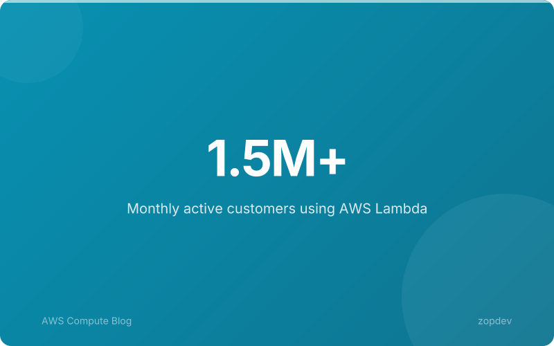
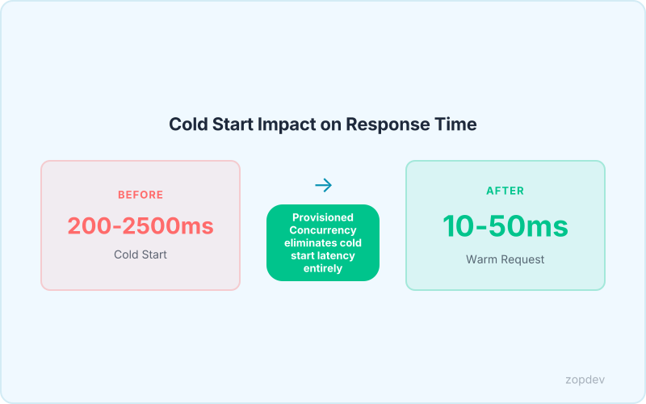
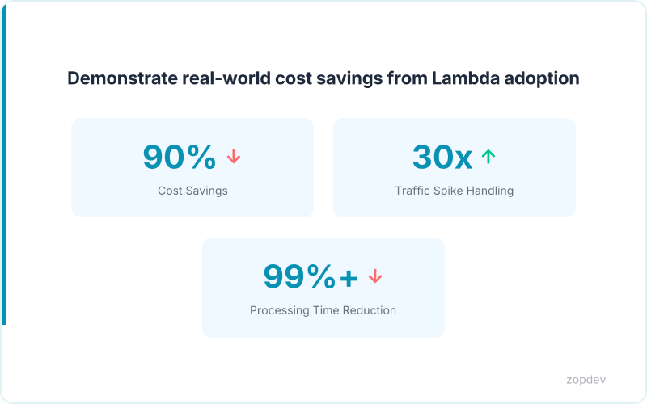
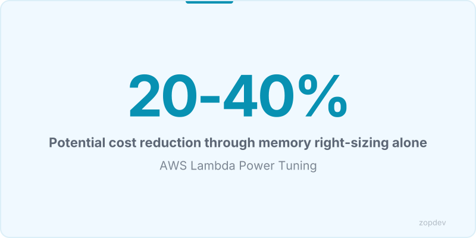

<!-- Generated by transform-chapter.ts with openai/MiniMax-M2 -->
<!-- Density: light | Word target: 800-1200 -->

Lambda powers modern applications at unprecedented scale. Over 1.5 million customers process tens of trillions of invocations annually. The serverless consulting market will grow to $13.1 billion by 2030. While Lambda delivers cost savings, optimization determines actual ROI. Cold starts add 200-2500ms latency, directly impacting user experience and conversion rates (AWS compute blog). Real companies achieve 90% cost savings by migrating to Lambda and optimizing (customer case study). Memory right-sizing can reduce costs by 20-40% while improving performance. Execution environment reuse can reduce execution time by 50-90% for I/O-bound functions. AWS Lambda Power Tuning identifies memory optimization opportunities while AWS X-Ray reveals cold start bottlenecks.

## Understanding the Lambda Pricing Model

Lambda pricing operates on three distinct meters. The first charges per invocation—currently $0.20 per million requests. The second meters duration in GB-seconds, billing based on how long your function runs multiplied by the memory allocated. The third component is memory allocation itself, which directly influences both duration cost and execution speed. This creates a counterintuitive reality: doubling memory often halves execution time, meaning you pay more per invocation but less for duration. The net effect varies by workload.

Think of it like a delivery service. You pay for each package delivered (invocations) and for the time the truck spends on the road (duration). More memory is like upgrading from a bicycle to a van—each delivery costs more, but you complete routes dramatically faster.

Most developers initially over-provision memory, allocating 512MB or 1024MB where 128MB suffices. This stems from early documentation that suggested conservative baselines. Memory right-sizing can reduce costs by 20-40% while improving performance (customer case study). The challenge lies in finding the sweet spot where increased memory cost is offset by reduced duration.

AWS Lambda Power Tuning identifies this optimal allocation programmatically. For functions where cold starts dominate latency, AWS X-Ray reveals exactly where execution time originates. Combined, these tools transform pricing complexity into measurable optimization decisions.

## Cold Start Latency and User Experience

When a function receives a request after sitting idle, AWS Lambda must initialize a new execution environment before processing can begin. This initialization phase—what developers call a cold start—adds 200-2500ms latency, directly impacting user experience and conversion rates (AWS compute blog). For interactive applications, this delay determines whether a user completes a transaction or abandons the page.

The impact extends beyond simple annoyance. Square Enix faced this challenge when their game streaming platform needed to handle traffic spikes 30 times normal volume. By moving image processing to Lambda, they reduced job completion time from hours to 10 seconds. This transformation demonstrates how eliminating cold start delays converts potential failures into successful interactions.

Runtime choice significantly influences cold start duration. Functions written in Java experience the longest initialization times due to JVM boot overhead. Python and Node.js start faster, though the exact delta varies by function complexity. AWS X-Ray traces reveal exactly where initialization time originates within your function's execution, making bottlenecks visible.

This latency directly affects business outcomes. When users encounter delays, bounce rates increase and conversion rates suffer. The connection between cold start performance and revenue creates a clear imperative: optimization matters for user experience, not merely infrastructure efficiency.

## Total Cost of Ownership: Lambda vs. Traditional Servers

Capital One's documented 90% cost savings proves serverless economics work at enterprise scale. Traditional servers carry hidden costs that silently erode budgets: idle capacity runs 24/7 regardless of actual traffic, maintenance requires dedicated staff and maintenance windows, and scaling involves procurement delays, capacity planning, and over-provisioned hardware. Lambda's pay-per-use model eliminates wasted compute—you pay only for actual execution time.

The scalability advantage compounds these savings. When Square Enix needed to handle traffic spikes 30 times normal volume, Lambda scaled automatically without infrastructure procurement. This elasticity converts fixed capital expenses into variable operational costs, aligning spending directly with business demand.

TCO extends beyond compute bills. Traditional servers require infrastructure management, OS patching, security updates, and capacity planning—work that pulls developers from feature development. Lambda offloads these operational burdens to AWS, letting teams focus on business logic.

Tools like AWS Lambda Power Tuning and AWS X-Ray make optimization measurable. Developers identify exact memory allocations that minimize cost while maintaining performance, transforming pricing complexity into actionable decisions.

## Quick Wins: High-Impact, Low-Effort Optimizations

The three components of Lambda pricing—invocations, duration, and memory allocation—create distinct optimization opportunities. Some yield immediate returns with minimal code changes.

Memory right-sizing delivers the fastest ROI. AWS Lambda Power Tuning benchmarks your function across memory allocations and identifies the configuration that minimizes total cost. Memory right-sizing can reduce costs by 20-40% while improving performance. The mechanism is counterintuitive: paying for more memory often reduces total spend because duration drops proportionally. A function running at 256MB for 3000ms costs the same as one running at 512MB for roughly 1500ms. Power Tuning finds this crossover point automatically.

For functions making network calls or accessing databases, execution environment reuse eliminates repeated setup overhead. The Lambda runtime preserves the execution context between invocations, maintaining warm connections across requests. Execution environment reuse can reduce execution time by 50-90% for I/O-bound functions by reusing database connections, HTTP clients, and SDK credentials without reinitialization. Code initialization logic outside the handler runs once per environment, not per invocation.

Timeout and retry configuration prevents throttling cascades. Setting appropriate timeouts avoids abandoned executions that still consume resources, while exponential backoff with jitter distributes retry attempts across time windows. This prevents thousands of failed requests from retrying simultaneously and triggering Lambda's concurrency limits.

These three patterns address different cost vectors: memory allocation, duration through environment reuse, and failed invocation costs. Implement them first before pursuing complex architectural changes.

## Key Takeaways

Lambda pricing has three components: invocations, duration, and memory allocation. Optimizing memory allocation impacts all three cost vectors. Cold starts add 200-2500ms latency, directly impacting user experience and conversion rates, but respond to provisioned concurrency. Real companies achieve 90% cost savings by migrating to Lambda and optimizing. Quick wins like memory tuning with AWS Lambda Power Tuning and execution context reuse offer immediate ROI. Execution environment reuse can reduce execution time by 50-90% for I/O-bound functions. Subsequent chapters dive deeper into provisioned concurrency for cold start mitigation, modular SDKs to shrink deployment packages, and event-driven patterns that minimize idle compute.

