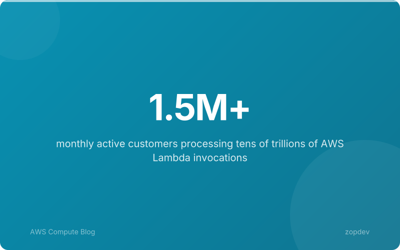
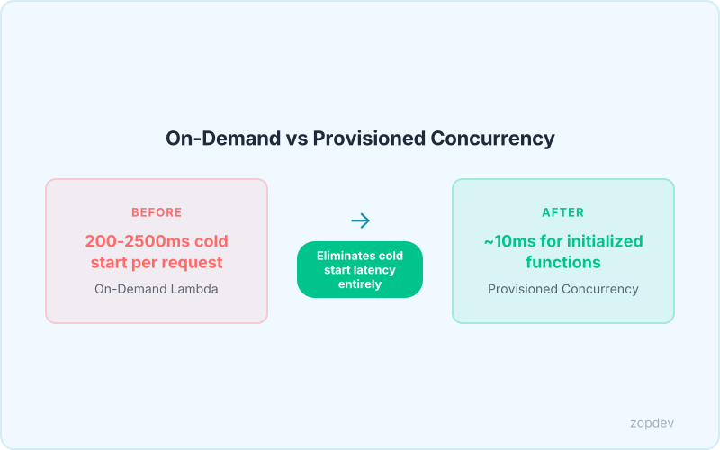
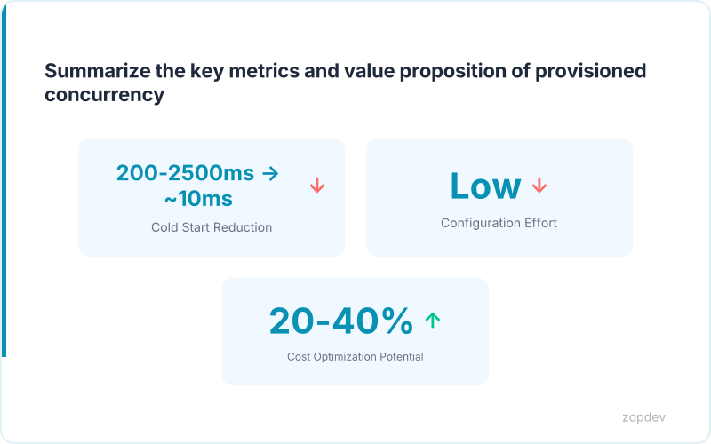

<!-- Generated by transform-chapter.ts with openai/MiniMax-M2 -->
<!-- Density: standard | Word target: 1200-1800 -->

AWS Lambda serves millions of functions every second across millions of customers. Its market dominance makes it the default choice for serverless architecture, yet a fundamental limitation persists: the cold start problem. When a function scales to handle incoming requests after being idle, initialization code must execute before the first response can return. This delay ranges from 200-2500ms depending on the runtime (AWS Documentation).

For e-commerce platforms during flash sales, this latency directly translates to abandoned shopping carts. Gaming applications experience timeouts during live events when player concurrency spikes. Financial trading systems lose competitive advantage when order execution stalls. Each millisecond of delay carries measurable business cost.

Provisioned concurrency eliminates this latency entirely. By maintaining warm instances ready to serve requests, developers achieve consistent response times regardless of traffic patterns. The following sections explore how to implement this pattern effectively.



## Understanding Cold Starts and Their Business Impact

When a Lambda function receives a request after idle time, the service must initialize a fresh execution environment before processing can begin. This delay—the cold start—directly impacts user experience and business outcomes.

The initialization process unfolds across three sequential phases. First, Lambda provisions the underlying compute instance. Second, the runtime language bootstrap executes, loading interpreter or compiled framework components. Third, function initialization code runs, establishing database connections, loading configuration, and preparing dependencies. Each phase adds measurable latency before the first business logic line executes.

Cold start duration varies significantly based on implementation choices. Memory allocation affects CPU entitlement—functions with more memory receive proportionally more processing power, reducing initialization time. Runtime selection matters enormously: lightweight interpreters like Node.js and Python initialize faster than compiled languages such as Java or Go. VPC configuration introduces substantial overhead because networking setup requires additional seconds. Large dependency graphs extend initialization as libraries load into memory.

The business consequences extend beyond sluggish responses. Research demonstrates user abandonment rates spike sharply after three seconds of等待. E-commerce transactions fail during traffic spikes when initialization delays cause timeout failures. Gaming platforms experience player disconnections during live events when cold starts prevent scaling fast enough.

Capital One's serverless transformation demonstrates this optimization delivers measurable value when executed with performance-conscious architecture. The key insight: cold starts are not an immutable Lambda characteristic but a configuration problem with proven solutions.

Pair provisioned concurrency with AWS Lambda Power Tuning to optimize memory allocation for both latency and cost. Manage these settings through AWS SAM or Serverless Framework as code, ensuring your infrastructure matches production traffic patterns.

## What is Provisioned Concurrency

Provisioned concurrency transforms Lambda from a reactive service into a proactive one. Instead of waiting for the first request to trigger environment initialization, you configure a pool of warm instances that remain running continuously.

When you set provisioned concurrency, Lambda maintains that many warm instances ready to serve requests immediately. No initialization delay occurs. You pay for the configured concurrency measured in GB-seconds, not per request.

This eliminates the 200-2500ms cold start latency that occurs with standard on-demand Lambda functions (AWS Documentation). Each pre-warmed instance keeps your function initialized and ready to respond in milliseconds.

The configuration attaches to a specific function version or alias. This enables controlled rollout through alias routing, allowing safe progressive deployments of new function versions (AWS Documentation). You shift traffic incrementally between versions without risking user-facing issues.

For latency-sensitive workloads like financial trading systems or real-time gaming applications, this predictability matters. Users receive consistent response times regardless of when requests arrive.

Pair provisioned concurrency with AWS Lambda Power Tuning to optimize memory allocation for both latency and cost. Manage these configurations through AWS SAM or Serverless Framework as code alongside your function definitions.



## Configuring Provisioned Concurrency

Configuring provisioned concurrency requires deliberate architectural decisions around aliasing, scaling behavior, and verification. The process begins in the AWS Console by selecting your Lambda function, choosing a specific alias like "prod" instead of $LATEST, and entering your desired concurrency count. This ensures every deployment remains version-controlled and rollback-capable.

For automated deployments, the AWS CLI provides direct control. The command accepts your function name, alias identifier, and concurrency value as parameters. After execution, verify active configuration by running the get-function command with your qualifier flag—the response displays current provisioned concurrency status and allocation details.

Infrastructure-as-Code templates codify these settings alongside function definitions. The SAM specification defines provisioned concurrency as a property on your alias resource, enabling version-tracked deployments through your CI/CD pipeline. This approach ensures infrastructure matches production traffic patterns exactly.

Two scaling strategies govern provisioned concurrency behavior. Manual provisioning fixes your warm instance count regardless of traffic volume, delivering predictable latency at constant cost. Auto scaling instead adjusts capacity dynamically, matching pre-warmed instances to actual demand and optimizing spend during low-traffic periods. For production APIs with variable patterns, auto scaling enables cost optimization by matching capacity to actual demand.

Alias routing enables safe progressive rollouts of new function versions. Always apply provisioned concurrency to aliases rather than $LATEST, and increment your alias pointer across versions during deployment rather than updating the alias itself. This preserves your provisioned pool during code changes and enables instant rollback if issues emerge.

Pair provisioned concurrency with AWS Lambda Power Tuning to optimize memory allocation for both latency and cost. Manage these configurations through AWS SAM or Serverless Framework as code alongside your function definitions.

```yaml
# StorageClass: provisions persistent volumes with cost-optimized settings
apiVersion: storage.k8s.io/v1
kind: StorageClass
metadata:
  name: cost-optimized-ssd
provisioner: pd.csi.storage.gke.io
parameters:
  type: pd-balanced
  replication-type: none
reclaimPolicy: Delete
allowVolumeExpansion: true
volumeBindingMode: WaitForFirstConsumer
```

## Auto Scaling for Provisioned Concurrency

Application Auto Scaling provides three distinct mechanisms for managing provisioned concurrency, each addressing different operational scenarios.

**Target tracking** maintains a concurrency pool based on utilization. You specify a target value—the percentage of provisioned concurrency that should be in use at any time. When utilization exceeds your threshold, Lambda scales out additional warm instances. When utilization drops, it scales in to reduce costs. This creates a self-regulating system that responds to organic traffic changes without manual intervention.

**Scheduled scaling** pre-warms capacity before predictable high-traffic events. Black Friday launches, product releases, and marketing campaigns generate known traffic spikes. By configuring scaling actions to trigger at specific times, you ensure warm instances exist before users arrive rather than reacting after latency complaints begin. Square Enix uses this approach to handle 30x traffic spikes during major game releases without cold start degradation.

**Step scaling** responds to CloudWatch alarms with graduated actions. Rather than linear adjustments, you define steps: a minor alarm triggers one additional instance, a critical alarm triggers five. This prevents over-correction during moderate fluctuations while ensuring aggressive response to genuine emergencies.

The scaling policy requires minimum and maximum bounds. Setting minimum scale to 1 ensures at least one warm instance remains available regardless of demand. Maximum scale caps total provisioned concurrency to control costs—this is critical because provisioned concurrency charges accumulate continuously regardless of actual request volume. The cooldown period prevents thrashing between scaling actions, allowing each adjustment to stabilize before the next begins.

```json
{
  "TargetValue": 70.0,
  "PredefinedMetricSpecification": {
    "PredefinedMetricType": "LambdaProvisionedConcurrencyUtilization"
  },
  "ScaleOutCooldown": 60,
  "ScaleInCooldown": 300
}
```

Pair provisioned concurrency with AWS Lambda Power Tuning to optimize memory allocation for both latency and cost improvements. Use AWS SAM or Serverless Framework to define scaling policies as code alongside your function definitions.

:::: {.content-visible when-format="html"}
::: {.chapter-diagram}
<?xml version="1.0" encoding="utf-8"?><svg xmlns="http://www.w3.org/2000/svg" xmlns:xlink="http://www.w3.org/1999/xlink" data-d2-version="v0.7.1" preserveAspectRatio="xMinYMin meet" viewBox="0 0 3715 309"><svg class="d2-1030158598 d2-svg" width="3715" height="309" viewBox="-9 -9 3715 309"><rect x="-9.000000" y="-9.000000" width="3715.000000" height="309.000000" rx="0.000000" fill="#FFFFFF" class=" fill-N7" stroke-width="0" /><style type="text/css"><![CDATA[
.d2-1030158598 .text {
	font-family: "d2-1030158598-font-regular";
}
@font-face {
	font-family: d2-1030158598-font-regular;
	src: url("data:application/font-woff;base64,d09GRgABAAAAABUwAAoAAAAAH5QAAguFAAAAAAAAAAAAAAAAAAAAAAAAAABPUy8yAAAA9AAAAGAAAABgXd/Vo2NtYXAAAAFUAAAA5AAAAUwqpCc0Z2x5ZgAAAjgAAA3WAAATCIAhaQ5oZWFkAAAQEAAAADYAAAA2G4Ue32hoZWEAABBIAAAAJAAAACQKhAYCaG10eAAAEGwAAADcAAABAHWcC35sb2NhAAARSAAAAIIAAACCpXyhRG1heHAAABHMAAAAIAAAACAAWAD2bmFtZQAAEewAAAMjAAAIFAbDVU1wb3N0AAAVEAAAAB0AAAAg/9EAMgADAgkBkAAFAAACigJYAAAASwKKAlgAAAFeADIBIwAAAgsFAwMEAwICBGAAAvcAAAADAAAAAAAAAABBREJPAEAAIP//Au7/BgAAA9gBESAAAZ8AAAAAAeYClAAAACAAA3iclM/LLqNxAMbh5+thOodOOzPtzDj7Skudqs5aGyJiIZKGsLeUuAKX4S5ErBGJw40IN8HyL6kuuvWuf4vnRSQpQlYqWkdNLCUnVjFh0pQZNbMamjZs2rJtV8u+Q8dO40LpLATEyqpdfb2r39Gy58CRk48+vCjK+ikvLSETXsNbeAwP4T7chdtwE67DVbgMF8/x03lb95lFVjUsWrKiaV7dsjHjqp0/0x3hnISklLQvMr765rsfbVVO3i+//VFQ9Nc///Xo1affgEFDhsVKRowqq1iwxjsAAAD//wEAAP//pjcxAnicfFhrcBvndb3fBxAgCfABAoslQLx2l8TiDRCLxYIECJB4kBBFEBQomiIlUhJFiZT1iMXGVlzLclLLkqK6DeM4rSfROErrmdhTeyJPppIzmvRhxS7VxM5jWjuuIyXtdBhPrTY1izRxbC46uwApMp7mB2c5O7vfvffcc869C6iDKQDM46dBAQ3QAm1AAHA6StdFsSyjFjhBYEiFwCKdegr9VFxGaEdEGY0qu9Pvpx9+7DG05yx+ev1477mFhddmT58W/2T1PTGM3nwPMCgAsBUvQwPoAPRqjnU6WUalUug5PcMy6u/ZX7O3OVqVLY5/uTN7Zyr5yxT61Py8cKKn54Q4jZfXH1hZAQBAEKmUcQe+DFaAOtrp5CPRKBc2kmqnk6FVKsJgNHLhqECqVKhU+tzOkXPjiX0WvzntSc5w4b3J4LA9wM5pdz1z7P5nSt2OqIUeeKhUejjtoiP+sHz+NAC6g5dBI9dNUARHMARFTKM/FN/58EPUjZcH3xz6r6HNXJz4Mjj+v1ykVHiG53QqFdp33/mR0YuT2RlLwJQOp+f4U0eZfv0fv20/WkuHs0XNnQMPlc58kWj7q5x4l/LW8sEpvAxaKR9OxyFOrWcUamJ6XIF0s2/858x3T+Fl8Tra8VvxfjTxxA83avg+Xoa66jsUMT2O7Hh5/foQbNSIH8XLEoacjtMbjSQXjQp6TsfoIlGBUSsYBcsYjYRuev6sltQqtYT2zOHReoUyckY4E1Eq1HhZ/As6R9M5Gs2uP4CO+o55vyy+iHZ/2XvMJ/45AGA5hkbG0SBHCRuNhEHFMDodF47yESfDTN8YPpk8f/z43H3jk/fN4uXOifzCvPgxyg8MDgmbZzjwMjQDueUMqf6tx7yRWYyPZb8x++zpk4VSqXASLzO7siMzOvHfECG+j6ZS/QORat2eShn9El8Gv9wvVpC5wkecTpYN4O3dk4hEkjZMGFQq1Jp7yBtm9nMDeWu3fdbe5+Zn4/F5xm/bERAyVNg84+zrjM5reV9vlz8eol2WZneTJx0KF/3+zqiVivjsbrPG1eof6I5MhAHBZKWMA3hZ0pbMGx2nq/I2Kv+rUqFM5lhy3J3z+gbdY8n7tdEzR9HnxEeLe53OvUX0uPjY0TNRQFJRWIGXoQmAU2zpo+LHP5462tahV7ZZdEcnfoiXxWd7D/f2Hu5Fc+sPAJZ4i15Ga2CGTgCSlogrROSy1awMAqFjJHGyEn1lIr/at+sLX9V5XZ5hq4M+1Ds1llUr6F1GJsk8fDCs3TEwNqGzxxiHocfoPrFXfKvX4knT9gstiaC7CzCUKmX0EV4BfU0pLKNmdByhrsYyyIGkXtIqNWE0Ije9w6FQp0uYKrr2z8X3DyaK8Zy9n3GktJQ1jFde3WNlz58afyiZW5geO0Q7Khay2t9ApYy+idbA8vv0KFlDW/9iYuBYMpQzeYig1ZdjxzN0r7GTGtMmlsZKSwmajOrbgxOx8QWrQbBSEheDlTJ6Z6OGKmby4SzPbYAl8JuBfrP3ZPyg4Ek6lONZtcIyYupP2HtsbMo5qH3i4eIfJG3m8RvrsR6LO5cRLWRwPDZ5CLCc/z+iNWgH+7YKJNJTm8amoGSoEDlwfzI1L8wcRlh8pW5ykIl3WO3F7yFlqofbpe1bKo4tJc8sNpkaCvsIXdRgQ87hQlHGyQaAUvifqt7O8AIfqeHE0ITkd7oD6XRuB+lpbeuwZBcW0F8m6wrDkw3qlHa2kBFnAEAB/ooD3UVr0A19UNhkEe/ccpEP5QhGVq2KodlqD2o9V2z0nDAY9TUt087qM/879YCTajPR+nY2vLvb0Nn0wryODI2FWbqprat7dmIicXLE05fwehN90cHdXHB3M9Vqbt/582zK3mNUalwWe6BJach6+VGPui7VytsjI26dpsNA2oQ+/0gQvZzi+USC51PixT4nbVYq9R6CDcjYlADQ23il5lobHJWcUeanrlRSMIVwYajkC3XFu/DKq/NU8OCM+H3kziadXeIVqFQgBwDfwtewExIAoIK+M1V+lipl+AlegZYqXrLsa019IeAuNTco1WpNvVHbw+Mj60/rdQgllcpqTvgDtAaUnJMkcgnZbZmpN6+lrFrhGPHGUi3OUd/OHSVfIJot+YLRLFodZILdPndkI92d4pXaZaNutFaruxZja91ZtYIZ3SxcPmxb3TX+/jdagxbo2Mbf7RonDEbUEl9IpRbiiSOp1JFEqlBIJUdHa9pLLJXGlhLZhfHdi4u7xxdA9g8OfYTWatq7l53MKidLEvqt/iFlShW9s3Px/TE6Q+PTsn2kOqnkG/hbMYvrwqnSQ0mbeeI5pNrmH5LGOfTORpw6XpCP3ySywOkUWzWOziutOz1VofdTuD79g02Rv/HSHotLFrrVGlgvINU9lW9wbBatSZvQJtY1l6oCbcq7rWSr1tBiz5jQ6p5AtDGvVIaTYm0HslTK6HG0Bh6ZR1vnmDzGfmeKVYfYjyKzjNuR9YZCFNdBpz1TRf+oxWWKOgJeW6iDyfrdRS1rEUyU326iycYminfHiw4yom/3WEgroWmihACbdsnx2ytllMMnpaks85jhBYGTjWOTz++P9uVHGnOPP055mmzaVkNQO51HTcm6ixcz4pq/u0GZVGvks3ZWyuhNtCrxbpsmdDVb/XkhP+4NOeO0hAs9oj04gyLi29kk60VTonnEFQIk7UboH9DqJ+fgjW9O7NOQGqWGbNy360W0Kt7tzDNMvhMZRLNUBwC+hlZlXW19b8sJjKK6p6oVX7uwO1/frFbWtzbsHBtp0NUr61vUQ6N/ND/Y0NKgrG9tzKJV8Rd0hqYzNDJt+c+M6phsV1eOET8GBM0A6CpaBRMAJ7AcWQslcGqSqe3EanXz1740NaBpb1JqjJr4fV96dmqoydysbGrXpsX3juk9BoNHf+yDX50y+gjCS56ScdRWgjIGHVs5IQjb4GjG061WbWu9ocEdbdHcnDikMWmUGkPj5Nh1XTD3I5VyANfF/Z3oF+L/2PM0lXegpvW10IhfOt8OgL6AVqEBgOMRw1MEogg7gn9HIxVA9T50OuMTP5+RdeSrlNFr+BJoNhgSqcl1qwd8eODEiQP7T5zYH8tmY7FcTvvSla8///zXr7yUfuzJJx955MknH5PrKgKg6/isvP9Ko5aPRgXJmItPfdo3YE6dy6K3+Hqydf31bFUbnQDou/iShAPHJ3HNFthNw5AMnSNcB84PJvpcWUvQtTc5dSTz4Ig5Zvp294EvPsgJg35H0McvTCQeuVDEyiFAYK6U0d/gS5/UG8NLO9vvhJA8SIp0d+SIw2MdjfUOs1Mj2SId51wZq69rOjZ+vD/SOxbbrxWYqC3Qzzt7HClHlApGO60Rxj9R6B02KJvG07GSD7DkEeif8VlokBQicNJ0lSii5ykeSTgwxOKKEim15mZO/Fek2zc5ufZtc95E+kgxcjWKnhE/nb4q4WKqlNHf47O17eVeDXLqeopg1Pes+j9G5imXdSQW3zWcpIJWH4FSv9aRAaswFe2b00apqMVfzKSHDXoL4oa+o2327snlDoarHhqqlNEtufcuAESr1BuBFJ/cyO4tgKjOnrfVD/UF++OR5Hxv7lOpyM6OgD5m8w8HsW2MHT8UmUB5l29mrpBK7hBfzH7+yGcvD7FWjuzgTh/u8h6a69sXkfvvk7wAn5W9IIkFiqeIZoX6ZRVbSImvoq/25F0G5Wf+9oXJIS7/xIWvVHcZd6WMVvAlsIMPemR85Ey3rDEyc4iqkyqi90hsVNSMV54Iv03MCoxgY6KhEjd+0OIyWMMObkbnYHp5X9ydrYvlQsWAkytq/WNhz0B3q9KUD3cPuw8MU/Fgi7LV1+cNjvrRorWfCaZjQWeYEV9PdbsjzjbToI/PVfF1Vcro7zbw1Ve9UkZTv9nV6LbBJef+YDzuGLLX5/sCA3u4gjlgEGzSHmQbc5UORSa41HxP7iT6TnKHyz9zsLD+G9YSIS2Rzxxx+mRgsxcXPnu59u04UCnDK7AkfR9vVfajJoYxtTOMlumwMoy1g5H2IPlZ9C5mIQSAjoJKugICN7yLWpAZFAACzxHu1XdTqer9n6HrqL16nyLc6E9/1tMj701jqAH/VOopWV0wSRlv8q3k4GCS6+3p6b16+Pa5c3fm2/ffXlq6vR8QOCtjcLv2Dit3TEKHMKim5Oe55ODg1drT7fN3zp27DQgaKwfQLvy6FJ9EHGpEmoT4qyuKIx9/pVp7L3oOLeIVycP1rMAKpMCRAqkm1ewlV8/BliMN3Q0LLQdj7BB6zjrrCpiOH2sPuGat91V/K3gK/TW+K317krzzngADSnlh5gjjvaFtU8o2cic07XA6CoGY4Oof6neNDSRCmQ6fhXcHovKN3UMnD9V5rT0WtifgjjgZb393Zqrx8KE6j7W7wxbxdQZp2j8YHZppPAwg9YOplBVGfBlYSAKgRmAhhZYAQA1JdAuqNdKwiH6AfVJ/5Z8ueHmwEz+5dm3g2rXFm8mbN5M3pefYyge4iNXSPKhjJZmxAiJQyntLHEbXbnlRa0vgRvZGQPy1EjZ2HngOrUrYcjpOVyqhVWkGV27hYRDwNSmebguf2u329na7HQ9bTe02W7vJKnGfqZRRAT31++fKK5lSKSP9OUMhJxsKaY/Pzx0/Pjd/nCuOjhYKo6PyN1BlqlKGj/BlKR814tA30P0x8c+0+Pn1PQDwfwAAAP//AQAA//8CAAhDAAAAAQAAAAILhQQwyLlfDzz1AAMD6AAAAADYXaChAAAAAN1mLzb+Ov7bCG8DyAAAAAMAAgAAAAAAAAABAAAD2P7vAAAImP46/joIbwABAAAAAAAAAAAAAAAAAAAAQHicLMq9LgRRAMXx/znTiRCNLJE1MRuMjx3FxGcUIiqF5BZkr0QvCk+h9BJUXkK9Go1Cq1K7zWZVIztRnOQk/58fGTAE52Q+ovYs0bfUPiXqm+hPoneJPiB6ng0/cOUMNKZ2SdCQvjep9ENfPboas+2cwIgzGkJ2THBBcLd1obXXBD2zpEDHOef6YNrvdPTKzOTrhWUltpS4UKKnxKISc0osKLHz30ol1vnlZDLtUeqLUhVBFau6YUpPHCpRZ/sUSqz4jjVGBGjedE/BZTP4AwAA//8BAAD//3WdM2kAAAAsACwAUACAAJYAyADiAPIBJAFGAW4BsgHWAfICKgJeAowCvgLyAxQDgAOiA64DygP8BB4ESgR+BLIE0gUSBTgFWgV2BbAF3AYMBiIGSAZgBooGyAbsByAHYAd6B9AIEAgmCDIIPghKCGQIfgiOCKwI7gkACRQJLAk4CU4JdAmEAAAAAQAAAEAAjAAMAGYABwABAAAAAAAAAAAAAAAAAAQAA3icnJTdThtXFIU/B9ttVDUXFYrIDTqXbZWM3QiiBK5MCYpVhFOP0x+pqjR4xj9iPDPyDFCqPkCv+xZ9i1z1OfoQVa+rs7wNNqoUgRCwzpy991lnr7UPsMm/bFCrPwT+av5guMZ2c8/wAx41nxre4Ljxt+H6SkyDuPGb4SZfNvqGP+J9/Q/DH7NT/9nwQ7bqR4Y/4Xl90/CnG45/DD9ih/cLXIOX/G64xhaF4Qds8pPhDR5jNWt1HtM23OAztg032QYGTKlImZIxxjFiyphz5iSUhCTMmTIiIcbRpUNKpa8ZkZBj/L9fI0Iq5kSqOKHCkRKSElEysYq/KivnrU4caTW3vQ4VEyJOlXFGRIYjZ0xORsKZ6lRUFOzRokXJUHwLKkoCSqakBOTMGdOixxHHDJgwpcRxpEqeWUjOiIpLIp3vLMJ3ZkhCRmmszsmIxdOJX6LsLsc4ehSKXa18vFbhKY7vlO255Yr9ikC/boXZ+rlLNhEX6meqrqTauZSCE+36czt8K1yxh7tXf9aZfLhHsf5XqnzKufSPpVQmJhnObdEhlINC9wTHgdZdQnXke7oMeEOPdwy07tCnT4cTBnR5rdwefRxf0+OEQ2V0hRd7R3LMCT/i+IauYnztxPqzUCzhFwpzdymOc91jRqGee+aB7prohndX2M9QvuaOUjlDzZGPdNIv05xFjM0VhRjO1MulN0rrX2yOmOkuXtubfT8NFzZ7yym+ItcMe7cuOHnlFow+pGpwyzOX+gmIiMk5VcSQnBktKq7E+y0R56Q4DtW9N5qSis51jj/nSi5JmIlBl0x15hT6G5lvQuM+XPO9s7ckVr5nenZ9q/uc4tSrG43eqXvLvdC6nKwo0DJV8xU3DcU1M+8nmqlV/qFyS71uOc/ok0j1VDe4/Q48J6DNDrvsM9E5Q+1c2BvR1jvR5hX76sEZiaJGcnViFXYJeMEuu7zixVrNDocc0GP/DhwXWT0OeH1rZ12nZRVndf4Um7b4Op5dr17eW6/P7+DLLzRRNy9jX9r4bl9YtRv/nxAx81zc1uqd3BOC/wAAAP//AQAA//8HW0wwAHicYmBmAIP/5xiMGLAAAAAAAP//AQAA//8vAQIDAAAA");
}
@font-face {
	font-family: d2-1030158598-font-semibold;
	src: url("data:application/font-woff;base64,d09GRgABAAAAABUwAAoAAAAAH7gAAguFAAAAAAAAAAAAAAAAAAAAAAAAAABPUy8yAAAA9AAAAGAAAABgXqrWeWNtYXAAAAFUAAAA5AAAAUwqpCc0Z2x5ZgAAAjgAAA2sAAAS0Iq5Dp1oZWFkAAAP5AAAADYAAAA2FnoA72hoZWEAABAcAAAAJAAAACQKgQYAaG10eAAAEEAAAADbAAABAHlPCnZsb2NhAAARHAAAAIIAAACCo16fNm1heHAAABGgAAAAIAAAACAAWAD2bmFtZQAAEcAAAANOAAAIcCYSZQ5wb3N0AAAVEAAAAB0AAAAg/9EAMgADAhoCWAAFAAACigJYAAAASwKKAlgAAAFeADIBJgAAAgsGAwMEAwICBGAAAvcAAAADAAAAAAAAAABBREJPAAAAIP//Au7/BgAAA9gBESAAAZ8AAAAAAesClAAAACAAA3iclM/LLqNxAMbh5+thOodOOzPtzDj7Skudqs5aGyJiIZKGsLeUuAKX4S5ErBGJw40IN8HyL6kuuvWuf4vnRSQpQlYqWkdNLCUnVjFh0pQZNbMamjZs2rJtV8u+Q8dO40LpLATEyqpdfb2r39Gy58CRk48+vCjK+ikvLSETXsNbeAwP4T7chdtwE67DVbgMF8/x03lb95lFVjUsWrKiaV7dsjHjqp0/0x3hnISklLQvMr765rsfbVVO3i+//VFQ9Nc///Xo1affgEFDhsVKRowqq1iwxjsAAAD//wEAAP//pjcxAnicfHh5cBv3df/7LkAsD4gkBCxWuI8FdgESBEAsFgseOHiBBHiIl0gJ4iWSoqyLOij95J8t13aicWWNzdieNAermUSejF1PUk8tzSi91MZq2nHajDOyJaeRG7fTxnVtdhp7ipqZjrnb+e6CIuV0+gcEcbn7fZ/3eZ/Pe28JFTAOQAwQXwcNVEEd7AYKgDd4DH6e4xhS5EWRoTUihwzkOPqNtPZOMqyNRLTh6JvNj506hcaWia9vnuh/ZHHxg5kDB6Rv/OyONIe+eweAkCUAIkqsQhUYAIwkz7Esx+h0GiNvZDiG/AX9Kl3vqNXucqzfu3zvMf4feDQ1PBxfTognpdPE6ubZN94AAEDQLJcIllgDO0CFl2WFeCLBx8w0ybKMV6ejTGY+lhBpnQ7tH31m78jl0fScK21JscJYZH401G1PB47oh7554vi3R2Kefqur5Vjh9JN+Zz7cjM8eA0AfEatQo+RMeSieYigPNYauSJ+sryM3sTr/6vyb8w9wJIg1cP1vOMowBEbgDTodOrz/ueHR5yZzhzCU8OTxpXl7rP7irzwny1B4d/8ez5PLp5+sq31+VvonT5OKhZggVkGPsfAG3siTRkZDUmPnNB8//ZP1p96YIValn6OgLJ1B8fN/CVv4f06sQoX6jIcaO4fqidXNu/Ow9XviG8QqxoxPNJtpPpEQjbyBMcQTCZEhNYyGY5wEZRj76rkaqlpbY6o+c+l4BanRCsd7TsS1GrKCWJV+5OpwuztcKLt5FjW68gXnt6T7iP2Ws5B3SfcACCWOU8FuUiLFzGbKpNMxDGXgY0KcZZixt/NnOztP987se6E/P0KssvsH+mbCn6LBC+kIxqqe0UqsQi3QO87AHDAGAx9LqMf8svtkprft6leeX5zu6u3tmiZWffvy/VMm6dcIZEBTLWKySc2dlUtok1iDRqVenGg2q4dwXJj4reKZaVqFjHZ3Ph7pZopNydaWUNGd4loWsi3H2DZXT0O4xRG1HWgtJI/qY+G9nmCYDfqMXG2oOxofa25iC1Zn0Gfx0DV+y0ivsF/AGIblEpEhVrGnFM0YeINJwZFQ/qvTob7+06lznnYukGJOtZ/St186jk5Jl3vHGGasFz0qvXj8Ujsg+QsAwk6swi4AXrOjjpq3fvr4VL21Xmuw1B288HfEqvRDcSmZXBJRfvMsEBCRS+iv0AZYgAGgvVi0opIyySkEUAYGe5LD0lW89KPsyJVvIi7m6/E0BI+0Th2crdR6+klns31xKKAfzu6drOda7KZBK3vyiPTLhJ0tOizLu3i/x6nUMC+XiCriNuwGJ86YY0jGwFOkGsukBMJl9JKU2YzEXFZTfXBF4yr4p5baZ/c2d8aS8aSV12fjxO2bozbv5TPjFzKzE2OFUfFDsxHzGZRL6CbaANv/4UHcCsxdxzPdZzoiOVvSGKDb+vOtDp6KeMf1qZWR0ZWUm+43GIuFfNFiGHA6gYBGuYTWidtgxE5ReVIO5gR+iyFR2AryX1PLbXNCQ5tduzJbqbX16cWoJWaJdLXqL///4XNph2Xv9c20YGNnxQ/p3fsG946r+sbY30MbsOdLHcRMmUiPeQu6hsf86JCteznb8UhLVzFcIb1VOdTmFm0cM3H9fizW2IWzGD6Xbjva4zN19BkNfbQTRVs6MqrubQCoSLyt9nFGEIV4mSPGS+H+Zpju7ByYtEbrzTZbem4OvTBRwQ8uVJMT+jHhoHQaADQQkDn032gDYpCGAYURVohjBrCAhG3ieYopO93LcmozLldaU640vmYsm9fL4Z9KrdNCzmjxUBYucYA3+ev+qKivj43H672Gml1M0+SBg9n/V2BizT5fLBZtKzQ1dAVsbPcv7C2NqZBWH3A6InVaY3djy1CQrNhX22hN9LM6stpkoPa0ZKN7w+hWPBLmY5FIXFqNuhwm0uHz+DEveQD078TtcofaEiXuhIohDPkVrWsgtrdvxRd0N7uI2zdnHU1L09JPkT8Vczml10CWIQ0AbxE/JlhoBwASUvBVhfO8XILPidtQp6pHsXm5oH+S4lfqq7QkWVft0heyRPfmTcqA0IRWp2LSVKIN8CiYsKkxqw8hIx9852crta58ONFhYAbDQ4VzfjbcsuLnwi1ovcsTjgTZ2BbclPRa+Wsrb7RRzrscY2fe2OJDDxJH653u8EN5l7X7BdqAui857yFT4+Ki3aljnZ3HUmn8bzqRTicSqVTZdamV0ZGV1EwxXyhi76n9Ik1UoY2y77bRlRVFU8YdDUPJfzAwdbh9VnRnnZoFtWHYYreJP4xb2ctnxy+kHZbRNURttwzF22m0vhWjQhCVox8IWOQNmh3eRo9qbTlWMXgw69JUH7y/Ze7b10atjGpwZ2RzDFHb7lY5voA28KbzgONyV1IJthY4hjLtMtc7sjRan4zy1YtabVNSuqt6do9cQi+iDQgo+tmeVaw6qx7qcbSToEy6d2KLvoSn0x9gXVGrOxOYG42POgWr4PD72gPebOO8nnMULE6vhbJR1XpGDHaM+uickXbRDmetnkmGMwcAgUkuoSJxBsyqbgVGEEVeWYJMZfl+vq83N1A798QTPbvs1SYTr1/Y+8lExTPPHPxkgtTuI2tU/N1yCf0LWscae0j/hnL7fB+rK+Butq/MVGncA/qlaRSX3k/F3D40LFF9bBgQ3nuUM9QZR5dnnMhrfvj980PVeDehqodOvYrWZV+BZQs+WaJU7gCIu2hd8dDO53acwJR3T5Jc+8q5tsoaUkvWVWWPdlTVV2pJPdl24olnWyprK7VkbWUSrctMzufr9crKd46RJepDpofjcsyvlHi1AOhdtA4WAN7I7QhD0ttxaq++dFGsoWu0VaaqyIUXr15s11t2aavNNXEE69OmRpOp0TT9m/88ZA5RVCN9CJ+rlxNK/tadGhDFh6jQ6Y6ZnLUUaaziIvqqN8/vq6FqtFXGqsKp6679f6vTFomKiN+FPvzM3ct4ez2fbcpjytleAPQyWocqAF4wMoKH0vCU99/eRjMf/TqNRg+mpNensFcCcgn9PXEZaso+V7VHmbDHFT2WV24zgoXz5xfwxxW12aIuZ9Ruj+p/cO3aK69cu/aDYuRYsfhIY+MjxeKxCI5fAEA/IS4quy0eqUIiIeImXFg9H8k5J56YQS/3VVl2b/7zjKonDwC6S1zGKHghTajtZWtnMel0uHnzFHvg6VyC96es2dBMx9TJzNGMpZW+2jXxu6eisfYGRzbCHzuQPP9YF1ExX/bYz4jLEPyyxxhhq4FtR8D9Bgf6dPCoV3QUovEOz0h+pi8W8qcdbcHplqmzbfHkQOqwXvAXHEG+ydNsHW8NBZo8tl5faHJEyJu0dcOZ1tGQOvt3K+8ZF6EKO0Tk8RTFMjEKHsGIeWCoS69qkVZvreWlj754dnh48wX7gN0StUqj3xtCV6SnD3zvQZ+4Q1wE95dyULAbPRRDbrflzwaPMoKjLyrksoKrwSEa0finu0ycRSyKmSW9wBRswWxrS9pgZFDrobXqmob9PT3zcRVvSC6h9xUdBACQV0duBdL89hvY9naH9LZ2W1U2HBCFQPpYpvdsR+u4PW0QHYHOoMY+4B07IhZRwhPYN5BpTbZIf9F55fjFb/c1OHOULXRkPxM4tJiZiSt5hpT3motKL0gTokfwULUa8g90vkJKehd9P9nD7daeufHyvkO5nt95+vemlZ0lWNauHYKQeDCldmwrO8qqSWyPLLOm3GoVZSOUnk/mmvx8bFKcOJxwhToTc7TVFgv5Y962inBbsKfRyXXrm4bibcN7tNZ8LN7fMDsYGaC1loFs81AYrVgTzgYxHHQ3uqQ7fIgJeQzmdn+kVeHVL5fQu1u8GtUeqbBofFDNxEMDSkH7NSFqT1mqshEuWWgZd6R3Y0YbCPsAM3pEPJhIH83kzqI/TrYy3PhAWiK2CPUGDi1mp/nOZ48//vt9qq8ycgnuwgv4fZfe4e4rrlDI5W5o0Ie83hD+4F1HuRf9K8FBFABNgA5/A4IGeAftQSxoAESBpxr+453xcfX6e+gm8qrXPVQDeu69gQFAMCgPIQvxAa4lrZaEVpim76RzuXRfMpFIXl/64NKlD5bcc/eXl+/PAYJGeQg2ys9wSq0wO5RJt6Lc35fO5a6X73Yrzyr9cw51EX+D49NGXqP/eOjj72qWvljD2KLoKfQM8Rbu3UZO5ERa5GmRJmmS+xrfumQ8WZOpWTYeaeX70VP++aZ2y5kzlvamef8kfrZJfgn9NfEJNAHQArtturBWkRdPmbeHs1OriOx+eNobZ/KB5iiXzqW5ka7haI+9zR73BSLqhcLyYkXANWT3hgOeJi8TykRy0/qlRV2jo8tqC3LOgNvT1MX3ztceAcC1cMolTSOxBhzeQFElcJBBjyobaBrdA7W2XlhA/0g049oqf4cQ1EF+78aNyRs3Fm6N37o1fgvfx8mfEiNEJZ4FFRy2FiciCqWTr0sr6PnXk8hYn/nO1Hcy0uda9dw8APw5Wse88gbekF9B6xIFSP4zogN6iB/jeIYdWnKxrMvFskSHz+nw+RxOH9a9Uy6hCfQS1OB3e/rhufLAiH/aMznZgz/uYNDtamjQn1yYP3FifuFkV3e+0NFRyHdjPPKkXEIEsYbxkIhHr6HDOemqnnhlswgA/wMAAP//AQAA//+zRwUjAAEAAAACC4W1v5+FXw889QADA+gAAAAA2F2gqwAAAADYXhEz/jj+zwhuA90AAAADAAIAAAAAAAAAAQAAA9j+7wAACJj+OP44CG4AAQAAAAAAAAAAAAAAAAAAAEB4nCzKP0ozcRyE8WcmL+EtgoJaLAqBBKLZJMYEbf2DLMJXEQI/RcETaB3P4RW8gZ1NLmDlGbQUBDsbxRWXFA8zxcf3nPEEHpY/PmDsVZKnjH1O0ifJbyQfkTwhucW675g4K7/9jy1vE3om9w59fZFrlzX/p+shoTp7WiRqJ4RHhDuVi8reEnog0zUrHlDog4bfyfTKwt/XjLZF1+LYomWRWSzNdzAvt+homf2qQ3p6oaeCUxX0dUlDj4wsNmtB06LtGzZUJ6CcaUqTq/LiFwAA//8BAAD//3HaJyMAAAAALAAsAFAAfgCUAMQA3gDuASIBRAFsAa4B0gHuAiYCVgKCArQC6AMKA3QDlgOiA74D8AQSBD4EcASiBMIE/gUiBUQFYAWYBcQF8gYGBjIGSgZ0BrIG1gcKB0oHZAe2B/YIDAgYCCQIMAhKCGQIcgiQCNII5Aj4CRAJHAkyCVgJaAAAAAEAAABAAI4ADABkAAcAAQAAAAAAAAAAAAAAAAAEAAN4nJyUQW8bRRzFf2unNhUiKghFqYSqOYLUrpMoqdrmgkMa1SKygzcFcdzEa3sVe9faXSeEj8FH4MYX4MypH4EDRz4ABw6c0byZxHVAkEaVmreemTfv//5v/sBasEqdYOU+8AY8Dtjgjcc1VvnL4zrdYMXjlbf23GMQ9D1u8Dj42eMmvwS/e/we27UfPb7Peu1Xj99nq/aHxx/UTd14vMp243OPH/CoUXn8IQ8aPzgcwLOG5wwC1hu/eVzj48afHtdZazY8XmGt+YnH9/ioueVxg0fNfX7CsMUGm2xgeHL99QxDmwE5JyQYIi4pqUiYUmLokHFKTsFM/8daG2D4lDEVFTNe0KLFhf6FxNdsoU5OafEZjzFckFIxxtAnoSSh4NyzHZCTUWHoEjO1Wsw6ETlzCk5JzEPCt7+lNSaTyiMKcv1idaeckDNhoHtGzJkQU7BFyAbb7LBLm3326LG7xHnF6Pie/IPPneuxx0u+lv6SVMrNEvuYnErVZ5xj2NRaKPefs8uUmDMS7RqS8J3qsQw7hDxlhx2e8/SdtC17k8qXGEOlrg2027pwhiFneOe+p6rW9tGee02mrrq1iMrvdLdnDGjpvFGtY3lmxDxXvwtS7Q7vpOaIWN017BNieOVZb5/MiktmJBwz9p4tkhjJp4oL+bZwdUIqlzNl2NY9V6WutitnIjocYuiJP1tiPlxisG/jZpo2lRZb00LZ8r2LHp8TkyrjJ0y0snhpse5t85VwxQvMDXdKTtWFGZX6UIorlM8jWvQ44PCGkv/3aKC/rr8nzK8T4qqzybDvu02k7kbmIYY9fXeI5Mg3dDjmFT1ec6zvNn36tOlyTIeXOtujj+ELenTZ14mOsFs7UMq7fIvhSzraY7kT74/rmH1/M6kvpd3lNWXKTJ5b5aGfLsmdOmwYetars6XOnJIy1E6j/mWaVjEjn4qZFE7l5VU2Fi/LJWKqWmxvF+sjck3WQq/Tshou/XywaXWa3BSobtHV8E6Z+e9pfXN+HemmoVQXPi1tqbO5jik5c7khV30ZCWeURHKulK/2zPdiyDWLCr2MkdRbt9pMlETri5sh1st/+3UkfYX643httqzTk2tHh+Keu+T8DQAA//8BAAD//9kvXF8AAHicYmBmAIP/5xiMGLAAAAAAAP//AQAA//8vAQIDAAAA");
}
.d2-1030158598 .text-bold {
	font-family: "d2-1030158598-font-bold";
}
@font-face {
	font-family: d2-1030158598-font-bold;
	src: url("data:application/font-woff;base64,d09GRgABAAAAABUkAAoAAAAAH1wAAguFAAAAAAAAAAAAAAAAAAAAAAAAAABPUy8yAAAA9AAAAGAAAABgXxHXrmNtYXAAAAFUAAAA5AAAAUwqpCc0Z2x5ZgAAAjgAAA3DAAASuOPtETloZWFkAAAP/AAAADYAAAA2G38e1GhoZWEAABA0AAAAJAAAACQKfwX/aG10eAAAEFgAAADgAAABAHzPCYhsb2NhAAAROAAAAIIAAACColSeLG1heHAAABG8AAAAIAAAACAAWAD3bmFtZQAAEdwAAAMoAAAIKgjwVkFwb3N0AAAVBAAAAB0AAAAg/9EAMgADAioCvAAFAAACigJYAAAASwKKAlgAAAFeADIBKQAAAgsHAwMEAwICBGAAAvcAAAADAAAAAAAAAABBREJPACAAIP//Au7/BgAAA9gBESAAAZ8AAAAAAfAClAAAACAAA3iclM/LLqNxAMbh5+thOodOOzPtzDj7Skudqs5aGyJiIZKGsLeUuAKX4S5ErBGJw40IN8HyL6kuuvWuf4vnRSQpQlYqWkdNLCUnVjFh0pQZNbMamjZs2rJtV8u+Q8dO40LpLATEyqpdfb2r39Gy58CRk48+vCjK+ikvLSETXsNbeAwP4T7chdtwE67DVbgMF8/x03lb95lFVjUsWrKiaV7dsjHjqp0/0x3hnISklLQvMr765rsfbVVO3i+//VFQ9Nc///Xo1affgEFDhsVKRowqq1iwxjsAAAD//wEAAP//pjcxAnicbFh5cBvndX/fBxArguCBY7EAiHuBXQAEQQCLxfIACR4geJjgJVOULPAQq4MWKUqxKJOOpLgzVu1WphrHVFXaytiOak/d1J7adTKjeKp0JtM40cSTurVdzXQmstN4NHHcWkyKpHFCAp1vAR5S8ge0mp3d937fe7/f770llMEwAJ7Bl0EB5VANOqABBK1L6xV4nqUkQZJYRiHxSEsNY13+lZd5v9LvVwaca44vT02hzCS+vDl/MDMz85uplpb8C995O38JnX4bABd+B4C78AqUgxZATwk8x/GsSqXQC3qWZ6k7NU9XV9ZWKjXm37375rtf9/3Ah/oTiciCEDuR/zO8srl49SoAAIJQIYfDeA1qAcrcHCfG4nEhamQojmPdKhVtMArRuMSo0MToxb1jl0aTh12DZokN9tXt6/UlTYOjmoG/OjH/3IjgnmRs0cnOw6c85uw0IMgAoLt4BSrk89IuWqBZ2kVn0Fr+97dvo2q8cu6Js1fObWNI4TVw/DEMJQgiKwpalQqdOPC1sfFnxnuOOjPmxsDAdPaggdPMf+7+UglIzDVptJ+aOXxKrT61nP/AFSpiwfN4BTQEi6AV9IJCzyooOrOq/N6173/6jRcH8Er+16giv5FfRvrD/wAl/P+FV6Cs+I6LzqwijFc2188V60Zivo5XCGYS0WhkhHhc0gtalsCXWIpieZ61Y5rOfONhtU6tVGvVx156kipXKMWJkYmYUrmHwiv529Y2u73Nitybi3edQ8OOq198cdUxPOS8C4DlHGEZt0HOEjUaaYNKxbK0VoiKMY5lMx/3nkmnF7tHepfbEym8wmeHBmYafoJGZ4UAwVmMsRevQBUwu2JQhCQkSrwY5rPuR1JJ8fIr50cGmltbmwfwinf/YO8Ek//9Z5+h6Ug4zJEzs4UcVuM1CMh94iWjsRiA50P4D5rGMEW0yND+ePRBdp8vVC/UjbkSXMvDqcZTgQec7TxX3xR4sCXdvKAJh47YObfNYdN5qhrSDfH9sWBgwlzrsNrtWrfpwe54thEQ9BVyeAivEMaXuTlRK2hlbsj/UaHBx5+83CxJib98QnPlZTSZX50eGJhGJ/LXXr4CqPAFABbwClQCCIpd/VJ89/tfH6xmqpVVpqrMlX/BK/n3xKPx+FERhTcXAUOgkEMfoA0wAwvAuAk5JfmIFC8fmNayRHcSoaisl++mhi+sYtbvaPeIDXPNU0eX1UpHzx6zVz+YcGjGk4P7q128iT5k8yw8kv9EsLKPMPpxdZ3NxMj96ijksBHfAENJDTxLsVqBpuRkckF5UnPWTdFGI+p2ddmUmtOrSlvKndjfkJjaz8X3Bf0Gn8blFPGN1wYstrYvDYw9llxODzxZ/yNdlcxdTyGHbqANsNyvtx25MSoVMnef7Oh9NBXqsXazTjGZDJtC+mbvPk3rmdG9i612Zso20NGeoaunnbVFrvGFHNrAN0APzq1ayYF5UdhVpS2C/Cp7smUq5m80q1aX1UpLGpt4nb7OwMYbNE8/NnKmzWoa+LvNroiFXTaYf6Sr6urp6wYsY/8p2gDTfW4hs9pFGEmwK4QYyYIcPY90ds239Ew0KHH+ljodEeMRbvL5t/igO65pWxwdWUwm51J6b3lccB2w2FGzX2wo6tsEgBbxTXIlmpbu4zexM+1DnZ2e4S5HrKa20qKptR84gM6fKKsV98U0qvmyMhdnP51/AkAB7kI9ptAGNEAL9MuV4cQYKQQhk7h1BEag2ZLA3bzcB0Ivg0qlKKpULpq+pFg3Jz/yq+bJxh59rdNk8TdPikHXt4eo8th+yebQuf3D2UOpc/02nrfZeN4fbee9gtmlqW1939IYTPiUlT5HbbRGqUvVJYZ8mrkKt6Gp36OuNup1LV3CSAjdDPh5v8/nD+RXPWamRqEwma22Ym06SLNljhJHKXGT1rJaGSWl7VilrA9ER/pWbU6rz4RvvHbAXDc3kX8XueI+M5N/EwoFkADgJ/h9zEECAChohYvF2IUc0uEbUF1k0JbGSVN/ONCyqi0vo1Q6jVdz8AHMbt5idAidKKOKmBQ2tAEuGRMRN+nWPcio7WsH0WQ6InboXf2R4QdWbU5vmPzTgNbbHfV1PndkC244/2bpsnVutFE6dynH7nMvq5XOzPbB0XrSXn/PuYv8lblQfd/E3ZF2qdPImDyZSp1MJhdSqYVkfShUH6qvL2mvdXHv6JnWpUx7xwCRYNE3erERbYAe7ADMDjqZThzP0Pod2yA4bX38Q7OJqbgzYSkb4uL76gIG33X8asTC/sXpseVkrXnoa8izbRpE271oQ47vBCgTJTnsligESdAqdmsbPawyd7qLAm8jDvXJtriv//WAySEL3OaMbO5Hnh11l7iFvoo2QHdPH4uqK1a4doCjrWpTpbnG2mpA6+PRSFnZ40qlP5r/GBDQhRx6EW0AL/NnZ0ZxxRm1HYxMKDumDar3I8e4TnfS4bLbQhZ7i+/hsaZxR6clZmlq4pyt/lkN58iaaxm91qhXazxN/u59vGm/wcibzFUVbFOoa6KoCW0hhxbwIpmyZDaJrChJgrz07BgqZIdSA9ovLy2xNo1ZzeglzfF9N0+oLlw4/YOAV6WcU2mKsRKFHPotWic8u0cD2pKN/sdI36rdaeWMq8sVCke/Zm4CxfIfiX6LDfXma7q9QUBk10EFtF6ad0xp3kmC4q2/vdyu1quV5Xp1x6VraP0X3gzPZ7y/yNds+R5eR+uyjna/tysCW9o1KeryuWfDKrVKSVWWS483lldTSqqcavjzpdfqqUpKSVVQQbR+x9vLcf3sHfna672Tr3mHTft8afYdOV8VAMqhdTADCHp+VxqK2clTtfbVF4Jqo1q5R7fHvfbMcy+ENYxGWW4o5xH+fJiuo+k6erjwy1E6SNN1xlESV1NoQ5tonahshweSdE8pqvCy0VVtoXR7vD419c+Xeyp0auUebXni0mtM49D3VMpTqMxjs6CffehOe9ke9sN8RdtYoNgjshB9C61DOYAg6lnRRSsEmnvvO+jUe7eGUOj0YP7fThPdeAs59Bl+CipKei9ykDYQrcu8LK3ZRrTn6PnzR8nP7GMYn9nkM5l8mm9eu/bKK9euffMR7+T4eNbtzo6PT3pJ/jQA+k98Vt5pyXgV43GJmHH64lKs1z2/tIROHlRbDZsbS0W8dgD0CX4KrOT5Nly0mdIOI7sEcXGB9o6cT0f8bsk03DCTSk6KLdmYKWH80wcz5x+ub4jwlqGoED3YKp48GVeUnSNxjYUc+gg/Bf779caKW2a2tSkZVMR8SK7/zZxgU7a0r6HR2t+9r93HuSV7f3CmeeYxSZB6OuY0Ud+E1cN7rH7jbAPn8totD3F1B/dG0kZlTaatZW9dcd/QA6Df4rNQTpSiF8g0JXTRiy5RT2rB0i89WYaUGktVNP8/P/9WXx/ac8wxYrfEa/MLa0fQV/KXTq2RMzCFHPoYnyUbxT1nkLHrXTRLbVfp/wbnuU5byhdpbgxavbZOHZr9tMLFSQcbO45rYt4JizcaCUerdAHUcW6pOjCeSh+OyVj9hRz6b5kHPgDkVlFbSRR/+NVFbVs30psFg7rR5WposLcudPed6Upm7Zkayco2swpzn210rnkKeW3uB5oi8Wgg/68dT59cWuurd+zX1XrH+53s1JHOqZjc/yAAuoPPyn7QhiWX6KKrFNSLKnc6kf8Zelvq8tYoj7/6/N5zD3U9evYZYmoKeff9ucwZHmLb02pnY9ndUsX9OwrHy7xGVPJwc7LeG45lW8aPR12h9sYjVt7vsQUSGm/YnfDR1mZNcEho7jcprb3R+FBgaijUY1SaB5PR4RD6Sn3YW+/x8sH8h7zP6rVp9aIt0AAY3IUcuiPX0w+gL/qjXD39dgfjxSF1z4R9NewxC3q15HaGW5MT9sGauNXT5MHmPlt8LNo83dRGioz+MRqQa5rXhOzFUjo8gfGuzmmh4+KpR5/rAwSthRzchdfJ9y2zS9VXOEHgOEHQiLxPFH28SHYd+Vn0S8xDGAClQEWugKAObiIXioACQBIFuu43N2dni/d/jL6NgsX7LroOXfzx5CQg6C1kkA9/RHrIFFvByDVm3k12dyezUjQqvXXs9oULt49xh27NHb81AwjChQyqKb3Dy45DqkMbVCvZxmi0MZvs7n6Lm7l1fO7WIU5+FxBUFqZRHL9D8jN6QVF5c/rmS4qjG8/Lvocm0N/gHxLf1vMSLzGSwEgMxVD85daWeWaxMlN52jTf0jqMJoKzkV7To0vm3shs8AB5ly88iz7AnxIuMiJXapMYCyllVgm0cefz0a6UuXUreIht57o9I1wileBG04fCvbb+2qjTw8k3hjILh8t4559Y7d0Wr9MdTNb3H6o6doQKOh40m+1uk8vuDHWEe49pZ4H0wVLIKdrxGvDQBoBUwEMSnZe3zzb0Uyj6pBsm0ec4Tvoq/81BLA7xf3/jjfk33pi8Pnv9+ux18pyvcBfvxeXE/8t4IideQjRqTV/JX0VHrqSRUTt0YfHCUP7Xyu2dGT5A66SmglbQdqyi9XwNoMLruAn24vdJPu0uHnlDIa83FMJNAZYNkB/xEEshh6bQs1BBtgzm3lmyrb5/Smez6Z5stsfMsmYzy2oWZmbm52dmFkYb0+l4PJ1uJHgKY4UcIt/yCgAKCejv0fRY/iUNfnkzCwD/DwAA//8BAAD//wGj90gAAAEAAAACC4Ut237tXw889QABA+gAAAAA2F2ghAAAAADdZi82/jf+xAhtA/EAAQADAAIAAAAAAAAAAQAAA9j+7wAACJj+N/43CG0AAQAAAAAAAAAAAAAAAAAAAEB4nBzMMUoDURRG4XP/gaAY9YoxhhQp4mg0MwQ7BTPFa4KCDwQNJJ2Ngjuw0h3YuwgbWzegYOcG3IZpnmSK030cvXPFJ6hKC00YKSfqiZHuiWoQtSDqhqg7okr29MqFyvSnTYaqCPZDroqBGuQ2paM2fZ0RrMWJ9QjZnKAxQUXtwtLaC8E+2LFntnTKWGs0sxU6EhtapWnfHMjZlzOR05PTlrMtZ1fOkZxSzlBO30qquksK+6WwGec249iuWbev+jPI5nSXVg8cWosA6c0e6XKbpv8AAAD//wEAAP//SRojuwAAACwALABQAHwAkgDCANwA7AEeAUABZgGmAcQB4AIYAkoCdgKoAtwDAgNqA4wDmAO0A+YECAQ0BGQEmAS4BPQFGgU8BVgFkAW8BewGAAYsBkQGcAauBtIHBAdEB14HrAfsCAIIDggaCCYIQAhaCGgIhgjGCNgI7AkECRAJJglMCVwAAAABAAAAQACQAAwAYwAHAAEAAAAAAAAAAAAAAAAABAADeJyclM9uG1UUxn9ObNMKwQJFVbqJ7oJFkejYVEnVNiuH1IpFFAePC0JCSBPP+I8ynhl5Jg7hCVjzFrxFVzwEz4FYo/l87NgF0SaKknx37vnznXO+c4Ed/mabSvUh8Ec9MVxhr35ueIsH9RPD27TrW4arPKn9abhGWJsbrvN5rWf4I95WfzP8gP3qT4YfslttG/6YZ9Udw59sO/4y/Cn7vF3gCrzgV8MVdskMb7HDj4a3eYTFrFR5RNNwjc/YM1xnD+gzoSBmQsIIx5AJI66YEZHjEzFjwpCIEEeHFjGFviYEQo7Rf34N8CmYESjimAJHjE9MQM7YIv4ir5RzZRzqNLO7FgVjAi7kcUlAgiNlREpCxKXiFBRkvKJBg5yB+GYU5HjkTIjxSJkxokGXNqf0GTMhx9FWpJKZT8qQgmsC5XdmUXZmQERCbqyuSAjF04lfJO8Opzi6ZLJdj3y6EeFLHN/Ju+SWyvYrPP26NWabeZdsAubqZ6yuxLq51gTHui3ztvhWuOAV7l792WTy/h6F+l8o8gVXmn+oSSVikuDcLi18Kch3j3Ec6dzBV0e+p0OfE7q8oa9zix49WpzRp8Nr+Xbp4fiaLmccy6MjvLhrSzFn/IDjGzqyKWNH1p/FxCJ+JjN15+I4Ux1TMvW8ZO6p1kgV3n3C5Q6lG+rI5TPQHpWWTvNLtGcBI1NFJoZT9XKpjdz6F5oipqqlnO3tfbkNc9u95RbfkGqHS7UuOJWTWzB631S9dzRzrR+PgJCUC1kMSJnSoOBGvM8JuCLGcazunWhLClornzLPjVQSMRWDDonizMj0NzDd+MZ9sKF7Z29JKP+S6eWqqvtkcerV7YzeqHvLO9+6HK1NoGFTTdfUNBDXxLQfaafW+fvyzfW6pTzliJSY8F8vwDM8muxzwCFjZRjoZm6vQ1MvRJOXHKr6SyJZDaXnyCIc4PGcAw54yfN3+rhk4oyLW3FZz93imCO6HH5QFQv7Lke8Xn37/6y/i2lTtTierk4v7j3FJ3dQ6xfas9v3sqeJlZOYW7TbrTgjYFpycbvrNbnHeP8AAAD//wEAAP//9LdPUXicYmBmAIP/5xiMGLAAAAAAAP//AQAA//8vAQIDAAAA");
}
.d2-1030158598 .text-italic {
	font-family: "d2-1030158598-font-italic";
}
@font-face {
	font-family: d2-1030158598-font-italic;
	src: url("data:application/font-woff;base64,d09GRgABAAAAABWUAAoAAAAAIJgAARhRAAAAAAAAAAAAAAAAAAAAAAAAAABPUy8yAAAA9AAAAGAAAABgW1SVeGNtYXAAAAFUAAAA5AAAAUwqpCc0Z2x5ZgAAAjgAAA4pAAAT7OIyojhoZWFkAAAQZAAAADYAAAA2G7Ur2mhoZWEAABCcAAAAJAAAACQLeAjkaG10eAAAEMAAAADnAAABAHHJBkpsb2NhAAARqAAAAIIAAACCrDCntG1heHAAABIsAAAAIAAAACAAWAD2bmFtZQAAEkwAAAMmAAAIMgntVzNwb3N0AAAVdAAAACAAAAAg/8YAMgADAeEBkAAFAAACigJY//EASwKKAlgARAFeADIBIwAAAgsFAwMEAwkCBCAAAHcAAAADAAAAAAAAAABBREJPAAEAIP//Au7/BgAAA9gBESAAAZMAAAAAAeYClAAAACAAA3iclM/LLqNxAMbh5+thOodOOzPtzDj7Skudqs5aGyJiIZKGsLeUuAKX4S5ErBGJw40IN8HyL6kuuvWuf4vnRSQpQlYqWkdNLCUnVjFh0pQZNbMamjZs2rJtV8u+Q8dO40LpLATEyqpdfb2r39Gy58CRk48+vCjK+ikvLSETXsNbeAwP4T7chdtwE67DVbgMF8/x03lb95lFVjUsWrKiaV7dsjHjqp0/0x3hnISklLQvMr765rsfbVVO3i+//VFQ9Nc///Xo1affgEFDhsVKRowqq1iwxjsAAAD//wEAAP//pjcxAnicfFhrcBvXdb73LoglKRAksACWgPAgsMAuHovXLoAFCOLFB/gC+KZISXyJkihRkmXKSiy5smRbmmoUtVYZjfqjHidW47STjJtEozQzTaKkdZRGslpl0lbppHGsjh+lE6kztjms6nrMRWcX4LPT/NnBELj3nO873/nOWYIq4AQAHUfXAAZqQD3QAj0APGHHMF4QKBLjGYbCcYEhCNx5Ht49/4qibc9/uK//D2tTdL70zd7/nHkDXVs9Bl+cfOEFce+lgwfHHj8WvfBfHwMAACr9AwDwl2gR1AANAATOMzTNUEolhDxBMRT+fvPtWkWtQmHixX+EB/YUBrW/nYfPLSxEjsQTh8RBtLi6cP8+ABAkSivIj14FNgCqHDQdjaQRzxlInKYphxrpdQYDz8UEUqmEjt7DsdCes4X4YGOMiNHN061OR0/S3dZEOSdVbaf7itdOdQpeTxOTOnC6JTkZbdrJ2fxAikEBgBrQItgh48ftOI9TuB2nLsAjdeL73k/UH/GQVqPF3C9bn7RWckqiV4FDzun/SUmgBB5TKiH77NnQ3pcGk4NGgRDc6dkOJ1XIOBOE61LdzxPOKdWXT/ddO5VfT6x5KtbY8L2s+IHVtZ7bGFoEKik3HuMhjxMUhuPUhb4cBrvHn/zp4Lkv+dGieAu2fy4eg7MXf7N2Dl5Fi6CqfE5C0/cs1NWhxdWbrZV7b6FFYJS/J0heIHiMImIxgcIxCpNqhWPUhcmEQZG/PXmht1BjUin632RTBoVSXd2DFsWvXroEZ1cX4DPsEd9V8etw4io7z4pXAJLv9st86uTbOYNep1RSFEbwXCwaoSmKuvD9iWd6XhqZj+SmDx4pdB1Eiz27Bg6FxU9h50B/gpc1JN/DoEVQBwwb90jwt9z01xMnjg+fHD72jNC+f+pAb9cMWswP7z2uEd+HBvERHB3Kx4JA5kRVWoEiehV4ASAdNCPIhYpGaIaRhBWLrVdRqdTrDCRpkPP+sG3BnbCMCi2DflfBm4xOJJMzNt6YD7iilrCzEIwk51TNzT4f1x53coaAqVvghriIO2D12EI76aDBb+4UmvdGAAT9pRU0hxYlNLJuYhLnUihJL4SsFuuBo0pFT19vTbYjvkc/WBgyn1fNz+mDRrggfsnvyBcnjsKr4tErz0l4hgBAOZkfwGM8YTCQfEy6CL6c7N9ZVY0pjFHT90bEb6JF8Vr0qVj06Qg8trpQ5pYprcBP4TLQSSyTGyrmBR6jBEqpZCQNr0v6u9kC2zPFMymNgkjvy1QrqHEt3e9k9ZzZ2Ra1hVV7R/PPTfBue0o0dbmC2UDw32iHt3uSy6TK8WylFfgxugv0kutI7FM4RfA4zsu063VqxHBpJJXUocRxg+ERk9JgusyVImNAzhG/HD7qbItaQx7HIBXQ8Sq3PYXu/njG4tuzSwqd9XZP8umU1/Uh7QAQuEor8CZcBuYt6DaqW3GNX/UfYIv7omyLwU/QltCuWKK5KWZwmIqqucn2k6NBhzFE6tsX2lrzJg2nc61zh5hNWDa4+/3kNWuxBrq4WGGvz7WdPaZp+ser8e30IRnL38JlYAKuzfHkbrAr1x0Q42OSmiWEH+ya9/dOhIScVVUl/rSmqc1rSZBWy+CflRCm9VDRKdWRfR0LQ2xggDPz6syAy6jh9Tbo2tFYZw7bRgEEPgDgy+gBIKXOozJoc3fgkkFivtHMjlxDfV/K5NXurN2psXuqNbOq/aPwG4mqwZ7huh0CXsv5htPiuMQZLDnhMlwGNhDY3H2CoFRSW9WnVGJb2HsjvItymjvc6R61kR4JpgZ83RNhOq3BiMwccTJBDTp8hrCZyvHW4G9oS5R0FLKHaXbXaNsXdnOSHrHpOWj3eX9BOzz58VAyWfYCGwDwV+huxf82dIjLJhiNSDAx25ViqEHhGWLT0ep0oUWh6DJ3BTrQ3ccpKpiL25ziPcjqGut6vQHxG6WSdCf4DN1ENGgBAChBqqsciy2tgM/QXaCVkEcj5VbX6ypleyqnPFM8C6EGU+Kw1qDKaIzo6OqX8RpMC1FSoVjPFz2Cy5J3SfmW0yUrSSu3ZL0ZwL4MrqCH6eZwVXDclYopFOliSqHo1HexHRKevKHL1wGXup1hwc3yubjGqtuMaePTBmdwGTRuzmE7ZVJEz1BgC2NyhO2EbfjQ23AZ1APLZm2XDUHWc6VhH/RPsT1TXP802zvl9Q/yMU56qA7v7Tg5Gig/s60L7a2dbQvtrXl5B3lS4uHHcLncp/imjNWIkh0IJ7Z4Tu3ljBJzjQbkduXoFgJpbX+x2XPuo+9mbf5Ks9oOvwZhxXTo37rsa3h42VflmFWCZAbb9L1V3dButyLXeGCzv15+bbM53H/tFB1ct9fVIoRbzbVcl+fhMmjYVBcSp9fqsUNhKfiN+p0NJmfBloJLk2yqpr06kxTvA1j6vLQCz8JlwGyfidtHojQRywPx9fCkMURmaW/KEw8k2G420GMOELydDsea0pHQkCripm3uAGVibKa0x5dzOa1unclvs9JaRwvrb3dJObeUVuA4OrbuzzFBchledpZN/vz9bEQBE507Cs7czjOqswnM7FCbdmgagqqMv95UB7WJqosX0+IjrdZqra0S8Hrp7nhpBX4El6TeJjfmbKXjiIpFv7HeDV2WTrajIA0194iqVdDYCBgTHxBGSaZwXDT1UHy5B5MAwHfh0v+dt+c7C06FUqHQOIk/KYqrcEn8kOqlnN1OaBRN5bN5ANAduATs285ufMIorLwj49g8VWiAECrqdza82KtBCCrUpoYXut6ZVst/tdQ/C5fE9xztDke7A1o3fTLBWqrL6eyixCcAlh4AAP+5zANFMDxZCSXwOElV9nEcZ3+9t89brcYV9U31o8N39/ez1ZpaRYODmILog2MGRq/z6I/91yfPGAIGA0ueBACWflIKwvfhEjABgMuakY18CyNqpKxtUhu1WlfOqB0u0NI2onFp/7ggvmdMdv0TjidqUhwFPxQ/shcpquCAmtVPgkVW5qr0BAD4bbgEagCgBEgJdhzyeG01bHunDqaqxR+JKhY+n/aLf5gu95y3tAJ/ji4DjcQuufGWsHWtkNvtLtfp8nbPRLm809M9HWbaIhY2ID9V8f3p3X/+fGfz/vSe62fyqfYTl9rbxjpOXGpvHQNQwgpfROfkdwSBJyghJvAYj5vq/mjmRO2okPzCeVUWPuRUjtWfZNcw/BRdls5RQhqrmAyzbkC4Ha+tnrkyFeSjTTkHw46Fhsa9Q88PQ50qMHhmdneAbbHbQrRnd3t0amahq1W6879LK/AtdBm4t/UqJaw7Jc6sTQR9uVl/mDto5cmecPvYyEFV/16G4y1tFmZ4cmCstyeaTM2rcn63I9Kb4FubPSmrN2Ym+cxAa2pCr9B0candYYlfqanuo3OgVtrn7ZRgF6CEnXLxgvS+oFTisLeLEn9XA6dGBoZVw2Lp72mlFlfo3LobEfiKuJBO/8iSs5sjjeVeAJLno3OgaTOOdQCEHafwtcGmvJWbsnCGXNzbxWYiNrbJPgB9db+LaLzGrum246qM32OPeIt8uqVBY4L+1lvVqtHhwtMpWRd8aQU+RpdBPWABEHSboyh15Ja3SWnIbAQ9k+ToFornjP1OOB8b8PkHnspGO3QRRws3llHbR+ydo8L0vY7RYI9byDmCO8j34vsys6+fag03eZrbzozQzvG+9BFJB2AeAFSFzsnvb2kk2AU7rkb4aUvP04PiPTW8Urv/2Tby9J1vDbRyk7d+9hQAAAP20gr8NboMbMAHEmuKjsWE6LonlytsRVKyxBoovc6AlRHSjDwyHwbG4r52xmyNjHGe7kBe0LnNLfssrpa4l82nrc6s29PGcK3dKmd3PNwT1SjMSUYoeptyXHaXTVHniTuah/3wYGMPF4wko1xS/IEl7nbxHr25Ny5U9vqG0gq8s8YxUfbtWKQytok1d4itrXlr2avRyxGucYCCSc7V4myIdOgiTWluV6bOPmzPjwpTSaFfYh1+q8yvSuJatIXsEr1DLmq8LzOfFWYz+75+qrWsKbK0Ai6BY1J/lj2/XMq8wciYDY0uldlgYi0GIwtKJfm3d+E7iAEhkIUngBKEKu/MD2EtNAIMAMkkKdXbdQ/X9kUKvAvfgGT5OztO7YBnVe/GYvJ3udIAHENvS31CVkpFKuV/BJB/0GgXDvf4jxyr0alvZF8f+uJbP5w0XhT//auBuRla6ukHpQHwqHKWiWnl4gnl1oX+I0drtPWcdMUN00Vo/0pwbpomsl8b+uK9H0hn/6Y0A7+GfiblhEMedsGbcbF4HZv7/JVyzmfhX8KvoLeAGgCCERiBFEhcIHESZ240dYxr9xvZ6kP4IdodgTct42G3/YjiqNpn20eOAwg0pavwF+gjeVsX6A2zCShkfAKPGzY2Aysm5YvjV3RsrylM5v1C3haOhW3+AV4X11MpA6drpkJpXzbjCwwndMfnajhbyBrKRpxRH+OP0+FiAJs9VMNa/BZ3wu+K+CP5SGQkopgFQKpXqrSCPkbXAQPSIADVgAEZuAcAgIM0vAHKWEPgELyHvFL9hSgV5aO8ntdT+off/k7Ld24cupO4fTtxR/qdrvQxSqMqabZUMYI9amcEqIdx5raYhX93m4HKBu+bmTe94qdV63s3uA+XJI55gsds+4qzcEke6hB0ol5wE92UYhKbNHeasFKkzkKhXtJgtDcajE2Sh5ZWYBZeBfXSjdv33M0T6nJzrjHY7pOebYyZtTY0ueSnaiwXnCgGxnKByWKAc6W7nYGW8lOemf7SCuxA19e08C/wg4hoVqG/Wh0BAPwvAAAA//8BAAD//zPaJgcAAAAAAQAAAAEYUTbcqV9fDzz1AAED6AAAAADYXaDMAAAAAN1mLzf+vf7dCB0DyQACAAMAAgAAAAAAAAABAAAD2P7vAAAIQP69/bwIHQPoAML/0QAAAAAAAAAAAAAAQHicHM7BKnxxGMbx7/PO8v/XjKjDbH7p58wpQ5SNCQsLbJRocgeKva2bYOcerGwsBxul2MwFvC5AyWJGklfH4qln862PnTHPI+gnnqxDT2Oy7dGzZbKeyXZHtg7ZumR98d9O2Nc7hzZLZTMk3VBaQaVXSrXp2hSyfyTeSHyy2EgkmyBZg8qKGNWdjki6iG9ts2Et1jRg3R7Y0XUMNYh7XcVIzoKctrz+MZbTlIOcVTmncubktPigqKfa90JWZktlDNWPW11yLmeyUbApZ8UOmP5zwa6OadKPpV8AAAD//wEAAP//8LY+TgAAAAAuAC4AUgCEAJwA0gDuAP4BLAFQAXgBuAHgAf4CNgJuApwC1AMOAzYDfgOoA7QD1gQYBEIEcASqBOQFAgU+BWwFmAW2BfAGHAZMBmQGlgauBtgHFAc8B3AHsgfMCCIIZgh8CIgIlgikCMII4AjwCQ4JVAlmCXoJkgmgCbYJ5gn2AAAAAQAAAEAAjAAMAGYABwABAAAAAAAAAAAAAAAAAAQAA3icnJTbThtXFIY/B9tterqoUERu0L5MpWRMoxAl4cqUoIyKcOpxepCqSoM9PojxzMgzmJIn6HXfom+Rqz5Gn6LqdbV/L4MdRUEgBPx79jr8a61/bWCT/9igVr8L/N2cG66x3fzZ8B2+aB4Z3mC/+ZnhOg8b/xhuMGi8NdzkQaNr+BPe1f80/ClP6r8ZvstW/dDw5zyubxr+csPxr+GveMK7Ba7BM/4wXGOLwvAdNvnV8Ab3sJi1OvfYMdzga7YNN9kGekyoSJmQMcIxZMKIM2YklEQkzJgwJGGAI6RNSqWvGbGQY/TBrzERFTNiRRxT4UiJSIkpGVvEt/LKea2MQ51mdtemYkzMiTxOiclw5IzIyUg4VZyKioIXtGhR0hffgoqSgJIJKQE5M0a06HDIET3GTChxHCqSZxaRM6TinFj5nVn4zvRJyCiN1RkZA/F04pfIO+QIR4dCtquRj9YiPMTxo7w9t1y23xLo160wW8+7ZBMzVz9TdSXVzbkmONatz9vmB+GKF7hb9WedyfU9Guh/pcgnnGn+A00qE5MM57ZoE0lBkbuPY1/nkEgd+YmQHq/o8Iaezm26dGlzTI+Ql/Lt0MXxHR2OOZBHKLy4O5RijvkFx/eEsvGxE+vPYmIJv1OYuktxnKmOKYV67pkHqjVRhTefsN+hfE0dpXz62iNv6TS/THsWMzJVFGI4VS+X2iitfwNTxFS1+Nle3fttmNvuLbf4glw77NW64OQnt2B03VSD9zRzrp+AmAE5J7LokzOlRcWFeL8m5owUx4G690pbUtG+9PF5LqSShKkYhGSKM6PQ39h0Exn3/prunb0lA/l7pqeXVd0mi1Ovrmb0Rt1b3kXW5WRlAi2bar6ipr64Zqb9RDu1yj+Sb6nXLecRoeIudvtDr8AOz9llj7Gy9HUzv7zzr4S32FMHTklkNZSmfQ2PCdgl4Cm77PKcp+/1csnGGR+3xmc1f5sD9umwd201C9sO+7xci/bxzH+J7Y7qcTy6PD279TQf3EC132jfrt7NribnpzG3aFfbcUzM1HNxW6s1ufsE/wMAAP//AQAA//9yoVFAAAAAAwAA//UAAP/OADIAAAAAAAAAAAAAAAAAAAAAAAAAAA==");
}]]></style><style type="text/css"><![CDATA[.shape {
  shape-rendering: geometricPrecision;
  stroke-linejoin: round;
}
.connection {
  stroke-linecap: round;
  stroke-linejoin: round;
}
.blend {
  mix-blend-mode: multiply;
  opacity: 0.5;
}

		.d2-1030158598 .fill-N1{fill:#0A0F25;}
		.d2-1030158598 .fill-N2{fill:#676C7E;}
		.d2-1030158598 .fill-N3{fill:#9499AB;}
		.d2-1030158598 .fill-N4{fill:#CFD2DD;}
		.d2-1030158598 .fill-N5{fill:#DEE1EB;}
		.d2-1030158598 .fill-N6{fill:#EEF1F8;}
		.d2-1030158598 .fill-N7{fill:#FFFFFF;}
		.d2-1030158598 .fill-B1{fill:#0D32B2;}
		.d2-1030158598 .fill-B2{fill:#0D32B2;}
		.d2-1030158598 .fill-B3{fill:#E3E9FD;}
		.d2-1030158598 .fill-B4{fill:#E3E9FD;}
		.d2-1030158598 .fill-B5{fill:#EDF0FD;}
		.d2-1030158598 .fill-B6{fill:#F7F8FE;}
		.d2-1030158598 .fill-AA2{fill:#4A6FF3;}
		.d2-1030158598 .fill-AA4{fill:#EDF0FD;}
		.d2-1030158598 .fill-AA5{fill:#F7F8FE;}
		.d2-1030158598 .fill-AB4{fill:#EDF0FD;}
		.d2-1030158598 .fill-AB5{fill:#F7F8FE;}
		.d2-1030158598 .stroke-N1{stroke:#0A0F25;}
		.d2-1030158598 .stroke-N2{stroke:#676C7E;}
		.d2-1030158598 .stroke-N3{stroke:#9499AB;}
		.d2-1030158598 .stroke-N4{stroke:#CFD2DD;}
		.d2-1030158598 .stroke-N5{stroke:#DEE1EB;}
		.d2-1030158598 .stroke-N6{stroke:#EEF1F8;}
		.d2-1030158598 .stroke-N7{stroke:#FFFFFF;}
		.d2-1030158598 .stroke-B1{stroke:#0D32B2;}
		.d2-1030158598 .stroke-B2{stroke:#0D32B2;}
		.d2-1030158598 .stroke-B3{stroke:#E3E9FD;}
		.d2-1030158598 .stroke-B4{stroke:#E3E9FD;}
		.d2-1030158598 .stroke-B5{stroke:#EDF0FD;}
		.d2-1030158598 .stroke-B6{stroke:#F7F8FE;}
		.d2-1030158598 .stroke-AA2{stroke:#4A6FF3;}
		.d2-1030158598 .stroke-AA4{stroke:#EDF0FD;}
		.d2-1030158598 .stroke-AA5{stroke:#F7F8FE;}
		.d2-1030158598 .stroke-AB4{stroke:#EDF0FD;}
		.d2-1030158598 .stroke-AB5{stroke:#F7F8FE;}
		.d2-1030158598 .background-color-N1{background-color:#0A0F25;}
		.d2-1030158598 .background-color-N2{background-color:#676C7E;}
		.d2-1030158598 .background-color-N3{background-color:#9499AB;}
		.d2-1030158598 .background-color-N4{background-color:#CFD2DD;}
		.d2-1030158598 .background-color-N5{background-color:#DEE1EB;}
		.d2-1030158598 .background-color-N6{background-color:#EEF1F8;}
		.d2-1030158598 .background-color-N7{background-color:#FFFFFF;}
		.d2-1030158598 .background-color-B1{background-color:#0D32B2;}
		.d2-1030158598 .background-color-B2{background-color:#0D32B2;}
		.d2-1030158598 .background-color-B3{background-color:#E3E9FD;}
		.d2-1030158598 .background-color-B4{background-color:#E3E9FD;}
		.d2-1030158598 .background-color-B5{background-color:#EDF0FD;}
		.d2-1030158598 .background-color-B6{background-color:#F7F8FE;}
		.d2-1030158598 .background-color-AA2{background-color:#4A6FF3;}
		.d2-1030158598 .background-color-AA4{background-color:#EDF0FD;}
		.d2-1030158598 .background-color-AA5{background-color:#F7F8FE;}
		.d2-1030158598 .background-color-AB4{background-color:#EDF0FD;}
		.d2-1030158598 .background-color-AB5{background-color:#F7F8FE;}
		.d2-1030158598 .color-N1{color:#0A0F25;}
		.d2-1030158598 .color-N2{color:#676C7E;}
		.d2-1030158598 .color-N3{color:#9499AB;}
		.d2-1030158598 .color-N4{color:#CFD2DD;}
		.d2-1030158598 .color-N5{color:#DEE1EB;}
		.d2-1030158598 .color-N6{color:#EEF1F8;}
		.d2-1030158598 .color-N7{color:#FFFFFF;}
		.d2-1030158598 .color-B1{color:#0D32B2;}
		.d2-1030158598 .color-B2{color:#0D32B2;}
		.d2-1030158598 .color-B3{color:#E3E9FD;}
		.d2-1030158598 .color-B4{color:#E3E9FD;}
		.d2-1030158598 .color-B5{color:#EDF0FD;}
		.d2-1030158598 .color-B6{color:#F7F8FE;}
		.d2-1030158598 .color-AA2{color:#4A6FF3;}
		.d2-1030158598 .color-AA4{color:#EDF0FD;}
		.d2-1030158598 .color-AA5{color:#F7F8FE;}
		.d2-1030158598 .color-AB4{color:#EDF0FD;}
		.d2-1030158598 .color-AB5{color:#F7F8FE;}.appendix text.text{fill:#0A0F25}.md{--color-fg-default:#0A0F25;--color-fg-muted:#676C7E;--color-fg-subtle:#9499AB;--color-canvas-default:#FFFFFF;--color-canvas-subtle:#EEF1F8;--color-border-default:#0D32B2;--color-border-muted:#0D32B2;--color-neutral-muted:#EEF1F8;--color-accent-fg:#0D32B2;--color-accent-emphasis:#0D32B2;--color-attention-subtle:#676C7E;--color-danger-fg:red;}.sketch-overlay-B1{fill:url(#streaks-darker-d2-1030158598);mix-blend-mode:lighten}.sketch-overlay-B2{fill:url(#streaks-darker-d2-1030158598);mix-blend-mode:lighten}.sketch-overlay-B3{fill:url(#streaks-bright-d2-1030158598);mix-blend-mode:darken}.sketch-overlay-B4{fill:url(#streaks-bright-d2-1030158598);mix-blend-mode:darken}.sketch-overlay-B5{fill:url(#streaks-bright-d2-1030158598);mix-blend-mode:darken}.sketch-overlay-B6{fill:url(#streaks-bright-d2-1030158598);mix-blend-mode:darken}.sketch-overlay-AA2{fill:url(#streaks-dark-d2-1030158598);mix-blend-mode:overlay}.sketch-overlay-AA4{fill:url(#streaks-bright-d2-1030158598);mix-blend-mode:darken}.sketch-overlay-AA5{fill:url(#streaks-bright-d2-1030158598);mix-blend-mode:darken}.sketch-overlay-AB4{fill:url(#streaks-bright-d2-1030158598);mix-blend-mode:darken}.sketch-overlay-AB5{fill:url(#streaks-bright-d2-1030158598);mix-blend-mode:darken}.sketch-overlay-N1{fill:url(#streaks-darker-d2-1030158598);mix-blend-mode:lighten}.sketch-overlay-N2{fill:url(#streaks-dark-d2-1030158598);mix-blend-mode:overlay}.sketch-overlay-N3{fill:url(#streaks-normal-d2-1030158598);mix-blend-mode:color-burn}.sketch-overlay-N4{fill:url(#streaks-normal-d2-1030158598);mix-blend-mode:color-burn}.sketch-overlay-N5{fill:url(#streaks-bright-d2-1030158598);mix-blend-mode:darken}.sketch-overlay-N6{fill:url(#streaks-bright-d2-1030158598);mix-blend-mode:darken}.sketch-overlay-N7{fill:url(#streaks-bright-d2-1030158598);mix-blend-mode:darken}.light-code{display: block}.dark-code{display: none}]]></style><style type="text/css">.d2-1030158598 .md em,
.d2-1030158598 .md dfn {
  font-family: "d2-1030158598-font-italic";
}

.d2-1030158598 .md b,
.d2-1030158598 .md strong {
  font-family: "d2-1030158598-font-bold";
}

.d2-1030158598 .md code,
.d2-1030158598 .md kbd,
.d2-1030158598 .md pre,
.d2-1030158598 .md samp {
  font-family: "d2-1030158598-font-mono";
  font-size: 1em;
}

.d2-1030158598 .md {
  tab-size: 4;
}

/* variables are provided in d2renderers/d2svg/d2svg.go */

.d2-1030158598 .md {
  -ms-text-size-adjust: 100%;
  -webkit-text-size-adjust: 100%;
  margin: 0;
  background-color: transparent; /* we don't want to define the background color */
  font-family: "d2-1030158598-font-regular";
  font-size: 16px;
  line-height: 1.5;
  word-wrap: break-word;
}

.d2-1030158598 .md details,
.d2-1030158598 .md figcaption,
.d2-1030158598 .md figure {
  display: block;
}

.d2-1030158598 .md summary {
  display: list-item;
}

.d2-1030158598 .md [hidden] {
  display: none !important;
}

.d2-1030158598 .md a {
  background-color: transparent;
  color: var(--color-accent-fg);
  text-decoration: none;
}

.d2-1030158598 .md a:active,
.d2-1030158598 .md a:hover {
  outline-width: 0;
}

.d2-1030158598 .md abbr[title] {
  border-bottom: none;
  text-decoration: underline dotted;
}

.d2-1030158598 .md dfn {
  font-style: italic;
}

.d2-1030158598 .md h1 {
  margin: 0.67em 0;
  padding-bottom: 0.3em;
  font-size: 2em;
  border-bottom: 1px solid var(--color-border-muted);
}

.d2-1030158598 .md mark {
  background-color: var(--color-attention-subtle);
  color: var(--color-text-primary);
}

.d2-1030158598 .md small {
  font-size: 90%;
}

.d2-1030158598 .md sub,
.d2-1030158598 .md sup {
  font-size: 75%;
  line-height: 0;
  position: relative;
  vertical-align: baseline;
}

.d2-1030158598 .md sub {
  bottom: -0.25em;
}

.d2-1030158598 .md sup {
  top: -0.5em;
}

.d2-1030158598 .md img {
  border-style: none;
  max-width: 100%;
  box-sizing: content-box;
  background-color: var(--color-canvas-default);
}

.d2-1030158598 .md figure {
  margin: 1em 40px;
}

.d2-1030158598 .md hr {
  box-sizing: content-box;
  overflow: hidden;
  background: transparent;
  border-bottom: 1px solid var(--color-border-muted);
  height: 0.25em;
  padding: 0;
  margin: 24px 0;
  background-color: var(--color-border-default);
  border: 0;
}

.d2-1030158598 .md input {
  font: inherit;
  margin: 0;
  overflow: visible;
  font-family: inherit;
  font-size: inherit;
  line-height: inherit;
}

.d2-1030158598 .md [type="button"],
.d2-1030158598 .md [type="reset"],
.d2-1030158598 .md [type="submit"] {
  -webkit-appearance: button;
}

.d2-1030158598 .md [type="button"]::-moz-focus-inner,
.d2-1030158598 .md [type="reset"]::-moz-focus-inner,
.d2-1030158598 .md [type="submit"]::-moz-focus-inner {
  border-style: none;
  padding: 0;
}

.d2-1030158598 .md [type="button"]:-moz-focusring,
.d2-1030158598 .md [type="reset"]:-moz-focusring,
.d2-1030158598 .md [type="submit"]:-moz-focusring {
  outline: 1px dotted ButtonText;
}

.d2-1030158598 .md [type="checkbox"],
.d2-1030158598 .md [type="radio"] {
  box-sizing: border-box;
  padding: 0;
}

.d2-1030158598 .md [type="number"]::-webkit-inner-spin-button,
.d2-1030158598 .md [type="number"]::-webkit-outer-spin-button {
  height: auto;
}

.d2-1030158598 .md [type="search"] {
  -webkit-appearance: textfield;
  outline-offset: -2px;
}

.d2-1030158598 .md [type="search"]::-webkit-search-cancel-button,
.d2-1030158598 .md [type="search"]::-webkit-search-decoration {
  -webkit-appearance: none;
}

.d2-1030158598 .md ::-webkit-input-placeholder {
  color: inherit;
  opacity: 0.54;
}

.d2-1030158598 .md ::-webkit-file-upload-button {
  -webkit-appearance: button;
  font: inherit;
}

.d2-1030158598 .md a:hover {
  text-decoration: underline;
}

.d2-1030158598 .md hr::before {
  display: table;
  content: "";
}

.d2-1030158598 .md hr::after {
  display: table;
  clear: both;
  content: "";
}

.d2-1030158598 .md table {
  border-spacing: 0;
  border-collapse: collapse;
  display: block;
  width: max-content;
  max-width: 100%;
  overflow: auto;
}

.d2-1030158598 .md td,
.d2-1030158598 .md th {
  padding: 0;
}

.d2-1030158598 .md details summary {
  cursor: pointer;
}

.d2-1030158598 .md details:not([open]) > *:not(summary) {
  display: none !important;
}

.d2-1030158598 .md kbd {
  display: inline-block;
  padding: 3px 5px;
  color: var(--color-fg-default);
  vertical-align: middle;
  background-color: var(--color-canvas-subtle);
  border: solid 1px var(--color-neutral-muted);
  border-bottom-color: var(--color-neutral-muted);
  border-radius: 6px;
  box-shadow: inset 0 -1px 0 var(--color-neutral-muted);
}

.d2-1030158598 .md h1,
.d2-1030158598 .md h2,
.d2-1030158598 .md h3,
.d2-1030158598 .md h4,
.d2-1030158598 .md h5,
.d2-1030158598 .md h6 {
  margin-top: 24px;
  margin-bottom: 16px;
  font-weight: 400;
  line-height: 1.25;
  font-family: "d2-1030158598-font-semibold";
}

.d2-1030158598 .md h2 {
  padding-bottom: 0.3em;
  font-size: 1.5em;
  border-bottom: 1px solid var(--color-border-muted);
}

.d2-1030158598 .md h3 {
  font-size: 1.25em;
}

.d2-1030158598 .md h4 {
  font-size: 1em;
}

.d2-1030158598 .md h5 {
  font-size: 0.875em;
}

.d2-1030158598 .md h6 {
  font-size: 0.85em;
  color: var(--color-fg-muted);
}

.d2-1030158598 .md p {
  margin-top: 0;
  margin-bottom: 10px;
}

.d2-1030158598 .md blockquote {
  margin: 0;
  padding: 0 1em;
  color: var(--color-fg-muted);
  border-left: 0.25em solid var(--color-border-default);
}

.d2-1030158598 .md ul,
.d2-1030158598 .md ol {
  margin-top: 0;
  margin-bottom: 0;
  padding-left: 2em;
}

.d2-1030158598 .md ol ol,
.d2-1030158598 .md ul ol {
  list-style-type: lower-roman;
}

.d2-1030158598 .md ul ul ol,
.d2-1030158598 .md ul ol ol,
.d2-1030158598 .md ol ul ol,
.d2-1030158598 .md ol ol ol {
  list-style-type: lower-alpha;
}

.d2-1030158598 .md dd {
  margin-left: 0;
}

.d2-1030158598 .md pre {
  margin-top: 0;
  margin-bottom: 0;
  word-wrap: normal;
}

.d2-1030158598 .md ::placeholder {
  color: var(--color-fg-subtle);
  opacity: 1;
}

.d2-1030158598 .md input::-webkit-outer-spin-button,
.d2-1030158598 .md input::-webkit-inner-spin-button {
  margin: 0;
  -webkit-appearance: none;
  appearance: none;
}

.d2-1030158598 .md::before {
  display: table;
  content: "";
}

.d2-1030158598 .md::after {
  display: table;
  clear: both;
  content: "";
}

.d2-1030158598 .md > *:first-child {
  margin-top: 0 !important;
}

.d2-1030158598 .md > *:last-child {
  margin-bottom: 0 !important;
}

.d2-1030158598 .md a:not([href]) {
  color: inherit;
  text-decoration: none;
}

.d2-1030158598 .md .absent {
  color: var(--color-danger-fg);
}

.d2-1030158598 .md .anchor {
  float: left;
  padding-right: 4px;
  margin-left: -20px;
  line-height: 1;
}

.d2-1030158598 .md .anchor:focus {
  outline: none;
}

.d2-1030158598 .md p,
.d2-1030158598 .md blockquote,
.d2-1030158598 .md ul,
.d2-1030158598 .md ol,
.d2-1030158598 .md dl,
.d2-1030158598 .md table,
.d2-1030158598 .md pre,
.d2-1030158598 .md details {
  margin-top: 0;
  margin-bottom: 16px;
}

.d2-1030158598 .md blockquote > :first-child {
  margin-top: 0;
}

.d2-1030158598 .md blockquote > :last-child {
  margin-bottom: 0;
}

.d2-1030158598 .md sup > a::before {
  content: "[";
}

.d2-1030158598 .md sup > a::after {
  content: "]";
}

.d2-1030158598 .md h1:hover .anchor,
.d2-1030158598 .md h2:hover .anchor,
.d2-1030158598 .md h3:hover .anchor,
.d2-1030158598 .md h4:hover .anchor,
.d2-1030158598 .md h5:hover .anchor,
.d2-1030158598 .md h6:hover .anchor {
  text-decoration: none;
}

.d2-1030158598 .md h1 tt,
.d2-1030158598 .md h1 code,
.d2-1030158598 .md h2 tt,
.d2-1030158598 .md h2 code,
.d2-1030158598 .md h3 tt,
.d2-1030158598 .md h3 code,
.d2-1030158598 .md h4 tt,
.d2-1030158598 .md h4 code,
.d2-1030158598 .md h5 tt,
.d2-1030158598 .md h5 code,
.d2-1030158598 .md h6 tt,
.d2-1030158598 .md h6 code {
  padding: 0 0.2em;
  font-size: inherit;
}

.d2-1030158598 .md ul.no-list,
.d2-1030158598 .md ol.no-list {
  padding: 0;
  list-style-type: none;
}

.d2-1030158598 .md ol[type="1"] {
  list-style-type: decimal;
}

.d2-1030158598 .md ol[type="a"] {
  list-style-type: lower-alpha;
}

.d2-1030158598 .md ol[type="i"] {
  list-style-type: lower-roman;
}

.d2-1030158598 .md div > ol:not([type]) {
  list-style-type: decimal;
}

.d2-1030158598 .md ul ul,
.d2-1030158598 .md ul ol,
.d2-1030158598 .md ol ol,
.d2-1030158598 .md ol ul {
  margin-top: 0;
  margin-bottom: 0;
}

.d2-1030158598 .md li > p {
  margin-top: 16px;
}

.d2-1030158598 .md li + li {
  margin-top: 0.25em;
}

.d2-1030158598 .md dl {
  padding: 0;
}

.d2-1030158598 .md dl dt {
  padding: 0;
  margin-top: 16px;
  font-size: 1em;
  font-style: italic;
  font-family: "d2-1030158598-font-semibold";
}

.d2-1030158598 .md dl dd {
  padding: 0 16px;
  margin-bottom: 16px;
}

.d2-1030158598 .md table th {
  font-family: "d2-1030158598-font-semibold";
}

.d2-1030158598 .md table th,
.d2-1030158598 .md table td {
  padding: 6px 13px;
  border: 1px solid var(--color-border-default);
}

.d2-1030158598 .md table tr {
  background-color: var(--color-canvas-default);
  border-top: 1px solid var(--color-border-muted);
}

.d2-1030158598 .md table tr:nth-child(2n) {
  background-color: var(--color-canvas-subtle);
}

.d2-1030158598 .md table img {
  background-color: transparent;
}

.d2-1030158598 .md img[align="right"] {
  padding-left: 20px;
}

.d2-1030158598 .md img[align="left"] {
  padding-right: 20px;
}

.d2-1030158598 .md span.frame {
  display: block;
  overflow: hidden;
}

.d2-1030158598 .md span.frame > span {
  display: block;
  float: left;
  width: auto;
  padding: 7px;
  margin: 13px 0 0;
  overflow: hidden;
  border: 1px solid var(--color-border-default);
}

.d2-1030158598 .md span.frame span img {
  display: block;
  float: left;
}

.d2-1030158598 .md span.frame span span {
  display: block;
  padding: 5px 0 0;
  clear: both;
  color: var(--color-fg-default);
}

.d2-1030158598 .md span.align-center {
  display: block;
  overflow: hidden;
  clear: both;
}

.d2-1030158598 .md span.align-center > span {
  display: block;
  margin: 13px auto 0;
  overflow: hidden;
  text-align: center;
}

.d2-1030158598 .md span.align-center span img {
  margin: 0 auto;
  text-align: center;
}

.d2-1030158598 .md span.align-right {
  display: block;
  overflow: hidden;
  clear: both;
}

.d2-1030158598 .md span.align-right > span {
  display: block;
  margin: 13px 0 0;
  overflow: hidden;
  text-align: right;
}

.d2-1030158598 .md span.align-right span img {
  margin: 0;
  text-align: right;
}

.d2-1030158598 .md span.float-left {
  display: block;
  float: left;
  margin-right: 13px;
  overflow: hidden;
}

.d2-1030158598 .md span.float-left span {
  margin: 13px 0 0;
}

.d2-1030158598 .md span.float-right {
  display: block;
  float: right;
  margin-left: 13px;
  overflow: hidden;
}

.d2-1030158598 .md span.float-right > span {
  display: block;
  margin: 13px auto 0;
  overflow: hidden;
  text-align: right;
}

.d2-1030158598 .md code,
.d2-1030158598 .md tt {
  padding: 0.2em 0.4em;
  margin: 0;
  font-size: 85%;
  background-color: var(--color-neutral-muted);
  border-radius: 6px;
}

.d2-1030158598 .md code br,
.d2-1030158598 .md tt br {
  display: none;
}

.d2-1030158598 .md del code {
  text-decoration: inherit;
}

.d2-1030158598 .md pre code {
  font-size: 100%;
}

.d2-1030158598 .md pre > code {
  padding: 0;
  margin: 0;
  word-break: normal;
  white-space: pre;
  background: transparent;
  border: 0;
}

.d2-1030158598 .md .highlight {
  margin-bottom: 16px;
}

.d2-1030158598 .md .highlight pre {
  margin-bottom: 0;
  word-break: normal;
}

.d2-1030158598 .md .highlight pre,
.d2-1030158598 .md pre {
  padding: 16px;
  overflow: auto;
  font-size: 85%;
  line-height: 1.45;
  background-color: var(--color-canvas-subtle);
  border-radius: 6px;
}

.d2-1030158598 .md pre code,
.d2-1030158598 .md pre tt {
  display: inline;
  max-width: auto;
  padding: 0;
  margin: 0;
  overflow: visible;
  line-height: inherit;
  word-wrap: normal;
  background-color: transparent;
  border: 0;
}

.d2-1030158598 .md .csv-data td,
.d2-1030158598 .md .csv-data th {
  padding: 5px;
  overflow: hidden;
  font-size: 12px;
  line-height: 1;
  text-align: left;
  white-space: nowrap;
}

.d2-1030158598 .md .csv-data .blob-num {
  padding: 10px 8px 9px;
  text-align: right;
  background: var(--color-canvas-default);
  border: 0;
}

.d2-1030158598 .md .csv-data tr {
  border-top: 0;
}

.d2-1030158598 .md .csv-data th {
  font-family: "d2-1030158598-font-semibold";
  background: var(--color-canvas-subtle);
  border-top: 0;
}

.d2-1030158598 .md .footnotes {
  font-size: 12px;
  color: var(--color-fg-muted);
  border-top: 1px solid var(--color-border-default);
}

.d2-1030158598 .md .footnotes ol {
  padding-left: 16px;
}

.d2-1030158598 .md .footnotes li {
  position: relative;
}

.d2-1030158598 .md .footnotes li:target::before {
  position: absolute;
  top: -8px;
  right: -8px;
  bottom: -8px;
  left: -24px;
  pointer-events: none;
  content: "";
  border: 2px solid var(--color-accent-emphasis);
  border-radius: 6px;
}

.d2-1030158598 .md .footnotes li:target {
  color: var(--color-fg-default);
}

.d2-1030158598 .md .task-list-item {
  list-style-type: none;
}

.d2-1030158598 .md .task-list-item label {
  font-weight: 400;
}

.d2-1030158598 .md .task-list-item.enabled label {
  cursor: pointer;
}

.d2-1030158598 .md .task-list-item + .task-list-item {
  margin-top: 3px;
}

.d2-1030158598 .md .task-list-item .handle {
  display: none;
}

.d2-1030158598 .md .task-list-item-checkbox {
  margin: 0 0.2em 0.25em -1.6em;
  vertical-align: middle;
}

.d2-1030158598 .md .contains-task-list:dir(rtl) .task-list-item-checkbox {
  margin: 0 -1.6em 0.25em 0.2em;
}
</style><g class="bWV0cmljcw=="><g class="shape" ><rect x="28.000000" y="12.000000" width="502.000000" height="124.000000" rx="8.000000" stroke="#0891b2" fill="#ecfeff" style="stroke-width:2;" /></g><text x="279.000000" y="45.000000" fill="#0A0F25" class="text fill-N1" style="text-anchor:middle;font-size:28px">Metrics Server</text></g><g class="dnBh"><g class="shape" ><rect x="795.000000" y="34.000000" width="1284.000000" height="224.000000" rx="8.000000" stroke="#16a34a" fill="#f0fdf4" style="stroke-width:3;" /></g><text x="1437.000000" y="67.000000" fill="#0A0F25" class="text fill-N1" style="text-anchor:middle;font-size:28px">Vertical Pod Autoscaler</text></g><g class="cG9kX2JlZm9yZQ=="><g class="shape" ><rect x="12.000000" y="155.000000" width="518.000000" height="124.000000" rx="8.000000" stroke="#ef4444" fill="#fef2f2" style="stroke-width:2;" /></g><text x="271.000000" y="188.000000" fill="#0A0F25" class="text fill-N1" style="text-anchor:middle;font-size:28px">Pod (before)</text></g><g class="cG9kX2FmdGVy"><g class="shape" ><rect x="2394.000000" y="84.000000" width="551.000000" height="124.000000" rx="8.000000" stroke="#16a34a" fill="#f0fdf4" style="stroke-width:2;" /></g><text x="2669.500000" y="117.000000" fill="#0A0F25" class="text fill-N1" style="text-anchor:middle;font-size:28px">Pod (after VPA)</text></g><g class="c2F2aW5ncw=="><g class="shape" ><rect x="3210.000000" y="111.000000" width="475.000000" height="69.000000" rx="8.000000" stroke="#fbbf24" fill="#fffbeb" style="stroke-width:2;" /></g><g><foreignObject requiredFeatures="http://www.w3.org/TR/SVG11/feature#Extensibility" x="3232.500000" y="133.500000" width="430" height="24"><div xmlns="http://www.w3.org/1999/xhtml" class="md color-N1" style="background-color:#fffbeb"><p>20–40% compute cost reduction
$52K/mo → $31K/mo (example)</p>
</div></foreignObject></g></g><g class="bWV0cmljcy5kZXNj"><g class="shape" ></g><g><foreignObject requiredFeatures="http://www.w3.org/TR/SVG11/feature#Extensibility" x="78.000000" y="62.000000" width="402" height="24"><div xmlns="http://www.w3.org/1999/xhtml" class="md color-N1"><p>Collects actual CPU + memory
usage per container every 30s</p>
</div></foreignObject></g></g><g class="dnBhLnJlY29tbWVuZGVy"><g class="shape" ><rect x="845.000000" y="84.000000" width="478.000000" height="124.000000" stroke="#0D32B2" fill="#ffffff" class=" stroke-B1" style="stroke-width:2;" /></g><text x="1084.000000" y="113.000000" fill="#0A0F25" class="text fill-N1" style="text-anchor:middle;font-size:24px">Recommender</text></g><g class="dnBhLnVwZGF0ZXI="><g class="shape" ><rect x="1624.000000" y="84.000000" width="405.000000" height="124.000000" stroke="#0D32B2" fill="#ffffff" class=" stroke-B1" style="stroke-width:2;" /></g><text x="1826.500000" y="113.000000" fill="#0A0F25" class="text fill-N1" style="text-anchor:middle;font-size:24px">Updater</text></g><g class="cG9kX2JlZm9yZS5yZXE="><g class="shape" ></g><g><foreignObject requiredFeatures="http://www.w3.org/TR/SVG11/feature#Extensibility" x="62.000000" y="205.000000" width="418" height="24"><div xmlns="http://www.w3.org/1999/xhtml" class="md color-N1"><p>requests.cpu: 2 cores
requests.mem: 4Gi
<strong>actual: 250m / 600Mi</strong></p>
</div></foreignObject></g></g><g class="cG9kX2FmdGVyLnJlcQ=="><g class="shape" ></g><g><foreignObject requiredFeatures="http://www.w3.org/TR/SVG11/feature#Extensibility" x="2444.000000" y="134.000000" width="451" height="24"><div xmlns="http://www.w3.org/1999/xhtml" class="md color-N1"><p>requests.cpu: 300m
requests.mem: 700Mi
<strong>savings: 85% CPU waste</strong></p>
</div></foreignObject></g></g><g class="dnBhLnJlY29tbWVuZGVyLmRlc2M="><g class="shape" ></g><g><foreignObject requiredFeatures="http://www.w3.org/TR/SVG11/feature#Extensibility" x="895.000000" y="134.000000" width="378" height="24"><div xmlns="http://www.w3.org/1999/xhtml" class="md color-N1"><p>Analyzes 7-day p95 usage
Generates new request targets</p>
</div></foreignObject></g></g><g class="dnBhLnVwZGF0ZXIuZGVzYw=="><g class="shape" ></g><g><foreignObject requiredFeatures="http://www.w3.org/TR/SVG11/feature#Extensibility" x="1674.000000" y="134.000000" width="305" height="24"><div xmlns="http://www.w3.org/1999/xhtml" class="md color-N1"><p>Evicts pods when drift
exceeds 20% threshold</p>
</div></foreignObject></g></g><g class="dnBhLihyZWNvbW1lbmRlciAtJmd0OyB1cGRhdGVyKVswXQ=="><marker id="mk-d2-1030158598-3054584388" markerWidth="10.000000" markerHeight="12.000000" refX="7.000000" refY="6.000000" viewBox="0.000000 0.000000 10.000000 12.000000" orient="auto" markerUnits="userSpaceOnUse"> <polygon points="0.000000,0.000000 10.000000,6.000000 0.000000,12.000000" fill="#16a34a" class="connection" stroke-width="2" /> </marker><path d="M 1325.000000 146.000000 L 1620.000000 146.000000" stroke="#16a34a" fill="none" class="connection" style="stroke-width:2;" marker-end="url(#mk-d2-1030158598-3054584388)" mask="url(#d2-1030158598)" /><text x="1473.500000" y="152.000000" fill="#676C7E" class="text-italic fill-N2" style="text-anchor:middle;font-size:16px">Apply recommendations</text></g><g class="KG1ldHJpY3MgLSZndDsgdnBhLnJlY29tbWVuZGVyKVswXQ=="><marker id="mk-d2-1030158598-2752398178" markerWidth="10.000000" markerHeight="12.000000" refX="7.000000" refY="6.000000" viewBox="0.000000 0.000000 10.000000 12.000000" orient="auto" markerUnits="userSpaceOnUse"> <polygon points="0.000000,0.000000 10.000000,6.000000 0.000000,12.000000" fill="#0891b2" class="connection" stroke-width="2" /> </marker><path d="M 532.000000 74.000000 L 740.000000 74.000000 S 750.000000 74.000000 750.000000 84.000000 L 750.000000 115.333000 S 750.000000 125.333000 760.000000 125.333000 L 841.000000 125.333000" stroke="#0891b2" fill="none" class="connection" style="stroke-width:2;" marker-end="url(#mk-d2-1030158598-2752398178)" mask="url(#d2-1030158598)" /><text x="713.500000" y="80.000000" fill="#676C7E" class="text-italic fill-N2" style="text-anchor:middle;font-size:16px">Usage data</text></g><g class="KHBvZF9iZWZvcmUgLSZndDsgdnBhLnJlY29tbWVuZGVyKVswXQ=="><marker id="mk-d2-1030158598-3085368153" markerWidth="10.000000" markerHeight="12.000000" refX="7.000000" refY="6.000000" viewBox="0.000000 0.000000 10.000000 12.000000" orient="auto" markerUnits="userSpaceOnUse"> <polygon points="0.000000,0.000000 10.000000,6.000000 0.000000,12.000000" fill="#ef4444" class="connection" stroke-width="2" /> </marker><path d="M 532.000000 217.998993 L 740.000000 217.998993 S 750.000000 217.998993 750.000000 207.998993 L 750.000000 176.666000 S 750.000000 166.666000 760.000000 166.666000 L 841.000000 166.666000" stroke="#ef4444" fill="none" class="connection" style="stroke-width:2;stroke-dasharray:6.000000,5.919384;" marker-end="url(#mk-d2-1030158598-3085368153)" mask="url(#d2-1030158598)" /><text x="713.000000" y="223.000000" fill="#676C7E" class="text-italic fill-N2" style="text-anchor:middle;font-size:16px">Current requests</text></g><g class="KHZwYS51cGRhdGVyIC0mZ3Q7IHBvZF9hZnRlcilbMF0="><path d="M 2031.000000 146.000000 L 2390.000000 146.000000" stroke="#16a34a" fill="none" class="connection" style="stroke-width:2;" marker-end="url(#mk-d2-1030158598-3054584388)" mask="url(#d2-1030158598)" /><text x="2212.000000" y="152.000000" fill="#676C7E" class="text-italic fill-N2" style="text-anchor:middle;font-size:16px">Restart with new requests</text></g><g class="KHBvZF9hZnRlciAtJmd0OyBzYXZpbmdzKVswXQ=="><marker id="mk-d2-1030158598-3559178086" markerWidth="10.000000" markerHeight="12.000000" refX="7.000000" refY="6.000000" viewBox="0.000000 0.000000 10.000000 12.000000" orient="auto" markerUnits="userSpaceOnUse"> <polygon points="0.000000,0.000000 10.000000,6.000000 0.000000,12.000000" fill="#fbbf24" class="connection" stroke-width="2" /> </marker><path d="M 2947.000000 146.000000 L 3206.000000 146.000000" stroke="#fbbf24" fill="none" class="connection" style="stroke-width:2;" marker-end="url(#mk-d2-1030158598-3559178086)" mask="url(#d2-1030158598)" /><text x="3077.500000" y="152.000000" fill="#676C7E" class="text-italic fill-N2" style="text-anchor:middle;font-size:16px">Lower reservations</text></g><mask id="d2-1030158598" maskUnits="userSpaceOnUse" x="-9" y="-9" width="3715" height="309">
<rect x="-9" y="-9" width="3715" height="309" fill="white"></rect>
<rect x="1391.000000" y="136.000000" width="165" height="21" fill="black"></rect>
<rect x="674.000000" y="64.000000" width="79" height="21" fill="black"></rect>
<rect x="656.000000" y="207.000000" width="114" height="21" fill="black"></rect>
<rect x="2125.000000" y="136.000000" width="174" height="21" fill="black"></rect>
<rect x="3013.000000" y="136.000000" width="129" height="21" fill="black"></rect>
</mask></svg></svg>

*Show the workflow of how auto scaling responds to traffic patterns for provisioned concurrency*
:::
::::

::: {.content-visible when-format="pdf"}

:::

## Cost Modeling for Warm Functions

Cost modeling for provisioned concurrency requires understanding two distinct pricing structures. On-demand Lambda pricing charges $0.20 per million requests plus $0.0000166667 per GB-second of execution time. Provisioned concurrency pricing replaces the request charge with continuous billing: $0.0000166667 per GB-second plus $0.0000097222 per vCPU-second.

The interactive calculator below lets you model these cost components against your actual traffic patterns. Enter your monthly request volume, average execution duration, function memory allocation, expected cold start frequency, and desired provisioned concurrency level. The tool calculates your monthly on-demand cost, provisioned concurrency cost, break-even concurrency point, and estimated latency savings from eliminating cold starts.

The break-even point occurs when the reduced request charges from on-demand pricing no longer offset the continuous provisioned concurrency fees. Cost modeling reveals break-even points where latency savings justify additional compute costs. Provisioned concurrency eliminates 200-2500ms cold start latency depending on runtime, which translates directly to improved user experience for latency-sensitive applications.

Three optimization strategies maximize your investment. First, right-size your concurrency allocation to match actual traffic patterns rather than provisioning for peak capacity. Second, enable auto scaling to adjust warm instance counts dynamically—auto scaling enables cost optimization by matching capacity to actual demand. Third, combine provisioned concurrency with reserved concurrency for baseline capacity to handle predictable load while scaling provisioned instances for traffic spikes.

Pair provisioned concurrency with AWS Lambda Power Tuning to optimize memory allocation for both latency and cost improvements. Use AWS SAM or Serverless Framework to define provisioned concurrency configurations as code, ensuring your infrastructure matches production traffic patterns exactly and enables version-tracked deployments through your CI/CD pipeline.

::: {.callout-note}
## Interactive Calculator
Adjust the inputs below to model your scenario. Static table shown in PDF/EPUB.
:::

::: {.callout-note}
## Interactive Calculator
This calculator lets you compare costs across different options.
Adjust the inputs below to see how costs change for your specific scenario.
:::

```{ojs}
//| echo: false

// --- Input Controls ---

viewof monthlyHours = Inputs.range([100, 10000], {
  value: 2000,
  step: 100,
  label: "Monthly compute hours"
})

viewof storageGB = Inputs.range([50, 5000], {
  value: 500,
  step: 50,
  label: "Storage (GB)"
})

viewof transferGB = Inputs.range([10, 2000], {
  value: 200,
  step: 10,
  label: "Data transfer (GB/month)"
})

viewof region = Inputs.select(
  ["us-east-1", "us-west-2", "eu-west-1", "ap-southeast-1"],
  { value: "us-east-1", label: "Region" }
)
```

```{ojs}
//| echo: false

// --- Cost Models ---
// Customize these rate tables for your comparison scenario.

regionMultiplier = ({
  "us-east-1": 1.0,
  "us-west-2": 1.02,
  "eu-west-1": 1.10,
  "ap-southeast-1": 1.15
})[region]

optionA = {
  const compute = monthlyHours * 0.085 * regionMultiplier;
  const storage = storageGB * 0.023;
  const transfer = transferGB * 0.09;
  const total = compute + storage + transfer;
  return { name: "Option A: On-Demand", compute, storage, transfer, total };
}

optionB = {
  const compute = monthlyHours * 0.053 * regionMultiplier;
  const storage = storageGB * 0.021;
  const transfer = transferGB * 0.085;
  const total = compute + storage + transfer;
  return { name: "Option B: Reserved (1yr)", compute, storage, transfer, total };
}

optionC = {
  const compute = monthlyHours * 0.035 * regionMultiplier;
  const storage = storageGB * 0.018;
  const transfer = transferGB * 0.08;
  const total = compute + storage + transfer;
  return { name: "Option C: Reserved (3yr)", compute, storage, transfer, total };
}
```

```{ojs}
//| echo: false

// --- Results Table ---

fmt = d3.format("$,.2f")

comparison = [optionA, optionB, optionC]

html`<div class="ojs-calculator">
  <table class="ojs-results-table">
    <thead>
      <tr>
        <th>Category</th>
        ${comparison.map(o => html`<th>${o.name}</th>`)}
      </tr>
    </thead>
    <tbody>
      <tr>
        <td>Compute</td>
        ${comparison.map(o => html`<td>${fmt(o.compute)}</td>`)}
      </tr>
      <tr>
        <td>Storage</td>
        ${comparison.map(o => html`<td>${fmt(o.storage)}</td>`)}
      </tr>
      <tr>
        <td>Transfer</td>
        ${comparison.map(o => html`<td>${fmt(o.transfer)}</td>`)}
      </tr>
      <tr class="ojs-total-row">
        <td><strong>Monthly Total</strong></td>
        ${comparison.map(o => html`<td><strong>${fmt(o.total)}</strong></td>`)}
      </tr>
      <tr class="ojs-total-row">
        <td><strong>Annual Total</strong></td>
        ${comparison.map(o => html`<td><strong>${fmt(o.total * 12)}</strong></td>`)}
      </tr>
    </tbody>
  </table>
  <p class="ojs-savings">
    <strong>Best option:</strong> ${comparison.reduce((a, b) => a.total < b.total ? a : b).name}
    — saves ${fmt((comparison.reduce((a, b) => a.total > b.total ? a : b).total - comparison.reduce((a, b) => a.total < b.total ? a : b).total) * 12)}/year
    vs. the most expensive option.
  </p>
</div>`
```

::: {.content-visible when-format="pdf"}
**Cost Comparison (Default Scenario)**

| Category | On-Demand | Reserved 1yr | Reserved 3yr |
|----------|-----------|-------------|-------------|
| Compute  | $170.00   | $106.00     | $70.00      |
| Storage  | $11.50    | $10.50      | $9.00       |
| Transfer | $18.00    | $17.00      | $16.00      |
| **Monthly Total** | **$199.50** | **$133.50** | **$95.00** |
| **Annual Total**  | **$2,394**  | **$1,602**  | **$1,140** |

*Based on 2,000 compute hours, 500 GB storage, 200 GB transfer in us-east-1.
Adjust values in the interactive HTML version.*
:::

::: {.content-visible when-format="epub"}
**Cost Comparison (Default Scenario)**

| Category | On-Demand | Reserved 1yr | Reserved 3yr |
|----------|-----------|-------------|-------------|
| Compute  | $170.00   | $106.00     | $70.00      |
| Storage  | $11.50    | $10.50      | $9.00       |
| Transfer | $18.00    | $17.00      | $16.00      |
| **Monthly Total** | **$199.50** | **$133.50** | **$95.00** |
| **Annual Total**  | **$2,394**  | **$1,602**  | **$1,140** |

*Based on 2,000 compute hours, 500 GB storage, 200 GB transfer in us-east-1.
Adjust values in the interactive HTML version.*
:::

## Alias Routing Strategies

```

Lambda aliases enable precise traffic splitting between function versions without deploying new code. You assign each alias a weight determining what percentage of invocations route to its target version. A 90% weight on the production alias directs most requests to your stable version while 10% flow to a canary for real-world validation. Alias routing enables safe progressive rollouts of new function versions by controlling exposure.

The critical strategy applies provisioned concurrency selectively. Your stable version receives high concurrency allocation to eliminate the 200-2500ms cold start latency that impacts user experience (Provisioned concurrency eliminates 200-2500ms cold start latency depending on runtime). New versions receive zero or minimal provisioned concurrency initially—cold starts on 10% of traffic cost less than warming an unproven deployment. Once telemetry confirms the canary performs correctly, you shift weights gradually and provision accordingly.

CodeDeploy integrates with aliases for automated canary deployments. The traffic shifting configuration specifies alias weights and a pre/post hook interval. SAM defines this directly: the production alias points to version $LATEST with full provisioned concurrency while the canary alias receives none.

This pattern matters for latency-sensitive applications. Testing new function code with production traffic while maintaining latency guarantees for the majority requires deliberate concurrency allocation. Your stable version keeps users fast; your canary version collects real performance data without degrading the experience most customers see.

Pair provisioned concurrency with AWS Lambda Power Tuning to optimize memory allocation for both latency and cost improvements. Use AWS SAM or Serverless Framework to define weighted alias configurations as code alongside your function definitions.

```yaml
# StorageClass: provisions persistent volumes with cost-optimized settings
apiVersion: storage.k8s.io/v1
kind: StorageClass
metadata:
  name: cost-optimized-ssd
provisioner: pd.csi.storage.gke.io
parameters:
  type: pd-balanced
  replication-type: none
reclaimPolicy: Delete
allowVolumeExpansion: true
volumeBindingMode: WaitForFirstConsumer
```

## Summary

Provisioned concurrency eliminates 200-2500ms cold start latency depending on runtime by maintaining pre-warmed execution environments. This chapter covered four essential concepts for implementation.

Configuration methods let you set baseline concurrency through AWS SAM, Serverless Framework, or the Lambda console. Auto scaling enables cost optimization by matching capacity to actual demand. Cost modeling reveals break-even points where latency savings justify additional compute costs—an interactive calculator helps you find your specific threshold.

Alias routing enables safe progressive rollouts of new function versions by splitting traffic between stable and canary deployments. Your production alias retains full provisioned concurrency while new versions receive zero allocation until validated.

Audit your functions to identify cold start sensitivity. Calculate your break-even point using the cost calculator. Start with a single critical function. Implement auto scaling to optimize ongoing costs. As serverless adoption grows to $13.1B market, provisioned concurrency becomes essential for production workloads.


