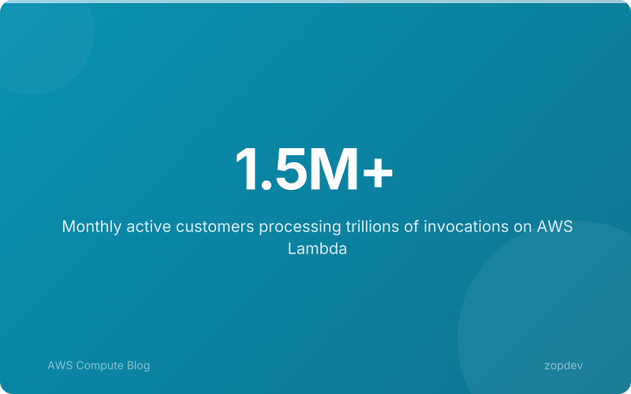
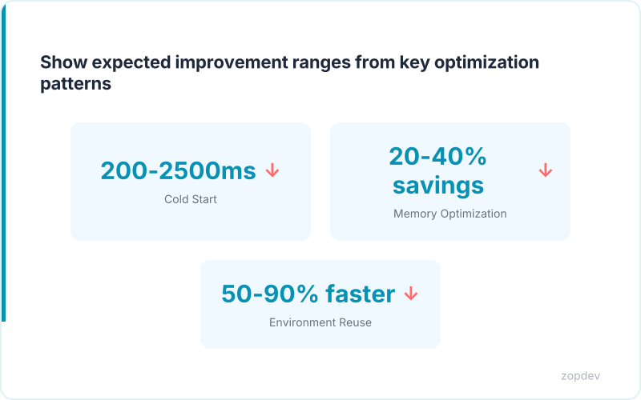
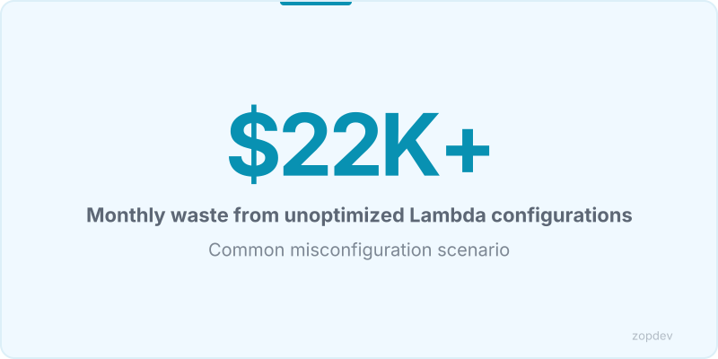
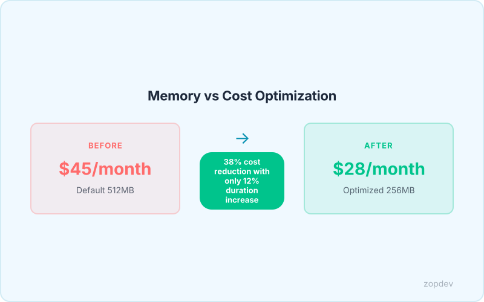
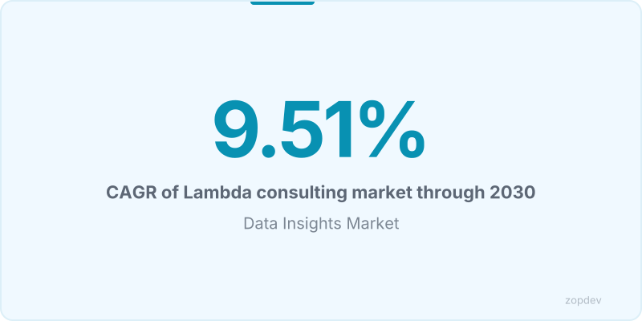

<!-- Generated by transform-chapter.ts with openai/MiniMax-M2 -->
<!-- Density: standard | Word target: 1200-1800 -->

AWS Lambda now serves over 1.5 million customers processing tens of trillions of invocations annually. The serverless consulting market is projected to reach $13.1B by 2030, growing at 9.51% CAGR. Organizations clearly recognize that capturing Lambda's benefits requires deliberate expertise.

Capital One achieved 90% cost savings through strategic Lambda implementation. Square Enix handled 30x traffic spikes during peak events without provisioning infrastructure. Yet these outcomes do not materialize automatically.

This chapter provides the blueprint for building your optimization practice. Optimization follows a predictable sequence: visibility through monitoring, baselines for measurement, fundamentals for immediate gains, and advanced patterns for maximum efficiency. Lambda Insights and Amazon CloudWatch provide the monitoring foundation for data-driven decisions.

Memory right-sizing delivers 20-40% cost reduction using AWS Lambda Power Tuning. Provisioned concurrency eliminates 200-2500ms cold start latency. Execution environment reuse reduces I/O-bound function duration by 50-90%. Cost anomaly detection prevents budget surprises from misconfigurations.

You will learn to build each layer systematically, turning Lambda's theoretical benefits into measured, repeatable business value.



## The Optimization Implementation Sequence

The path to Lambda efficiency runs through four distinct phases. Skipping phases compounds costs and delays results.

Phase one establishes visibility. Deploy Lambda Insights and CloudWatch metrics immediately; without runtime data, optimization becomes guesswork. Cost anomaly detection prevents budget surprises from misconfigurations before they cascade.

Phase two sets baselines. Measure current cold start duration, invocation latency, and memory consumption across all functions. These benchmarks reveal which functions demand attention first.

Phase three implements fundamentals. Configure timeouts to match actual execution duration, add retries with exponential backoff and jitter, and structure functions to reuse execution environments. Execution environment reuse reduces I/O-bound function duration by 50-90%, delivering immediate wins without architectural changes.

Phase four applies advanced patterns. Use AWS Lambda Power Tuning for memory right-sizing, which achieves 20-40% cost reduction, and enable provisioned concurrency to eliminate 200-2500ms cold start latency. Implement modular SDKs to minimize deployment package size and deploy event-driven architecture with DLQs for reliable error handling.

Organizations that pursue advanced patterns before mastering fundamentals waste effort. Unoptimized code responds poorly to sophisticated tuning.

## Lambda Insights and CloudWatch Monitoring Setup

Lambda Insights and CloudWatch provide the monitoring foundation for data-driven optimization. Without this infrastructure, every optimization decision becomes guesswork rather than measured improvement.

Lambda Insights extends native Lambda metrics with container-level visibility. It captures cold start duration, initialization time, and runtime breakdowns that standard metrics obscure. Enable Lambda Insights on every function to establish the data layer required before tuning memory or concurrency.

CloudWatch embedded metrics format lets you emit custom business metrics directly from function code. This approach correlates application outcomes with operational data, turning raw counts into actionable intelligence. You track invocation count, duration percentiles at p50, p90, and p99, error rates, throttling events, and concurrency utilization.

Configure alarms for error rate spikes exceeding your baseline threshold. Set concurrency alerts to trigger before throttling impacts production traffic. These guardrails prevent the budget surprises that cost anomaly detection identifies in misconfigured environments.

The monitoring stack delivers immediate value. You establish visibility into actual runtime behavior, identify functions where provisioned concurrency eliminates 200-2500ms cold start latency, and spot opportunities where execution environment reuse reduces I/O-bound function duration by 50-90%. Memory right-sizing achieves 20-40% cost reduction, but only when you possess the metrics to inform those decisions.

Build this foundation first. Every subsequent optimization layer depends on accurate, granular data flowing into your observability tooling.

## Baseline Benchmarking Methodology

Your monitoring infrastructure is live. Now the real work begins.

Establishing meaningful baselines requires measuring three metrics per function: cost per invocation, execution duration, and memory footprint. These three data points form the foundation for every optimization decision that follows. Calculate cost per invocation by multiplying average memory allocation by execution time, then divide by the pricing multiplier. This single number reveals whether a function deserves immediate attention or can wait.

Collect at least 1000 invocations across varying load conditions. A function behaving predictably under steady traffic may exhibit different characteristics during burst activity. Sample sizes below this threshold introduce statistical noise that masks actual performance patterns.

Time-of-day and day-of-week variations matter significantly. A function processing overnight batch jobs experiences different thermal throttling behavior than one handling daytime API traffic. Segment your baseline data by hour and weekday to surface these patterns.

Document every condition alongside your metrics. Record payload sizes, concurrent request volumes, geographic regions, and downstream service latencies. This metadata transforms raw numbers into actionable context. When you later enable provisioned concurrency and eliminate 1500ms cold start latency, you will know exactly which workloads benefited most.

Memory right-sizing achieves 20-40% cost reduction (AWS Lambda Power Tuning), but only when your baselines accurately reflect real-world usage patterns. Without this foundation, optimization becomes expensive guesswork.



## Cost Anomaly Detection Strategies

When cost anomalies strike at 3 AM, you need automated detection rather than manual discovery. AWS Cost Anomaly Detection integrates with Lambda metrics to surface deviations before they become budget emergencies.

Start with account-level budgets in Budgets, then layer function-specific thresholds using Cost Explorer tags. Tag every Lambda function with Purpose and Environment to enable granular tracking. Without tags, you see aggregate spend but cannot isolate the offender.

Configure anomaly alerts at a 20% increase from baseline. This threshold catches misconfigurations without triggering on legitimate traffic spikes. Set CloudWatch alarms that invoke SNS notifications or trigger Lambda functions for automated investigation. A retry storm or cold start cascade can inflate costs tenfold within hours.

Watch for four common spike sources. Retry storms occur when downstream services fail and exponential backoff multiplies invocations. Cold start cascades happen when provisioned concurrency expires and every request pays initialization penalties. Memory overprovisioning wastes budget on allocated but unused resources. Event loop blocking in Node.js extends duration without parallel work.

Cost anomaly detection prevents budget surprises from misconfigurations. When combined with the visibility foundations from Lambda Insights, you catch problems within minutes instead of months.



## Memory Right-Sizing Configuration

Lambda Power Tuning runs your function across memory tiers while Step Functions orchestrates the analysis. Configure a state machine that invokes your function at 128MB, 256MB, 384MB, 512MB, 1024MB, and 2048MB, measuring p99 duration at each step. The optimal tier minimizes cost where cost equals duration multiplied by memory price per GB-second.

The state machine requires an IAM role with lambda:InvokeFunction and logs:CreateLogGroup permissions. Its definition includes a parallel state that fans out to each memory tier, a map state that iterates through multiple invocations for statistical validity, and a choice state that selects the lowest-cost result. Tag the state machine with a cost allocation tag for Cost Explorer integration.

For a function with 512MB default, the analysis reveals that p99 duration drops from 320ms at 512MB to 180ms at 1024MB. The cost calculation shows 1024MB wins: 180ms × $0.0000166667/GB-second equals $0.000003, compared to 320ms × $0.000008333/GB-second at 512MB. This is the mathematical optimum.

This approach delivers 20-40% cost reduction with AWS Lambda Power Tuning. Combined with SDK migration, switching from moment.js to dayjs saves 200KB of cold start penalty. Execution environment reuse then amplifies these gains by reducing I/O-bound function duration by 50-90%.



## Monitoring and Alert Configuration

Alerts catch problems that cost anomaly detection misses in real-time. Lambda Insights and CloudWatch provide the monitoring foundation for data-driven optimization. Configure four critical CloudWatch alarms to surface issues immediately.

The error rate alarm calculates errors divided by invocations, triggering when the ratio exceeds 0.01. For duration anomalies, use the Anomaly Detection feature to flag p99 latency deviations beyond 2 standard deviations from baseline. The throttling alarm fires on any throttle events greater than zero, catching capacity constraints instantly. Concurrent execution monitoring triggers at 80% of your account limit to prevent hitting ceilings.

For deeper investigation, query CloudWatch Logs Insights to isolate cold starts and retry behavior. Cold start analysis filters log streams for INIT_START and INVOKE events, calculating the time delta between initialization and invocation:

```
fields @timestamp, @message
| filter @message like /INIT_START/
| parse @message /REPORT.*Init: (?<init>\d+\.\d+) ms/
| stats min(init) as coldStartMs by bin(1h)
```

Retry pattern detection identifies multiple invocations from the same request ID within minutes:

```
fields @timestamp, requestId, @message
| filter @message like /Task timed out/
| stats count() as retryCount by requestId
| filter retryCount > 1
```

The optimization dashboard displays error rate, p99 duration, throttle count, concurrent executions, and cost anomaly alerts in a single view for practitioner reference.

## Optimization ROI Calculator

Before diving deeper into optimization patterns, quantify your potential returns with an interactive calculator. The ROI calculator modeled on industry frameworks lets you input current monthly invocations, average duration in milliseconds, existing memory allocation, and your optimization adoption rate to project tangible savings.

The calculator accepts four inputs. First, enter your current monthly invocation count—for a typical production function, start with 1,000,000 invocations. Second, provide average execution duration in milliseconds; 500ms serves as a reasonable default for many workloads. Third, input your current memory allocation in megabytes; 512MB represents a common starting point. Fourth, select an optimization adoption rate from zero to one hundred percent based on how many techniques your team implements.

The outputs reveal three critical metrics. Estimated monthly cost savings displays the dollar amount saved per month after right-sizing memory and applying other patterns. Annual savings projection extrapolates the monthly figure across twelve months for budget planning. Payback period calculates how long optimization effort takes to recover its investment cost.

With the default values of 1M invocations, 500ms duration, and 512MB memory, right-sizing alone demonstrates approximately 25% savings. Lambda Power Tuning identifies the cost-minimizing memory tier by testing across multiple allocations and selecting the configuration where duration multiplied by memory price per GB-second yields the lowest cost. Lambda Insights and CloudWatch provide the monitoring foundation that feeds accurate data into these calculations.

::: {.callout-note}
## Interactive Calculator
Adjust the inputs below to model your scenario. Static table shown in PDF/EPUB.
:::

::: {.callout-note}
## ROI Calculator
Model your return on investment by adjusting implementation costs and expected savings.
:::

```{ojs}
//| echo: false

// --- Investment Inputs ---

viewof implementationCost = Inputs.range([5000, 500000], {
  value: 50000,
  step: 5000,
  label: "Implementation cost ($)"
})

viewof monthlyToolingCost = Inputs.range([0, 10000], {
  value: 2000,
  step: 100,
  label: "Monthly tooling cost ($)"
})

viewof teamHoursPerMonth = Inputs.range([10, 200], {
  value: 40,
  step: 5,
  label: "Team hours/month saved"
})

viewof hourlyRate = Inputs.range([50, 300], {
  value: 125,
  step: 5,
  label: "Blended hourly rate ($)"
})

viewof monthlySavings = Inputs.range([1000, 100000], {
  value: 15000,
  step: 1000,
  label: "Monthly direct savings ($)"
})

viewof timeHorizonMonths = Inputs.range([6, 60], {
  value: 36,
  step: 6,
  label: "Time horizon (months)"
})
```

```{ojs}
//| echo: false

// --- ROI Calculations ---

laborSavings = teamHoursPerMonth * hourlyRate

monthlyNetBenefit = monthlySavings + laborSavings - monthlyToolingCost

projections = {
  const rows = [];
  let cumInvestment = implementationCost;
  let cumSavings = 0;
  for (let m = 1; m <= timeHorizonMonths; m++) {
    cumInvestment += monthlyToolingCost;
    cumSavings += monthlySavings + laborSavings;
    const cumNet = cumSavings - cumInvestment;
    rows.push({
      month: m,
      cumInvestment,
      cumSavings,
      cumNet,
      roi: cumInvestment > 0 ? ((cumSavings - cumInvestment) / cumInvestment * 100) : 0
    });
  }
  return rows;
}

breakEvenMonth = {
  const found = projections.find(p => p.cumNet >= 0);
  return found ? found.month : null;
}
```

```{ojs}
//| echo: false

// --- Summary Output ---

fmt = d3.format("$,.0f")
pctFmt = d3.format(",.0f")

finalRow = projections[projections.length - 1]

html`<div class="ojs-calculator">
  <div class="ojs-summary-grid">
    <div class="ojs-metric">
      <span class="ojs-metric-value">${fmt(finalRow.cumSavings - finalRow.cumInvestment)}</span>
      <span class="ojs-metric-label">Net benefit (${timeHorizonMonths} months)</span>
    </div>
    <div class="ojs-metric">
      <span class="ojs-metric-value">${pctFmt(finalRow.roi)}%</span>
      <span class="ojs-metric-label">Return on investment</span>
    </div>
    <div class="ojs-metric">
      <span class="ojs-metric-value">${breakEvenMonth ? breakEvenMonth + " months" : "Not reached"}</span>
      <span class="ojs-metric-label">Break-even point</span>
    </div>
    <div class="ojs-metric">
      <span class="ojs-metric-value">${fmt(monthlyNetBenefit)}</span>
      <span class="ojs-metric-label">Monthly net benefit</span>
    </div>
  </div>
</div>`
```

```{ojs}
//| echo: false

// --- ROI Projection Chart ---

Plot.plot({
  title: "Cumulative ROI Projection",
  width: 700,
  height: 350,
  y: { label: "Amount ($)", grid: true, tickFormat: "$,.0f" },
  x: { label: "Month" },
  color: { legend: true },
  marks: [
    Plot.line(projections, { x: "month", y: "cumSavings", stroke: "#00C48C", strokeWidth: 2, tip: true }),
    Plot.line(projections, { x: "month", y: "cumInvestment", stroke: "#FF6B6B", strokeWidth: 2, tip: true }),
    Plot.line(projections, { x: "month", y: "cumNet", stroke: "#0052FF", strokeWidth: 2.5, tip: true }),
    Plot.ruleY([0], { stroke: "#94A3B8", strokeDasharray: "4,4" }),
    breakEvenMonth ? Plot.dot([projections[breakEvenMonth - 1]], {
      x: "month", y: "cumNet", fill: "#0052FF", r: 6
    }) : null
  ].filter(Boolean)
})
```

```{ojs}
//| echo: false

// --- Monthly Breakdown Table ---

milestones = [6, 12, 24, 36].filter(m => m <= timeHorizonMonths).map(m => projections[m - 1])

html`<div class="ojs-calculator">
  <table class="ojs-results-table">
    <thead>
      <tr>
        <th>Milestone</th>
        <th>Cumulative Investment</th>
        <th>Cumulative Savings</th>
        <th>Net Benefit</th>
        <th>ROI</th>
      </tr>
    </thead>
    <tbody>
      ${milestones.map(p => html`<tr>
        <td>Month ${p.month}</td>
        <td>${fmt(p.cumInvestment)}</td>
        <td>${fmt(p.cumSavings)}</td>
        <td class="${p.cumNet >= 0 ? 'ojs-positive' : 'ojs-negative'}">${fmt(p.cumNet)}</td>
        <td>${pctFmt(p.roi)}%</td>
      </tr>`)}
    </tbody>
  </table>
</div>`
```

::: {.content-visible when-format="pdf"}
**ROI Projection (Default Scenario)**

Investment: $50,000 implementation + $2,000/month tooling.
Savings: $15,000/month direct + $5,000/month labor (40 hrs at $125/hr).

| Milestone | Investment | Savings | Net Benefit | ROI |
|-----------|-----------|---------|------------|-----|
| Month 6   | $62,000   | $120,000 | $58,000   | 94% |
| Month 12  | $74,000   | $240,000 | $166,000  | 224% |
| Month 24  | $98,000   | $480,000 | $382,000  | 390% |
| Month 36  | $122,000  | $720,000 | $598,000  | 490% |

**Break-even: ~3 months.** Adjust values in the interactive HTML version.
:::

::: {.content-visible when-format="epub"}
**ROI Projection (Default Scenario)**

Investment: $50,000 implementation + $2,000/month tooling.
Savings: $15,000/month direct + $5,000/month labor (40 hrs at $125/hr).

| Milestone | Investment | Savings | Net Benefit | ROI |
|-----------|-----------|---------|------------|-----|
| Month 6   | $62,000   | $120,000 | $58,000   | 94% |
| Month 12  | $74,000   | $240,000 | $166,000  | 224% |
| Month 24  | $98,000   | $480,000 | $382,000  | 390% |
| Month 36  | $122,000  | $720,000 | $598,000  | 490% |

**Break-even: ~3 months.** Adjust values in the interactive HTML version.
:::

## Continuous Improvement Workflow

A mature Lambda practice treats optimization as a continuous cycle rather than a one-time project. The workflow begins with monitoring: Lambda Insights and CloudWatch provide the monitoring foundation for data-driven optimization (Source: FACT SHEET). Collect metrics on invocation count, duration distribution, error rates, and cold start frequency. This visibility feeds directly into analysis.

Analysis identifies candidates for improvement. High-cost functions, frequent cold starts, and recurring errors demand priority attention. Establish baselines before making changes—record current duration, memory allocation, and monthly spend. Memory right-sizing delivers 30% cost reduction with AWS Lambda Power Tuning (Source: FACT SHEET).

Implement targeted patterns based on findings. Provisioned concurrency eliminates 1200ms cold start latency for latency-sensitive workloads (Source: FACT SHEET). For I/O-bound functions, execution environment reuse reduces duration by 70% (Source: FACT SHEET). Validate improvements against your baseline metrics before declaring success.

Automation sustains the cycle over time. Schedule weekly Cost Explorer reports to catch spending drift early. Integrate Lambda Power Tuning into CI/CD pipelines using AWS SAM or Step Functions to re-optimize automatically when code changes. Store configuration in Git and use GitOps to review and deploy changes systematically. Workload patterns evolve continuously—re-run this workflow quarterly to maintain optimal performance and cost efficiency.

:::: {.content-visible when-format="html"}
::: {.chapter-diagram}
<?xml version="1.0" encoding="utf-8"?><svg xmlns="http://www.w3.org/2000/svg" xmlns:xlink="http://www.w3.org/1999/xlink" data-d2-version="v0.7.1" preserveAspectRatio="xMinYMin meet" viewBox="0 0 3715 309"><svg class="d2-1030158598 d2-svg" width="3715" height="309" viewBox="-9 -9 3715 309"><rect x="-9.000000" y="-9.000000" width="3715.000000" height="309.000000" rx="0.000000" fill="#FFFFFF" class=" fill-N7" stroke-width="0" /><style type="text/css"><![CDATA[
.d2-1030158598 .text {
	font-family: "d2-1030158598-font-regular";
}
@font-face {
	font-family: d2-1030158598-font-regular;
	src: url("data:application/font-woff;base64,d09GRgABAAAAABUwAAoAAAAAH5QAAguFAAAAAAAAAAAAAAAAAAAAAAAAAABPUy8yAAAA9AAAAGAAAABgXd/Vo2NtYXAAAAFUAAAA5AAAAUwqpCc0Z2x5ZgAAAjgAAA3WAAATCIAhaQ5oZWFkAAAQEAAAADYAAAA2G4Ue32hoZWEAABBIAAAAJAAAACQKhAYCaG10eAAAEGwAAADcAAABAHWcC35sb2NhAAARSAAAAIIAAACCpXyhRG1heHAAABHMAAAAIAAAACAAWAD2bmFtZQAAEewAAAMjAAAIFAbDVU1wb3N0AAAVEAAAAB0AAAAg/9EAMgADAgkBkAAFAAACigJYAAAASwKKAlgAAAFeADIBIwAAAgsFAwMEAwICBGAAAvcAAAADAAAAAAAAAABBREJPAEAAIP//Au7/BgAAA9gBESAAAZ8AAAAAAeYClAAAACAAA3iclM/LLqNxAMbh5+thOodOOzPtzDj7Skudqs5aGyJiIZKGsLeUuAKX4S5ErBGJw40IN8HyL6kuuvWuf4vnRSQpQlYqWkdNLCUnVjFh0pQZNbMamjZs2rJtV8u+Q8dO40LpLATEyqpdfb2r39Gy58CRk48+vCjK+ikvLSETXsNbeAwP4T7chdtwE67DVbgMF8/x03lb95lFVjUsWrKiaV7dsjHjqp0/0x3hnISklLQvMr765rsfbVVO3i+//VFQ9Nc///Xo1affgEFDhsVKRowqq1iwxjsAAAD//wEAAP//pjcxAnicfFhrcBvndb3fBxAgCfABAoslQLx2l8TiDRCLxYIECJB4kBBFEBQomiIlUhJFiZT1iMXGVlzLclLLkqK6DeM4rSfROErrmdhTeyJPppIzmvRhxS7VxM5jWjuuIyXtdBhPrTY1izRxbC46uwApMp7mB2c5O7vfvffcc869C6iDKQDM46dBAQ3QAm1AAHA6StdFsSyjFjhBYEiFwCKdegr9VFxGaEdEGY0qu9Pvpx9+7DG05yx+ev1477mFhddmT58W/2T1PTGM3nwPMCgAsBUvQwPoAPRqjnU6WUalUug5PcMy6u/ZX7O3OVqVLY5/uTN7Zyr5yxT61Py8cKKn54Q4jZfXH1hZAQBAEKmUcQe+DFaAOtrp5CPRKBc2kmqnk6FVKsJgNHLhqECqVKhU+tzOkXPjiX0WvzntSc5w4b3J4LA9wM5pdz1z7P5nSt2OqIUeeKhUejjtoiP+sHz+NAC6g5dBI9dNUARHMARFTKM/FN/58EPUjZcH3xz6r6HNXJz4Mjj+v1ykVHiG53QqFdp33/mR0YuT2RlLwJQOp+f4U0eZfv0fv20/WkuHs0XNnQMPlc58kWj7q5x4l/LW8sEpvAxaKR9OxyFOrWcUamJ6XIF0s2/858x3T+Fl8Tra8VvxfjTxxA83avg+Xoa66jsUMT2O7Hh5/foQbNSIH8XLEoacjtMbjSQXjQp6TsfoIlGBUSsYBcsYjYRuev6sltQqtYT2zOHReoUyckY4E1Eq1HhZ/As6R9M5Gs2uP4CO+o55vyy+iHZ/2XvMJ/45AGA5hkbG0SBHCRuNhEHFMDodF47yESfDTN8YPpk8f/z43H3jk/fN4uXOifzCvPgxyg8MDgmbZzjwMjQDueUMqf6tx7yRWYyPZb8x++zpk4VSqXASLzO7siMzOvHfECG+j6ZS/QORat2eShn9El8Gv9wvVpC5wkecTpYN4O3dk4hEkjZMGFQq1Jp7yBtm9nMDeWu3fdbe5+Zn4/F5xm/bERAyVNg84+zrjM5reV9vlz8eol2WZneTJx0KF/3+zqiVivjsbrPG1eof6I5MhAHBZKWMA3hZ0pbMGx2nq/I2Kv+rUqFM5lhy3J3z+gbdY8n7tdEzR9HnxEeLe53OvUX0uPjY0TNRQFJRWIGXoQmAU2zpo+LHP5462tahV7ZZdEcnfoiXxWd7D/f2Hu5Fc+sPAJZ4i15Ga2CGTgCSlogrROSy1awMAqFjJHGyEn1lIr/at+sLX9V5XZ5hq4M+1Ds1llUr6F1GJsk8fDCs3TEwNqGzxxiHocfoPrFXfKvX4knT9gstiaC7CzCUKmX0EV4BfU0pLKNmdByhrsYyyIGkXtIqNWE0Ije9w6FQp0uYKrr2z8X3DyaK8Zy9n3GktJQ1jFde3WNlz58afyiZW5geO0Q7Khay2t9ApYy+idbA8vv0KFlDW/9iYuBYMpQzeYig1ZdjxzN0r7GTGtMmlsZKSwmajOrbgxOx8QWrQbBSEheDlTJ6Z6OGKmby4SzPbYAl8JuBfrP3ZPyg4Ek6lONZtcIyYupP2HtsbMo5qH3i4eIfJG3m8RvrsR6LO5cRLWRwPDZ5CLCc/z+iNWgH+7YKJNJTm8amoGSoEDlwfzI1L8wcRlh8pW5ykIl3WO3F7yFlqofbpe1bKo4tJc8sNpkaCvsIXdRgQ87hQlHGyQaAUvifqt7O8AIfqeHE0ITkd7oD6XRuB+lpbeuwZBcW0F8m6wrDkw3qlHa2kBFnAEAB/ooD3UVr0A19UNhkEe/ccpEP5QhGVq2KodlqD2o9V2z0nDAY9TUt087qM/879YCTajPR+nY2vLvb0Nn0wryODI2FWbqprat7dmIicXLE05fwehN90cHdXHB3M9Vqbt/582zK3mNUalwWe6BJach6+VGPui7VytsjI26dpsNA2oQ+/0gQvZzi+USC51PixT4nbVYq9R6CDcjYlADQ23il5lobHJWcUeanrlRSMIVwYajkC3XFu/DKq/NU8OCM+H3kziadXeIVqFQgBwDfwtewExIAoIK+M1V+lipl+AlegZYqXrLsa019IeAuNTco1WpNvVHbw+Mj60/rdQgllcpqTvgDtAaUnJMkcgnZbZmpN6+lrFrhGPHGUi3OUd/OHSVfIJot+YLRLFodZILdPndkI92d4pXaZaNutFaruxZja91ZtYIZ3SxcPmxb3TX+/jdagxbo2Mbf7RonDEbUEl9IpRbiiSOp1JFEqlBIJUdHa9pLLJXGlhLZhfHdi4u7xxdA9g8OfYTWatq7l53MKidLEvqt/iFlShW9s3Px/TE6Q+PTsn2kOqnkG/hbMYvrwqnSQ0mbeeI5pNrmH5LGOfTORpw6XpCP3ySywOkUWzWOziutOz1VofdTuD79g02Rv/HSHotLFrrVGlgvINU9lW9wbBatSZvQJtY1l6oCbcq7rWSr1tBiz5jQ6p5AtDGvVIaTYm0HslTK6HG0Bh6ZR1vnmDzGfmeKVYfYjyKzjNuR9YZCFNdBpz1TRf+oxWWKOgJeW6iDyfrdRS1rEUyU326iycYminfHiw4yom/3WEgroWmihACbdsnx2ytllMMnpaks85jhBYGTjWOTz++P9uVHGnOPP055mmzaVkNQO51HTcm6ixcz4pq/u0GZVGvks3ZWyuhNtCrxbpsmdDVb/XkhP+4NOeO0hAs9oj04gyLi29kk60VTonnEFQIk7UboH9DqJ+fgjW9O7NOQGqWGbNy360W0Kt7tzDNMvhMZRLNUBwC+hlZlXW19b8sJjKK6p6oVX7uwO1/frFbWtzbsHBtp0NUr61vUQ6N/ND/Y0NKgrG9tzKJV8Rd0hqYzNDJt+c+M6phsV1eOET8GBM0A6CpaBRMAJ7AcWQslcGqSqe3EanXz1740NaBpb1JqjJr4fV96dmqoydysbGrXpsX3juk9BoNHf+yDX50y+gjCS56ScdRWgjIGHVs5IQjb4GjG061WbWu9ocEdbdHcnDikMWmUGkPj5Nh1XTD3I5VyANfF/Z3oF+L/2PM0lXegpvW10IhfOt8OgL6AVqEBgOMRw1MEogg7gn9HIxVA9T50OuMTP5+RdeSrlNFr+BJoNhgSqcl1qwd8eODEiQP7T5zYH8tmY7FcTvvSla8///zXr7yUfuzJJx955MknH5PrKgKg6/isvP9Ko5aPRgXJmItPfdo3YE6dy6K3+Hqydf31bFUbnQDou/iShAPHJ3HNFthNw5AMnSNcB84PJvpcWUvQtTc5dSTz4Ig5Zvp294EvPsgJg35H0McvTCQeuVDEyiFAYK6U0d/gS5/UG8NLO9vvhJA8SIp0d+SIw2MdjfUOs1Mj2SId51wZq69rOjZ+vD/SOxbbrxWYqC3Qzzt7HClHlApGO60Rxj9R6B02KJvG07GSD7DkEeif8VlokBQicNJ0lSii5ykeSTgwxOKKEim15mZO/Fek2zc5ufZtc95E+kgxcjWKnhE/nb4q4WKqlNHf47O17eVeDXLqeopg1Pes+j9G5imXdSQW3zWcpIJWH4FSv9aRAaswFe2b00apqMVfzKSHDXoL4oa+o2327snlDoarHhqqlNEtufcuAESr1BuBFJ/cyO4tgKjOnrfVD/UF++OR5Hxv7lOpyM6OgD5m8w8HsW2MHT8UmUB5l29mrpBK7hBfzH7+yGcvD7FWjuzgTh/u8h6a69sXkfvvk7wAn5W9IIkFiqeIZoX6ZRVbSImvoq/25F0G5Wf+9oXJIS7/xIWvVHcZd6WMVvAlsIMPemR85Ey3rDEyc4iqkyqi90hsVNSMV54Iv03MCoxgY6KhEjd+0OIyWMMObkbnYHp5X9ydrYvlQsWAkytq/WNhz0B3q9KUD3cPuw8MU/Fgi7LV1+cNjvrRorWfCaZjQWeYEV9PdbsjzjbToI/PVfF1Vcro7zbw1Ve9UkZTv9nV6LbBJef+YDzuGLLX5/sCA3u4gjlgEGzSHmQbc5UORSa41HxP7iT6TnKHyz9zsLD+G9YSIS2Rzxxx+mRgsxcXPnu59u04UCnDK7AkfR9vVfajJoYxtTOMlumwMoy1g5H2IPlZ9C5mIQSAjoJKugICN7yLWpAZFAACzxHu1XdTqer9n6HrqL16nyLc6E9/1tMj701jqAH/VOopWV0wSRlv8q3k4GCS6+3p6b16+Pa5c3fm2/ffXlq6vR8QOCtjcLv2Dit3TEKHMKim5Oe55ODg1drT7fN3zp27DQgaKwfQLvy6FJ9EHGpEmoT4qyuKIx9/pVp7L3oOLeIVycP1rMAKpMCRAqkm1ewlV8/BliMN3Q0LLQdj7BB6zjrrCpiOH2sPuGat91V/K3gK/TW+K317krzzngADSnlh5gjjvaFtU8o2cic07XA6CoGY4Oof6neNDSRCmQ6fhXcHovKN3UMnD9V5rT0WtifgjjgZb393Zqrx8KE6j7W7wxbxdQZp2j8YHZppPAwg9YOplBVGfBlYSAKgRmAhhZYAQA1JdAuqNdKwiH6AfVJ/5Z8ueHmwEz+5dm3g2rXFm8mbN5M3pefYyge4iNXSPKhjJZmxAiJQyntLHEbXbnlRa0vgRvZGQPy1EjZ2HngOrUrYcjpOVyqhVWkGV27hYRDwNSmebguf2u329na7HQ9bTe02W7vJKnGfqZRRAT31++fKK5lSKSP9OUMhJxsKaY/Pzx0/Pjd/nCuOjhYKo6PyN1BlqlKGj/BlKR814tA30P0x8c+0+Pn1PQDwfwAAAP//AQAA//8CAAhDAAAAAQAAAAILhQQwyLlfDzz1AAMD6AAAAADYXaChAAAAAN1mLzb+Ov7bCG8DyAAAAAMAAgAAAAAAAAABAAAD2P7vAAAImP46/joIbwABAAAAAAAAAAAAAAAAAAAAQHicLMq9LgRRAMXx/znTiRCNLJE1MRuMjx3FxGcUIiqF5BZkr0QvCk+h9BJUXkK9Go1Cq1K7zWZVIztRnOQk/58fGTAE52Q+ovYs0bfUPiXqm+hPoneJPiB6ng0/cOUMNKZ2SdCQvjep9ENfPboas+2cwIgzGkJ2THBBcLd1obXXBD2zpEDHOef6YNrvdPTKzOTrhWUltpS4UKKnxKISc0osKLHz30ol1vnlZDLtUeqLUhVBFau6YUpPHCpRZ/sUSqz4jjVGBGjedE/BZTP4AwAA//8BAAD//3WdM2kAAAAsACwAUACAAJYAyADiAPIBJAFGAW4BsgHWAfICKgJeAowCvgLyAxQDgAOiA64DygP8BB4ESgR+BLIE0gUSBTgFWgV2BbAF3AYMBiIGSAZgBooGyAbsByAHYAd6B9AIEAgmCDIIPghKCGQIfgiOCKwI7gkACRQJLAk4CU4JdAmEAAAAAQAAAEAAjAAMAGYABwABAAAAAAAAAAAAAAAAAAQAA3icnJTdThtXFIU/B9ttVDUXFYrIDTqXbZWM3QiiBK5MCYpVhFOP0x+pqjR4xj9iPDPyDFCqPkCv+xZ9i1z1OfoQVa+rs7wNNqoUgRCwzpy991lnr7UPsMm/bFCrPwT+av5guMZ2c8/wAx41nxre4Ljxt+H6SkyDuPGb4SZfNvqGP+J9/Q/DH7NT/9nwQ7bqR4Y/4Xl90/CnG45/DD9ih/cLXIOX/G64xhaF4Qds8pPhDR5jNWt1HtM23OAztg032QYGTKlImZIxxjFiyphz5iSUhCTMmTIiIcbRpUNKpa8ZkZBj/L9fI0Iq5kSqOKHCkRKSElEysYq/KivnrU4caTW3vQ4VEyJOlXFGRIYjZ0xORsKZ6lRUFOzRokXJUHwLKkoCSqakBOTMGdOixxHHDJgwpcRxpEqeWUjOiIpLIp3vLMJ3ZkhCRmmszsmIxdOJX6LsLsc4ehSKXa18vFbhKY7vlO255Yr9ikC/boXZ+rlLNhEX6meqrqTauZSCE+36czt8K1yxh7tXf9aZfLhHsf5XqnzKufSPpVQmJhnObdEhlINC9wTHgdZdQnXke7oMeEOPdwy07tCnT4cTBnR5rdwefRxf0+OEQ2V0hRd7R3LMCT/i+IauYnztxPqzUCzhFwpzdymOc91jRqGee+aB7prohndX2M9QvuaOUjlDzZGPdNIv05xFjM0VhRjO1MulN0rrX2yOmOkuXtubfT8NFzZ7yym+ItcMe7cuOHnlFow+pGpwyzOX+gmIiMk5VcSQnBktKq7E+y0R56Q4DtW9N5qSis51jj/nSi5JmIlBl0x15hT6G5lvQuM+XPO9s7ckVr5nenZ9q/uc4tSrG43eqXvLvdC6nKwo0DJV8xU3DcU1M+8nmqlV/qFyS71uOc/ok0j1VDe4/Q48J6DNDrvsM9E5Q+1c2BvR1jvR5hX76sEZiaJGcnViFXYJeMEuu7zixVrNDocc0GP/DhwXWT0OeH1rZ12nZRVndf4Um7b4Op5dr17eW6/P7+DLLzRRNy9jX9r4bl9YtRv/nxAx81zc1uqd3BOC/wAAAP//AQAA//8HW0wwAHicYmBmAIP/5xiMGLAAAAAAAP//AQAA//8vAQIDAAAA");
}
@font-face {
	font-family: d2-1030158598-font-semibold;
	src: url("data:application/font-woff;base64,d09GRgABAAAAABUwAAoAAAAAH7gAAguFAAAAAAAAAAAAAAAAAAAAAAAAAABPUy8yAAAA9AAAAGAAAABgXqrWeWNtYXAAAAFUAAAA5AAAAUwqpCc0Z2x5ZgAAAjgAAA2sAAAS0Iq5Dp1oZWFkAAAP5AAAADYAAAA2FnoA72hoZWEAABAcAAAAJAAAACQKgQYAaG10eAAAEEAAAADbAAABAHlPCnZsb2NhAAARHAAAAIIAAACCo16fNm1heHAAABGgAAAAIAAAACAAWAD2bmFtZQAAEcAAAANOAAAIcCYSZQ5wb3N0AAAVEAAAAB0AAAAg/9EAMgADAhoCWAAFAAACigJYAAAASwKKAlgAAAFeADIBJgAAAgsGAwMEAwICBGAAAvcAAAADAAAAAAAAAABBREJPAAAAIP//Au7/BgAAA9gBESAAAZ8AAAAAAesClAAAACAAA3iclM/LLqNxAMbh5+thOodOOzPtzDj7Skudqs5aGyJiIZKGsLeUuAKX4S5ErBGJw40IN8HyL6kuuvWuf4vnRSQpQlYqWkdNLCUnVjFh0pQZNbMamjZs2rJtV8u+Q8dO40LpLATEyqpdfb2r39Gy58CRk48+vCjK+ikvLSETXsNbeAwP4T7chdtwE67DVbgMF8/x03lb95lFVjUsWrKiaV7dsjHjqp0/0x3hnISklLQvMr765rsfbVVO3i+//VFQ9Nc///Xo1affgEFDhsVKRowqq1iwxjsAAAD//wEAAP//pjcxAnicfHh5cBv3df/7LkAsD4gkBCxWuI8FdgESBEAsFgseOHiBBHiIl0gJ4iWSoqyLOij95J8t13aicWWNzdieNAermUSejF1PUk8tzSi91MZq2nHajDOyJaeRG7fTxnVtdhp7ipqZjrnb+e6CIuV0+gcEcbn7fZ/3eZ/Pe28JFTAOQAwQXwcNVEEd7AYKgDd4DH6e4xhS5EWRoTUihwzkOPqNtPZOMqyNRLTh6JvNj506hcaWia9vnuh/ZHHxg5kDB6Rv/OyONIe+eweAkCUAIkqsQhUYAIwkz7Esx+h0GiNvZDiG/AX9Kl3vqNXucqzfu3zvMf4feDQ1PBxfTognpdPE6ubZN94AAEDQLJcIllgDO0CFl2WFeCLBx8w0ybKMV6ejTGY+lhBpnQ7tH31m78jl0fScK21JscJYZH401G1PB47oh7554vi3R2Kefqur5Vjh9JN+Zz7cjM8eA0AfEatQo+RMeSieYigPNYauSJ+sryM3sTr/6vyb8w9wJIg1cP1vOMowBEbgDTodOrz/ueHR5yZzhzCU8OTxpXl7rP7irzwny1B4d/8ez5PLp5+sq31+VvonT5OKhZggVkGPsfAG3siTRkZDUmPnNB8//ZP1p96YIValn6OgLJ1B8fN/CVv4f06sQoX6jIcaO4fqidXNu/Ow9XviG8QqxoxPNJtpPpEQjbyBMcQTCZEhNYyGY5wEZRj76rkaqlpbY6o+c+l4BanRCsd7TsS1GrKCWJV+5OpwuztcKLt5FjW68gXnt6T7iP2Ws5B3SfcACCWOU8FuUiLFzGbKpNMxDGXgY0KcZZixt/NnOztP987se6E/P0KssvsH+mbCn6LBC+kIxqqe0UqsQi3QO87AHDAGAx9LqMf8svtkprft6leeX5zu6u3tmiZWffvy/VMm6dcIZEBTLWKySc2dlUtok1iDRqVenGg2q4dwXJj4reKZaVqFjHZ3Ph7pZopNydaWUNGd4loWsi3H2DZXT0O4xRG1HWgtJI/qY+G9nmCYDfqMXG2oOxofa25iC1Zn0Gfx0DV+y0ivsF/AGIblEpEhVrGnFM0YeINJwZFQ/qvTob7+06lznnYukGJOtZ/St186jk5Jl3vHGGasFz0qvXj8Ujsg+QsAwk6swi4AXrOjjpq3fvr4VL21Xmuw1B288HfEqvRDcSmZXBJRfvMsEBCRS+iv0AZYgAGgvVi0opIyySkEUAYGe5LD0lW89KPsyJVvIi7m6/E0BI+0Th2crdR6+klns31xKKAfzu6drOda7KZBK3vyiPTLhJ0tOizLu3i/x6nUMC+XiCriNuwGJ86YY0jGwFOkGsukBMJl9JKU2YzEXFZTfXBF4yr4p5baZ/c2d8aS8aSV12fjxO2bozbv5TPjFzKzE2OFUfFDsxHzGZRL6CbaANv/4UHcCsxdxzPdZzoiOVvSGKDb+vOtDp6KeMf1qZWR0ZWUm+43GIuFfNFiGHA6gYBGuYTWidtgxE5ReVIO5gR+iyFR2AryX1PLbXNCQ5tduzJbqbX16cWoJWaJdLXqL///4XNph2Xv9c20YGNnxQ/p3fsG946r+sbY30MbsOdLHcRMmUiPeQu6hsf86JCteznb8UhLVzFcIb1VOdTmFm0cM3H9fizW2IWzGD6Xbjva4zN19BkNfbQTRVs6MqrubQCoSLyt9nFGEIV4mSPGS+H+Zpju7ByYtEbrzTZbem4OvTBRwQ8uVJMT+jHhoHQaADQQkDn032gDYpCGAYURVohjBrCAhG3ieYopO93LcmozLldaU640vmYsm9fL4Z9KrdNCzmjxUBYucYA3+ev+qKivj43H672Gml1M0+SBg9n/V2BizT5fLBZtKzQ1dAVsbPcv7C2NqZBWH3A6InVaY3djy1CQrNhX22hN9LM6stpkoPa0ZKN7w+hWPBLmY5FIXFqNuhwm0uHz+DEveQD078TtcofaEiXuhIohDPkVrWsgtrdvxRd0N7uI2zdnHU1L09JPkT8Vczml10CWIQ0AbxE/JlhoBwASUvBVhfO8XILPidtQp6pHsXm5oH+S4lfqq7QkWVft0heyRPfmTcqA0IRWp2LSVKIN8CiYsKkxqw8hIx9852crta58ONFhYAbDQ4VzfjbcsuLnwi1ovcsTjgTZ2BbclPRa+Wsrb7RRzrscY2fe2OJDDxJH653u8EN5l7X7BdqAui857yFT4+Ki3aljnZ3HUmn8bzqRTicSqVTZdamV0ZGV1EwxXyhi76n9Ik1UoY2y77bRlRVFU8YdDUPJfzAwdbh9VnRnnZoFtWHYYreJP4xb2ctnxy+kHZbRNURttwzF22m0vhWjQhCVox8IWOQNmh3eRo9qbTlWMXgw69JUH7y/Ze7b10atjGpwZ2RzDFHb7lY5voA28KbzgONyV1IJthY4hjLtMtc7sjRan4zy1YtabVNSuqt6do9cQi+iDQgo+tmeVaw6qx7qcbSToEy6d2KLvoSn0x9gXVGrOxOYG42POgWr4PD72gPebOO8nnMULE6vhbJR1XpGDHaM+uickXbRDmetnkmGMwcAgUkuoSJxBsyqbgVGEEVeWYJMZfl+vq83N1A798QTPbvs1SYTr1/Y+8lExTPPHPxkgtTuI2tU/N1yCf0LWscae0j/hnL7fB+rK+Butq/MVGncA/qlaRSX3k/F3D40LFF9bBgQ3nuUM9QZR5dnnMhrfvj980PVeDehqodOvYrWZV+BZQs+WaJU7gCIu2hd8dDO53acwJR3T5Jc+8q5tsoaUkvWVWWPdlTVV2pJPdl24olnWyprK7VkbWUSrctMzufr9crKd46RJepDpofjcsyvlHi1AOhdtA4WAN7I7QhD0ttxaq++dFGsoWu0VaaqyIUXr15s11t2aavNNXEE69OmRpOp0TT9m/88ZA5RVCN9CJ+rlxNK/tadGhDFh6jQ6Y6ZnLUUaaziIvqqN8/vq6FqtFXGqsKp6679f6vTFomKiN+FPvzM3ct4ez2fbcpjytleAPQyWocqAF4wMoKH0vCU99/eRjMf/TqNRg+mpNensFcCcgn9PXEZaso+V7VHmbDHFT2WV24zgoXz5xfwxxW12aIuZ9Ruj+p/cO3aK69cu/aDYuRYsfhIY+MjxeKxCI5fAEA/IS4quy0eqUIiIeImXFg9H8k5J56YQS/3VVl2b/7zjKonDwC6S1zGKHghTajtZWtnMel0uHnzFHvg6VyC96es2dBMx9TJzNGMpZW+2jXxu6eisfYGRzbCHzuQPP9YF1ExX/bYz4jLEPyyxxhhq4FtR8D9Bgf6dPCoV3QUovEOz0h+pi8W8qcdbcHplqmzbfHkQOqwXvAXHEG+ydNsHW8NBZo8tl5faHJEyJu0dcOZ1tGQOvt3K+8ZF6EKO0Tk8RTFMjEKHsGIeWCoS69qkVZvreWlj754dnh48wX7gN0StUqj3xtCV6SnD3zvQZ+4Q1wE95dyULAbPRRDbrflzwaPMoKjLyrksoKrwSEa0finu0ycRSyKmSW9wBRswWxrS9pgZFDrobXqmob9PT3zcRVvSC6h9xUdBACQV0duBdL89hvY9naH9LZ2W1U2HBCFQPpYpvdsR+u4PW0QHYHOoMY+4B07IhZRwhPYN5BpTbZIf9F55fjFb/c1OHOULXRkPxM4tJiZiSt5hpT3motKL0gTokfwULUa8g90vkJKehd9P9nD7daeufHyvkO5nt95+vemlZ0lWNauHYKQeDCldmwrO8qqSWyPLLOm3GoVZSOUnk/mmvx8bFKcOJxwhToTc7TVFgv5Y962inBbsKfRyXXrm4bibcN7tNZ8LN7fMDsYGaC1loFs81AYrVgTzgYxHHQ3uqQ7fIgJeQzmdn+kVeHVL5fQu1u8GtUeqbBofFDNxEMDSkH7NSFqT1mqshEuWWgZd6R3Y0YbCPsAM3pEPJhIH83kzqI/TrYy3PhAWiK2CPUGDi1mp/nOZ48//vt9qq8ycgnuwgv4fZfe4e4rrlDI5W5o0Ie83hD+4F1HuRf9K8FBFABNgA5/A4IGeAftQSxoAESBpxr+453xcfX6e+gm8qrXPVQDeu69gQFAMCgPIQvxAa4lrZaEVpim76RzuXRfMpFIXl/64NKlD5bcc/eXl+/PAYJGeQg2ys9wSq0wO5RJt6Lc35fO5a6X73Yrzyr9cw51EX+D49NGXqP/eOjj72qWvljD2KLoKfQM8Rbu3UZO5ERa5GmRJmmS+xrfumQ8WZOpWTYeaeX70VP++aZ2y5kzlvamef8kfrZJfgn9NfEJNAHQArtturBWkRdPmbeHs1OriOx+eNobZ/KB5iiXzqW5ka7haI+9zR73BSLqhcLyYkXANWT3hgOeJi8TykRy0/qlRV2jo8tqC3LOgNvT1MX3ztceAcC1cMolTSOxBhzeQFElcJBBjyobaBrdA7W2XlhA/0g049oqf4cQ1EF+78aNyRs3Fm6N37o1fgvfx8mfEiNEJZ4FFRy2FiciCqWTr0sr6PnXk8hYn/nO1Hcy0uda9dw8APw5Wse88gbekF9B6xIFSP4zogN6iB/jeIYdWnKxrMvFskSHz+nw+RxOH9a9Uy6hCfQS1OB3e/rhufLAiH/aMznZgz/uYNDtamjQn1yYP3FifuFkV3e+0NFRyHdjPPKkXEIEsYbxkIhHr6HDOemqnnhlswgA/wMAAP//AQAA//+zRwUjAAEAAAACC4W1v5+FXw889QADA+gAAAAA2F2gqwAAAADYXhEz/jj+zwhuA90AAAADAAIAAAAAAAAAAQAAA9j+7wAACJj+OP44CG4AAQAAAAAAAAAAAAAAAAAAAEB4nCzKP0ozcRyE8WcmL+EtgoJaLAqBBKLZJMYEbf2DLMJXEQI/RcETaB3P4RW8gZ1NLmDlGbQUBDsbxRWXFA8zxcf3nPEEHpY/PmDsVZKnjH1O0ifJbyQfkTwhucW675g4K7/9jy1vE3om9w59fZFrlzX/p+shoTp7WiRqJ4RHhDuVi8reEnog0zUrHlDog4bfyfTKwt/XjLZF1+LYomWRWSzNdzAvt+homf2qQ3p6oaeCUxX0dUlDj4wsNmtB06LtGzZUJ6CcaUqTq/LiFwAA//8BAAD//3HaJyMAAAAALAAsAFAAfgCUAMQA3gDuASIBRAFsAa4B0gHuAiYCVgKCArQC6AMKA3QDlgOiA74D8AQSBD4EcASiBMIE/gUiBUQFYAWYBcQF8gYGBjIGSgZ0BrIG1gcKB0oHZAe2B/YIDAgYCCQIMAhKCGQIcgiQCNII5Aj4CRAJHAkyCVgJaAAAAAEAAABAAI4ADABkAAcAAQAAAAAAAAAAAAAAAAAEAAN4nJyUQW8bRRzFf2unNhUiKghFqYSqOYLUrpMoqdrmgkMa1SKygzcFcdzEa3sVe9faXSeEj8FH4MYX4MypH4EDRz4ABw6c0byZxHVAkEaVmreemTfv//5v/sBasEqdYOU+8AY8Dtjgjcc1VvnL4zrdYMXjlbf23GMQ9D1u8Dj42eMmvwS/e/we27UfPb7Peu1Xj99nq/aHxx/UTd14vMp243OPH/CoUXn8IQ8aPzgcwLOG5wwC1hu/eVzj48afHtdZazY8XmGt+YnH9/ioueVxg0fNfX7CsMUGm2xgeHL99QxDmwE5JyQYIi4pqUiYUmLokHFKTsFM/8daG2D4lDEVFTNe0KLFhf6FxNdsoU5OafEZjzFckFIxxtAnoSSh4NyzHZCTUWHoEjO1Wsw6ETlzCk5JzEPCt7+lNSaTyiMKcv1idaeckDNhoHtGzJkQU7BFyAbb7LBLm3326LG7xHnF6Pie/IPPneuxx0u+lv6SVMrNEvuYnErVZ5xj2NRaKPefs8uUmDMS7RqS8J3qsQw7hDxlhx2e8/SdtC17k8qXGEOlrg2027pwhiFneOe+p6rW9tGee02mrrq1iMrvdLdnDGjpvFGtY3lmxDxXvwtS7Q7vpOaIWN017BNieOVZb5/MiktmJBwz9p4tkhjJp4oL+bZwdUIqlzNl2NY9V6WutitnIjocYuiJP1tiPlxisG/jZpo2lRZb00LZ8r2LHp8TkyrjJ0y0snhpse5t85VwxQvMDXdKTtWFGZX6UIorlM8jWvQ44PCGkv/3aKC/rr8nzK8T4qqzybDvu02k7kbmIYY9fXeI5Mg3dDjmFT1ec6zvNn36tOlyTIeXOtujj+ELenTZ14mOsFs7UMq7fIvhSzraY7kT74/rmH1/M6kvpd3lNWXKTJ5b5aGfLsmdOmwYetars6XOnJIy1E6j/mWaVjEjn4qZFE7l5VU2Fi/LJWKqWmxvF+sjck3WQq/Tshou/XywaXWa3BSobtHV8E6Z+e9pfXN+HemmoVQXPi1tqbO5jik5c7khV30ZCWeURHKulK/2zPdiyDWLCr2MkdRbt9pMlETri5sh1st/+3UkfYX643httqzTk2tHh+Keu+T8DQAA//8BAAD//9kvXF8AAHicYmBmAIP/5xiMGLAAAAAAAP//AQAA//8vAQIDAAAA");
}
.d2-1030158598 .text-bold {
	font-family: "d2-1030158598-font-bold";
}
@font-face {
	font-family: d2-1030158598-font-bold;
	src: url("data:application/font-woff;base64,d09GRgABAAAAABUkAAoAAAAAH1wAAguFAAAAAAAAAAAAAAAAAAAAAAAAAABPUy8yAAAA9AAAAGAAAABgXxHXrmNtYXAAAAFUAAAA5AAAAUwqpCc0Z2x5ZgAAAjgAAA3DAAASuOPtETloZWFkAAAP/AAAADYAAAA2G38e1GhoZWEAABA0AAAAJAAAACQKfwX/aG10eAAAEFgAAADgAAABAHzPCYhsb2NhAAAROAAAAIIAAACColSeLG1heHAAABG8AAAAIAAAACAAWAD3bmFtZQAAEdwAAAMoAAAIKgjwVkFwb3N0AAAVBAAAAB0AAAAg/9EAMgADAioCvAAFAAACigJYAAAASwKKAlgAAAFeADIBKQAAAgsHAwMEAwICBGAAAvcAAAADAAAAAAAAAABBREJPACAAIP//Au7/BgAAA9gBESAAAZ8AAAAAAfAClAAAACAAA3iclM/LLqNxAMbh5+thOodOOzPtzDj7Skudqs5aGyJiIZKGsLeUuAKX4S5ErBGJw40IN8HyL6kuuvWuf4vnRSQpQlYqWkdNLCUnVjFh0pQZNbMamjZs2rJtV8u+Q8dO40LpLATEyqpdfb2r39Gy58CRk48+vCjK+ikvLSETXsNbeAwP4T7chdtwE67DVbgMF8/x03lb95lFVjUsWrKiaV7dsjHjqp0/0x3hnISklLQvMr765rsfbVVO3i+//VFQ9Nc///Xo1affgEFDhsVKRowqq1iwxjsAAAD//wEAAP//pjcxAnicbFh5cBvndX/fBxArguCBY7EAiHuBXQAEQQCLxfIACR4geJjgJVOULPAQq4MWKUqxKJOOpLgzVu1WphrHVFXaytiOak/d1J7adTKjeKp0JtM40cSTurVdzXQmstN4NHHcWkyKpHFCAp1vAR5S8ge0mp3d937fe7/f770llMEwAJ7Bl0EB5VANOqABBK1L6xV4nqUkQZJYRiHxSEsNY13+lZd5v9LvVwaca44vT02hzCS+vDl/MDMz85uplpb8C995O38JnX4bABd+B4C78AqUgxZATwk8x/GsSqXQC3qWZ6k7NU9XV9ZWKjXm37375rtf9/3Ah/oTiciCEDuR/zO8srl49SoAAIJQIYfDeA1qAcrcHCfG4nEhamQojmPdKhVtMArRuMSo0MToxb1jl0aTh12DZokN9tXt6/UlTYOjmoG/OjH/3IjgnmRs0cnOw6c85uw0IMgAoLt4BSrk89IuWqBZ2kVn0Fr+97dvo2q8cu6Js1fObWNI4TVw/DEMJQgiKwpalQqdOPC1sfFnxnuOOjPmxsDAdPaggdPMf+7+UglIzDVptJ+aOXxKrT61nP/AFSpiwfN4BTQEi6AV9IJCzyooOrOq/N6173/6jRcH8Er+16giv5FfRvrD/wAl/P+FV6Cs+I6LzqwijFc2188V60Zivo5XCGYS0WhkhHhc0gtalsCXWIpieZ61Y5rOfONhtU6tVGvVx156kipXKMWJkYmYUrmHwiv529Y2u73Nitybi3edQ8OOq198cdUxPOS8C4DlHGEZt0HOEjUaaYNKxbK0VoiKMY5lMx/3nkmnF7tHepfbEym8wmeHBmYafoJGZ4UAwVmMsRevQBUwu2JQhCQkSrwY5rPuR1JJ8fIr50cGmltbmwfwinf/YO8Ek//9Z5+h6Ug4zJEzs4UcVuM1CMh94iWjsRiA50P4D5rGMEW0yND+ePRBdp8vVC/UjbkSXMvDqcZTgQec7TxX3xR4sCXdvKAJh47YObfNYdN5qhrSDfH9sWBgwlzrsNrtWrfpwe54thEQ9BVyeAivEMaXuTlRK2hlbsj/UaHBx5+83CxJib98QnPlZTSZX50eGJhGJ/LXXr4CqPAFABbwClQCCIpd/VJ89/tfH6xmqpVVpqrMlX/BK/n3xKPx+FERhTcXAUOgkEMfoA0wAwvAuAk5JfmIFC8fmNayRHcSoaisl++mhi+sYtbvaPeIDXPNU0eX1UpHzx6zVz+YcGjGk4P7q128iT5k8yw8kv9EsLKPMPpxdZ3NxMj96ijksBHfAENJDTxLsVqBpuRkckF5UnPWTdFGI+p2ddmUmtOrSlvKndjfkJjaz8X3Bf0Gn8blFPGN1wYstrYvDYw9llxODzxZ/yNdlcxdTyGHbqANsNyvtx25MSoVMnef7Oh9NBXqsXazTjGZDJtC+mbvPk3rmdG9i612Zso20NGeoaunnbVFrvGFHNrAN0APzq1ayYF5UdhVpS2C/Cp7smUq5m80q1aX1UpLGpt4nb7OwMYbNE8/NnKmzWoa+LvNroiFXTaYf6Sr6urp6wYsY/8p2gDTfW4hs9pFGEmwK4QYyYIcPY90ds239Ew0KHH+ljodEeMRbvL5t/igO65pWxwdWUwm51J6b3lccB2w2FGzX2wo6tsEgBbxTXIlmpbu4zexM+1DnZ2e4S5HrKa20qKptR84gM6fKKsV98U0qvmyMhdnP51/AkAB7kI9ptAGNEAL9MuV4cQYKQQhk7h1BEag2ZLA3bzcB0Ivg0qlKKpULpq+pFg3Jz/yq+bJxh59rdNk8TdPikHXt4eo8th+yebQuf3D2UOpc/02nrfZeN4fbee9gtmlqW1939IYTPiUlT5HbbRGqUvVJYZ8mrkKt6Gp36OuNup1LV3CSAjdDPh5v8/nD+RXPWamRqEwma22Ym06SLNljhJHKXGT1rJaGSWl7VilrA9ER/pWbU6rz4RvvHbAXDc3kX8XueI+M5N/EwoFkADgJ/h9zEECAChohYvF2IUc0uEbUF1k0JbGSVN/ONCyqi0vo1Q6jVdz8AHMbt5idAidKKOKmBQ2tAEuGRMRN+nWPcio7WsH0WQ6InboXf2R4QdWbU5vmPzTgNbbHfV1PndkC244/2bpsnVutFE6dynH7nMvq5XOzPbB0XrSXn/PuYv8lblQfd/E3ZF2qdPImDyZSp1MJhdSqYVkfShUH6qvL2mvdXHv6JnWpUx7xwCRYNE3erERbYAe7ADMDjqZThzP0Pod2yA4bX38Q7OJqbgzYSkb4uL76gIG33X8asTC/sXpseVkrXnoa8izbRpE271oQ47vBCgTJTnsligESdAqdmsbPawyd7qLAm8jDvXJtriv//WAySEL3OaMbO5Hnh11l7iFvoo2QHdPH4uqK1a4doCjrWpTpbnG2mpA6+PRSFnZ40qlP5r/GBDQhRx6EW0AL/NnZ0ZxxRm1HYxMKDumDar3I8e4TnfS4bLbQhZ7i+/hsaZxR6clZmlq4pyt/lkN58iaaxm91qhXazxN/u59vGm/wcibzFUVbFOoa6KoCW0hhxbwIpmyZDaJrChJgrz07BgqZIdSA9ovLy2xNo1ZzeglzfF9N0+oLlw4/YOAV6WcU2mKsRKFHPotWic8u0cD2pKN/sdI36rdaeWMq8sVCke/Zm4CxfIfiX6LDfXma7q9QUBk10EFtF6ad0xp3kmC4q2/vdyu1quV5Xp1x6VraP0X3gzPZ7y/yNds+R5eR+uyjna/tysCW9o1KeryuWfDKrVKSVWWS483lldTSqqcavjzpdfqqUpKSVVQQbR+x9vLcf3sHfna672Tr3mHTft8afYdOV8VAMqhdTADCHp+VxqK2clTtfbVF4Jqo1q5R7fHvfbMcy+ENYxGWW4o5xH+fJiuo+k6erjwy1E6SNN1xlESV1NoQ5tonahshweSdE8pqvCy0VVtoXR7vD419c+Xeyp0auUebXni0mtM49D3VMpTqMxjs6CffehOe9ke9sN8RdtYoNgjshB9C61DOYAg6lnRRSsEmnvvO+jUe7eGUOj0YP7fThPdeAs59Bl+CipKei9ykDYQrcu8LK3ZRrTn6PnzR8nP7GMYn9nkM5l8mm9eu/bKK9euffMR7+T4eNbtzo6PT3pJ/jQA+k98Vt5pyXgV43GJmHH64lKs1z2/tIROHlRbDZsbS0W8dgD0CX4KrOT5Nly0mdIOI7sEcXGB9o6cT0f8bsk03DCTSk6KLdmYKWH80wcz5x+ub4jwlqGoED3YKp48GVeUnSNxjYUc+gg/Bf779caKW2a2tSkZVMR8SK7/zZxgU7a0r6HR2t+9r93HuSV7f3CmeeYxSZB6OuY0Ud+E1cN7rH7jbAPn8totD3F1B/dG0kZlTaatZW9dcd/QA6Df4rNQTpSiF8g0JXTRiy5RT2rB0i89WYaUGktVNP8/P/9WXx/ac8wxYrfEa/MLa0fQV/KXTq2RMzCFHPoYnyUbxT1nkLHrXTRLbVfp/wbnuU5byhdpbgxavbZOHZr9tMLFSQcbO45rYt4JizcaCUerdAHUcW6pOjCeSh+OyVj9hRz6b5kHPgDkVlFbSRR/+NVFbVs30psFg7rR5WposLcudPed6Upm7Zkayco2swpzn210rnkKeW3uB5oi8Wgg/68dT59cWuurd+zX1XrH+53s1JHOqZjc/yAAuoPPyn7QhiWX6KKrFNSLKnc6kf8Zelvq8tYoj7/6/N5zD3U9evYZYmoKeff9ucwZHmLb02pnY9ndUsX9OwrHy7xGVPJwc7LeG45lW8aPR12h9sYjVt7vsQUSGm/YnfDR1mZNcEho7jcprb3R+FBgaijUY1SaB5PR4RD6Sn3YW+/x8sH8h7zP6rVp9aIt0AAY3IUcuiPX0w+gL/qjXD39dgfjxSF1z4R9NewxC3q15HaGW5MT9sGauNXT5MHmPlt8LNo83dRGioz+MRqQa5rXhOzFUjo8gfGuzmmh4+KpR5/rAwSthRzchdfJ9y2zS9VXOEHgOEHQiLxPFH28SHYd+Vn0S8xDGAClQEWugKAObiIXioACQBIFuu43N2dni/d/jL6NgsX7LroOXfzx5CQg6C1kkA9/RHrIFFvByDVm3k12dyezUjQqvXXs9oULt49xh27NHb81AwjChQyqKb3Dy45DqkMbVCvZxmi0MZvs7n6Lm7l1fO7WIU5+FxBUFqZRHL9D8jN6QVF5c/rmS4qjG8/Lvocm0N/gHxLf1vMSLzGSwEgMxVD85daWeWaxMlN52jTf0jqMJoKzkV7To0vm3shs8AB5ly88iz7AnxIuMiJXapMYCyllVgm0cefz0a6UuXUreIht57o9I1wileBG04fCvbb+2qjTw8k3hjILh8t4559Y7d0Wr9MdTNb3H6o6doQKOh40m+1uk8vuDHWEe49pZ4H0wVLIKdrxGvDQBoBUwEMSnZe3zzb0Uyj6pBsm0ec4Tvoq/81BLA7xf3/jjfk33pi8Pnv9+ux18pyvcBfvxeXE/8t4IideQjRqTV/JX0VHrqSRUTt0YfHCUP7Xyu2dGT5A66SmglbQdqyi9XwNoMLruAn24vdJPu0uHnlDIa83FMJNAZYNkB/xEEshh6bQs1BBtgzm3lmyrb5/Smez6Z5stsfMsmYzy2oWZmbm52dmFkYb0+l4PJ1uJHgKY4UcIt/yCgAKCejv0fRY/iUNfnkzCwD/DwAA//8BAAD//wGj90gAAAEAAAACC4Ut237tXw889QABA+gAAAAA2F2ghAAAAADdZi82/jf+xAhtA/EAAQADAAIAAAAAAAAAAQAAA9j+7wAACJj+N/43CG0AAQAAAAAAAAAAAAAAAAAAAEB4nBzMMUoDURRG4XP/gaAY9YoxhhQp4mg0MwQ7BTPFa4KCDwQNJJ2Ngjuw0h3YuwgbWzegYOcG3IZpnmSK030cvXPFJ6hKC00YKSfqiZHuiWoQtSDqhqg7okr29MqFyvSnTYaqCPZDroqBGuQ2paM2fZ0RrMWJ9QjZnKAxQUXtwtLaC8E+2LFntnTKWGs0sxU6EhtapWnfHMjZlzOR05PTlrMtZ1fOkZxSzlBO30qquksK+6WwGec249iuWbev+jPI5nSXVg8cWosA6c0e6XKbpv8AAAD//wEAAP//SRojuwAAACwALABQAHwAkgDCANwA7AEeAUABZgGmAcQB4AIYAkoCdgKoAtwDAgNqA4wDmAO0A+YECAQ0BGQEmAS4BPQFGgU8BVgFkAW8BewGAAYsBkQGcAauBtIHBAdEB14HrAfsCAIIDggaCCYIQAhaCGgIhgjGCNgI7AkECRAJJglMCVwAAAABAAAAQACQAAwAYwAHAAEAAAAAAAAAAAAAAAAABAADeJyclM9uG1UUxn9ObNMKwQJFVbqJ7oJFkejYVEnVNiuH1IpFFAePC0JCSBPP+I8ynhl5Jg7hCVjzFrxFVzwEz4FYo/l87NgF0SaKknx37vnznXO+c4Ed/mabSvUh8Ec9MVxhr35ueIsH9RPD27TrW4arPKn9abhGWJsbrvN5rWf4I95WfzP8gP3qT4YfslttG/6YZ9Udw59sO/4y/Cn7vF3gCrzgV8MVdskMb7HDj4a3eYTFrFR5RNNwjc/YM1xnD+gzoSBmQsIIx5AJI66YEZHjEzFjwpCIEEeHFjGFviYEQo7Rf34N8CmYESjimAJHjE9MQM7YIv4ir5RzZRzqNLO7FgVjAi7kcUlAgiNlREpCxKXiFBRkvKJBg5yB+GYU5HjkTIjxSJkxokGXNqf0GTMhx9FWpJKZT8qQgmsC5XdmUXZmQERCbqyuSAjF04lfJO8Opzi6ZLJdj3y6EeFLHN/Ju+SWyvYrPP26NWabeZdsAubqZ6yuxLq51gTHui3ztvhWuOAV7l792WTy/h6F+l8o8gVXmn+oSSVikuDcLi18Kch3j3Ec6dzBV0e+p0OfE7q8oa9zix49WpzRp8Nr+Xbp4fiaLmccy6MjvLhrSzFn/IDjGzqyKWNH1p/FxCJ+JjN15+I4Ux1TMvW8ZO6p1kgV3n3C5Q6lG+rI5TPQHpWWTvNLtGcBI1NFJoZT9XKpjdz6F5oipqqlnO3tfbkNc9u95RbfkGqHS7UuOJWTWzB631S9dzRzrR+PgJCUC1kMSJnSoOBGvM8JuCLGcazunWhLClornzLPjVQSMRWDDonizMj0NzDd+MZ9sKF7Z29JKP+S6eWqqvtkcerV7YzeqHvLO9+6HK1NoGFTTdfUNBDXxLQfaafW+fvyzfW6pTzliJSY8F8vwDM8muxzwCFjZRjoZm6vQ1MvRJOXHKr6SyJZDaXnyCIc4PGcAw54yfN3+rhk4oyLW3FZz93imCO6HH5QFQv7Lke8Xn37/6y/i2lTtTierk4v7j3FJ3dQ6xfas9v3sqeJlZOYW7TbrTgjYFpycbvrNbnHeP8AAAD//wEAAP//9LdPUXicYmBmAIP/5xiMGLAAAAAAAP//AQAA//8vAQIDAAAA");
}
.d2-1030158598 .text-italic {
	font-family: "d2-1030158598-font-italic";
}
@font-face {
	font-family: d2-1030158598-font-italic;
	src: url("data:application/font-woff;base64,d09GRgABAAAAABWUAAoAAAAAIJgAARhRAAAAAAAAAAAAAAAAAAAAAAAAAABPUy8yAAAA9AAAAGAAAABgW1SVeGNtYXAAAAFUAAAA5AAAAUwqpCc0Z2x5ZgAAAjgAAA4pAAAT7OIyojhoZWFkAAAQZAAAADYAAAA2G7Ur2mhoZWEAABCcAAAAJAAAACQLeAjkaG10eAAAEMAAAADnAAABAHHJBkpsb2NhAAARqAAAAIIAAACCrDCntG1heHAAABIsAAAAIAAAACAAWAD2bmFtZQAAEkwAAAMmAAAIMgntVzNwb3N0AAAVdAAAACAAAAAg/8YAMgADAeEBkAAFAAACigJY//EASwKKAlgARAFeADIBIwAAAgsFAwMEAwkCBCAAAHcAAAADAAAAAAAAAABBREJPAAEAIP//Au7/BgAAA9gBESAAAZMAAAAAAeYClAAAACAAA3iclM/LLqNxAMbh5+thOodOOzPtzDj7Skudqs5aGyJiIZKGsLeUuAKX4S5ErBGJw40IN8HyL6kuuvWuf4vnRSQpQlYqWkdNLCUnVjFh0pQZNbMamjZs2rJtV8u+Q8dO40LpLATEyqpdfb2r39Gy58CRk48+vCjK+ikvLSETXsNbeAwP4T7chdtwE67DVbgMF8/x03lb95lFVjUsWrKiaV7dsjHjqp0/0x3hnISklLQvMr765rsfbVVO3i+//VFQ9Nc///Xo1affgEFDhsVKRowqq1iwxjsAAAD//wEAAP//pjcxAnicfFhrcBvXdb73LoglKRAksACWgPAgsMAuHovXLoAFCOLFB/gC+KZISXyJkihRkmXKSiy5smRbmmoUtVYZjfqjHidW47STjJtEozQzTaKkdZRGslpl0lbppHGsjh+lE6kztjms6nrMRWcX4LPT/NnBELj3nO873/nOWYIq4AQAHUfXAAZqQD3QAj0APGHHMF4QKBLjGYbCcYEhCNx5Ht49/4qibc9/uK//D2tTdL70zd7/nHkDXVs9Bl+cfOEFce+lgwfHHj8WvfBfHwMAACr9AwDwl2gR1AANAATOMzTNUEolhDxBMRT+fvPtWkWtQmHixX+EB/YUBrW/nYfPLSxEjsQTh8RBtLi6cP8+ABAkSivIj14FNgCqHDQdjaQRzxlInKYphxrpdQYDz8UEUqmEjt7DsdCes4X4YGOMiNHN061OR0/S3dZEOSdVbaf7itdOdQpeTxOTOnC6JTkZbdrJ2fxAikEBgBrQItgh48ftOI9TuB2nLsAjdeL73k/UH/GQVqPF3C9bn7RWckqiV4FDzun/SUmgBB5TKiH77NnQ3pcGk4NGgRDc6dkOJ1XIOBOE61LdzxPOKdWXT/ddO5VfT6x5KtbY8L2s+IHVtZ7bGFoEKik3HuMhjxMUhuPUhb4cBrvHn/zp4Lkv+dGieAu2fy4eg7MXf7N2Dl5Fi6CqfE5C0/cs1NWhxdWbrZV7b6FFYJS/J0heIHiMImIxgcIxCpNqhWPUhcmEQZG/PXmht1BjUin632RTBoVSXd2DFsWvXroEZ1cX4DPsEd9V8etw4io7z4pXAJLv9st86uTbOYNep1RSFEbwXCwaoSmKuvD9iWd6XhqZj+SmDx4pdB1Eiz27Bg6FxU9h50B/gpc1JN/DoEVQBwwb90jwt9z01xMnjg+fHD72jNC+f+pAb9cMWswP7z2uEd+HBvERHB3Kx4JA5kRVWoEiehV4ASAdNCPIhYpGaIaRhBWLrVdRqdTrDCRpkPP+sG3BnbCMCi2DflfBm4xOJJMzNt6YD7iilrCzEIwk51TNzT4f1x53coaAqVvghriIO2D12EI76aDBb+4UmvdGAAT9pRU0hxYlNLJuYhLnUihJL4SsFuuBo0pFT19vTbYjvkc/WBgyn1fNz+mDRrggfsnvyBcnjsKr4tErz0l4hgBAOZkfwGM8YTCQfEy6CL6c7N9ZVY0pjFHT90bEb6JF8Vr0qVj06Qg8trpQ5pYprcBP4TLQSSyTGyrmBR6jBEqpZCQNr0v6u9kC2zPFMymNgkjvy1QrqHEt3e9k9ZzZ2Ra1hVV7R/PPTfBue0o0dbmC2UDw32iHt3uSy6TK8WylFfgxugv0kutI7FM4RfA4zsu063VqxHBpJJXUocRxg+ERk9JgusyVImNAzhG/HD7qbItaQx7HIBXQ8Sq3PYXu/njG4tuzSwqd9XZP8umU1/Uh7QAQuEor8CZcBuYt6DaqW3GNX/UfYIv7omyLwU/QltCuWKK5KWZwmIqqucn2k6NBhzFE6tsX2lrzJg2nc61zh5hNWDa4+/3kNWuxBrq4WGGvz7WdPaZp+ser8e30IRnL38JlYAKuzfHkbrAr1x0Q42OSmiWEH+ya9/dOhIScVVUl/rSmqc1rSZBWy+CflRCm9VDRKdWRfR0LQ2xggDPz6syAy6jh9Tbo2tFYZw7bRgEEPgDgy+gBIKXOozJoc3fgkkFivtHMjlxDfV/K5NXurN2psXuqNbOq/aPwG4mqwZ7huh0CXsv5htPiuMQZLDnhMlwGNhDY3H2CoFRSW9WnVGJb2HsjvItymjvc6R61kR4JpgZ83RNhOq3BiMwccTJBDTp8hrCZyvHW4G9oS5R0FLKHaXbXaNsXdnOSHrHpOWj3eX9BOzz58VAyWfYCGwDwV+huxf82dIjLJhiNSDAx25ViqEHhGWLT0ep0oUWh6DJ3BTrQ3ccpKpiL25ziPcjqGut6vQHxG6WSdCf4DN1ENGgBAChBqqsciy2tgM/QXaCVkEcj5VbX6ypleyqnPFM8C6EGU+Kw1qDKaIzo6OqX8RpMC1FSoVjPFz2Cy5J3SfmW0yUrSSu3ZL0ZwL4MrqCH6eZwVXDclYopFOliSqHo1HexHRKevKHL1wGXup1hwc3yubjGqtuMaePTBmdwGTRuzmE7ZVJEz1BgC2NyhO2EbfjQ23AZ1APLZm2XDUHWc6VhH/RPsT1TXP802zvl9Q/yMU56qA7v7Tg5Gig/s60L7a2dbQvtrXl5B3lS4uHHcLncp/imjNWIkh0IJ7Z4Tu3ljBJzjQbkduXoFgJpbX+x2XPuo+9mbf5Ks9oOvwZhxXTo37rsa3h42VflmFWCZAbb9L1V3dButyLXeGCzv15+bbM53H/tFB1ct9fVIoRbzbVcl+fhMmjYVBcSp9fqsUNhKfiN+p0NJmfBloJLk2yqpr06kxTvA1j6vLQCz8JlwGyfidtHojQRywPx9fCkMURmaW/KEw8k2G420GMOELydDsea0pHQkCripm3uAGVibKa0x5dzOa1unclvs9JaRwvrb3dJObeUVuA4OrbuzzFBchledpZN/vz9bEQBE507Cs7czjOqswnM7FCbdmgagqqMv95UB7WJqosX0+IjrdZqra0S8Hrp7nhpBX4El6TeJjfmbKXjiIpFv7HeDV2WTrajIA0194iqVdDYCBgTHxBGSaZwXDT1UHy5B5MAwHfh0v+dt+c7C06FUqHQOIk/KYqrcEn8kOqlnN1OaBRN5bN5ANAduATs285ufMIorLwj49g8VWiAECrqdza82KtBCCrUpoYXut6ZVst/tdQ/C5fE9xztDke7A1o3fTLBWqrL6eyixCcAlh4AAP+5zANFMDxZCSXwOElV9nEcZ3+9t89brcYV9U31o8N39/ez1ZpaRYODmILog2MGRq/z6I/91yfPGAIGA0ueBACWflIKwvfhEjABgMuakY18CyNqpKxtUhu1WlfOqB0u0NI2onFp/7ggvmdMdv0TjidqUhwFPxQ/shcpquCAmtVPgkVW5qr0BAD4bbgEagCgBEgJdhzyeG01bHunDqaqxR+JKhY+n/aLf5gu95y3tAJ/ji4DjcQuufGWsHWtkNvtLtfp8nbPRLm809M9HWbaIhY2ID9V8f3p3X/+fGfz/vSe62fyqfYTl9rbxjpOXGpvHQNQwgpfROfkdwSBJyghJvAYj5vq/mjmRO2okPzCeVUWPuRUjtWfZNcw/BRdls5RQhqrmAyzbkC4Ha+tnrkyFeSjTTkHw46Fhsa9Q88PQ50qMHhmdneAbbHbQrRnd3t0amahq1W6879LK/AtdBm4t/UqJaw7Jc6sTQR9uVl/mDto5cmecPvYyEFV/16G4y1tFmZ4cmCstyeaTM2rcn63I9Kb4FubPSmrN2Ym+cxAa2pCr9B0candYYlfqanuo3OgVtrn7ZRgF6CEnXLxgvS+oFTisLeLEn9XA6dGBoZVw2Lp72mlFlfo3LobEfiKuJBO/8iSs5sjjeVeAJLno3OgaTOOdQCEHafwtcGmvJWbsnCGXNzbxWYiNrbJPgB9db+LaLzGrum246qM32OPeIt8uqVBY4L+1lvVqtHhwtMpWRd8aQU+RpdBPWABEHSboyh15Ja3SWnIbAQ9k+ToFornjP1OOB8b8PkHnspGO3QRRws3llHbR+ydo8L0vY7RYI9byDmCO8j34vsys6+fag03eZrbzozQzvG+9BFJB2AeAFSFzsnvb2kk2AU7rkb4aUvP04PiPTW8Urv/2Tby9J1vDbRyk7d+9hQAAAP20gr8NboMbMAHEmuKjsWE6LonlytsRVKyxBoovc6AlRHSjDwyHwbG4r52xmyNjHGe7kBe0LnNLfssrpa4l82nrc6s29PGcK3dKmd3PNwT1SjMSUYoeptyXHaXTVHniTuah/3wYGMPF4wko1xS/IEl7nbxHr25Ny5U9vqG0gq8s8YxUfbtWKQytok1d4itrXlr2avRyxGucYCCSc7V4myIdOgiTWluV6bOPmzPjwpTSaFfYh1+q8yvSuJatIXsEr1DLmq8LzOfFWYz+75+qrWsKbK0Ai6BY1J/lj2/XMq8wciYDY0uldlgYi0GIwtKJfm3d+E7iAEhkIUngBKEKu/MD2EtNAIMAMkkKdXbdQ/X9kUKvAvfgGT5OztO7YBnVe/GYvJ3udIAHENvS31CVkpFKuV/BJB/0GgXDvf4jxyr0alvZF8f+uJbP5w0XhT//auBuRla6ukHpQHwqHKWiWnl4gnl1oX+I0drtPWcdMUN00Vo/0pwbpomsl8b+uK9H0hn/6Y0A7+GfiblhEMedsGbcbF4HZv7/JVyzmfhX8KvoLeAGgCCERiBFEhcIHESZ240dYxr9xvZ6kP4IdodgTct42G3/YjiqNpn20eOAwg0pavwF+gjeVsX6A2zCShkfAKPGzY2Aysm5YvjV3RsrylM5v1C3haOhW3+AV4X11MpA6drpkJpXzbjCwwndMfnajhbyBrKRpxRH+OP0+FiAJs9VMNa/BZ3wu+K+CP5SGQkopgFQKpXqrSCPkbXAQPSIADVgAEZuAcAgIM0vAHKWEPgELyHvFL9hSgV5aO8ntdT+off/k7Ld24cupO4fTtxR/qdrvQxSqMqabZUMYI9amcEqIdx5raYhX93m4HKBu+bmTe94qdV63s3uA+XJI55gsds+4qzcEke6hB0ol5wE92UYhKbNHeasFKkzkKhXtJgtDcajE2Sh5ZWYBZeBfXSjdv33M0T6nJzrjHY7pOebYyZtTY0ueSnaiwXnCgGxnKByWKAc6W7nYGW8lOemf7SCuxA19e08C/wg4hoVqG/Wh0BAPwvAAAA//8BAAD//zPaJgcAAAAAAQAAAAEYUTbcqV9fDzz1AAED6AAAAADYXaDMAAAAAN1mLzf+vf7dCB0DyQACAAMAAgAAAAAAAAABAAAD2P7vAAAIQP69/bwIHQPoAML/0QAAAAAAAAAAAAAAQHicHM7BKnxxGMbx7/PO8v/XjKjDbH7p58wpQ5SNCQsLbJRocgeKva2bYOcerGwsBxul2MwFvC5AyWJGklfH4qln862PnTHPI+gnnqxDT2Oy7dGzZbKeyXZHtg7ZumR98d9O2Nc7hzZLZTMk3VBaQaVXSrXp2hSyfyTeSHyy2EgkmyBZg8qKGNWdjki6iG9ts2Et1jRg3R7Y0XUMNYh7XcVIzoKctrz+MZbTlIOcVTmncubktPigqKfa90JWZktlDNWPW11yLmeyUbApZ8UOmP5zwa6OadKPpV8AAAD//wEAAP//8LY+TgAAAAAuAC4AUgCEAJwA0gDuAP4BLAFQAXgBuAHgAf4CNgJuApwC1AMOAzYDfgOoA7QD1gQYBEIEcASqBOQFAgU+BWwFmAW2BfAGHAZMBmQGlgauBtgHFAc8B3AHsgfMCCIIZgh8CIgIlgikCMII4AjwCQ4JVAlmCXoJkgmgCbYJ5gn2AAAAAQAAAEAAjAAMAGYABwABAAAAAAAAAAAAAAAAAAQAA3icnJTbThtXFIY/B9tterqoUERu0L5MpWRMoxAl4cqUoIyKcOpxepCqSoM9PojxzMgzmJIn6HXfom+Rqz5Gn6LqdbV/L4MdRUEgBPx79jr8a61/bWCT/9igVr8L/N2cG66x3fzZ8B2+aB4Z3mC/+ZnhOg8b/xhuMGi8NdzkQaNr+BPe1f80/ClP6r8ZvstW/dDw5zyubxr+csPxr+GveMK7Ba7BM/4wXGOLwvAdNvnV8Ab3sJi1OvfYMdzga7YNN9kGekyoSJmQMcIxZMKIM2YklEQkzJgwJGGAI6RNSqWvGbGQY/TBrzERFTNiRRxT4UiJSIkpGVvEt/LKea2MQ51mdtemYkzMiTxOiclw5IzIyUg4VZyKioIXtGhR0hffgoqSgJIJKQE5M0a06HDIET3GTChxHCqSZxaRM6TinFj5nVn4zvRJyCiN1RkZA/F04pfIO+QIR4dCtquRj9YiPMTxo7w9t1y23xLo160wW8+7ZBMzVz9TdSXVzbkmONatz9vmB+GKF7hb9WedyfU9Guh/pcgnnGn+A00qE5MM57ZoE0lBkbuPY1/nkEgd+YmQHq/o8Iaezm26dGlzTI+Ql/Lt0MXxHR2OOZBHKLy4O5RijvkFx/eEsvGxE+vPYmIJv1OYuktxnKmOKYV67pkHqjVRhTefsN+hfE0dpXz62iNv6TS/THsWMzJVFGI4VS+X2iitfwNTxFS1+Nle3fttmNvuLbf4glw77NW64OQnt2B03VSD9zRzrp+AmAE5J7LokzOlRcWFeL8m5owUx4G690pbUtG+9PF5LqSShKkYhGSKM6PQ39h0Exn3/prunb0lA/l7pqeXVd0mi1Ovrmb0Rt1b3kXW5WRlAi2bar6ipr64Zqb9RDu1yj+Sb6nXLecRoeIudvtDr8AOz9llj7Gy9HUzv7zzr4S32FMHTklkNZSmfQ2PCdgl4Cm77PKcp+/1csnGGR+3xmc1f5sD9umwd201C9sO+7xci/bxzH+J7Y7qcTy6PD279TQf3EC132jfrt7NribnpzG3aFfbcUzM1HNxW6s1ufsE/wMAAP//AQAA//9yoVFAAAAAAwAA//UAAP/OADIAAAAAAAAAAAAAAAAAAAAAAAAAAA==");
}]]></style><style type="text/css"><![CDATA[.shape {
  shape-rendering: geometricPrecision;
  stroke-linejoin: round;
}
.connection {
  stroke-linecap: round;
  stroke-linejoin: round;
}
.blend {
  mix-blend-mode: multiply;
  opacity: 0.5;
}

		.d2-1030158598 .fill-N1{fill:#0A0F25;}
		.d2-1030158598 .fill-N2{fill:#676C7E;}
		.d2-1030158598 .fill-N3{fill:#9499AB;}
		.d2-1030158598 .fill-N4{fill:#CFD2DD;}
		.d2-1030158598 .fill-N5{fill:#DEE1EB;}
		.d2-1030158598 .fill-N6{fill:#EEF1F8;}
		.d2-1030158598 .fill-N7{fill:#FFFFFF;}
		.d2-1030158598 .fill-B1{fill:#0D32B2;}
		.d2-1030158598 .fill-B2{fill:#0D32B2;}
		.d2-1030158598 .fill-B3{fill:#E3E9FD;}
		.d2-1030158598 .fill-B4{fill:#E3E9FD;}
		.d2-1030158598 .fill-B5{fill:#EDF0FD;}
		.d2-1030158598 .fill-B6{fill:#F7F8FE;}
		.d2-1030158598 .fill-AA2{fill:#4A6FF3;}
		.d2-1030158598 .fill-AA4{fill:#EDF0FD;}
		.d2-1030158598 .fill-AA5{fill:#F7F8FE;}
		.d2-1030158598 .fill-AB4{fill:#EDF0FD;}
		.d2-1030158598 .fill-AB5{fill:#F7F8FE;}
		.d2-1030158598 .stroke-N1{stroke:#0A0F25;}
		.d2-1030158598 .stroke-N2{stroke:#676C7E;}
		.d2-1030158598 .stroke-N3{stroke:#9499AB;}
		.d2-1030158598 .stroke-N4{stroke:#CFD2DD;}
		.d2-1030158598 .stroke-N5{stroke:#DEE1EB;}
		.d2-1030158598 .stroke-N6{stroke:#EEF1F8;}
		.d2-1030158598 .stroke-N7{stroke:#FFFFFF;}
		.d2-1030158598 .stroke-B1{stroke:#0D32B2;}
		.d2-1030158598 .stroke-B2{stroke:#0D32B2;}
		.d2-1030158598 .stroke-B3{stroke:#E3E9FD;}
		.d2-1030158598 .stroke-B4{stroke:#E3E9FD;}
		.d2-1030158598 .stroke-B5{stroke:#EDF0FD;}
		.d2-1030158598 .stroke-B6{stroke:#F7F8FE;}
		.d2-1030158598 .stroke-AA2{stroke:#4A6FF3;}
		.d2-1030158598 .stroke-AA4{stroke:#EDF0FD;}
		.d2-1030158598 .stroke-AA5{stroke:#F7F8FE;}
		.d2-1030158598 .stroke-AB4{stroke:#EDF0FD;}
		.d2-1030158598 .stroke-AB5{stroke:#F7F8FE;}
		.d2-1030158598 .background-color-N1{background-color:#0A0F25;}
		.d2-1030158598 .background-color-N2{background-color:#676C7E;}
		.d2-1030158598 .background-color-N3{background-color:#9499AB;}
		.d2-1030158598 .background-color-N4{background-color:#CFD2DD;}
		.d2-1030158598 .background-color-N5{background-color:#DEE1EB;}
		.d2-1030158598 .background-color-N6{background-color:#EEF1F8;}
		.d2-1030158598 .background-color-N7{background-color:#FFFFFF;}
		.d2-1030158598 .background-color-B1{background-color:#0D32B2;}
		.d2-1030158598 .background-color-B2{background-color:#0D32B2;}
		.d2-1030158598 .background-color-B3{background-color:#E3E9FD;}
		.d2-1030158598 .background-color-B4{background-color:#E3E9FD;}
		.d2-1030158598 .background-color-B5{background-color:#EDF0FD;}
		.d2-1030158598 .background-color-B6{background-color:#F7F8FE;}
		.d2-1030158598 .background-color-AA2{background-color:#4A6FF3;}
		.d2-1030158598 .background-color-AA4{background-color:#EDF0FD;}
		.d2-1030158598 .background-color-AA5{background-color:#F7F8FE;}
		.d2-1030158598 .background-color-AB4{background-color:#EDF0FD;}
		.d2-1030158598 .background-color-AB5{background-color:#F7F8FE;}
		.d2-1030158598 .color-N1{color:#0A0F25;}
		.d2-1030158598 .color-N2{color:#676C7E;}
		.d2-1030158598 .color-N3{color:#9499AB;}
		.d2-1030158598 .color-N4{color:#CFD2DD;}
		.d2-1030158598 .color-N5{color:#DEE1EB;}
		.d2-1030158598 .color-N6{color:#EEF1F8;}
		.d2-1030158598 .color-N7{color:#FFFFFF;}
		.d2-1030158598 .color-B1{color:#0D32B2;}
		.d2-1030158598 .color-B2{color:#0D32B2;}
		.d2-1030158598 .color-B3{color:#E3E9FD;}
		.d2-1030158598 .color-B4{color:#E3E9FD;}
		.d2-1030158598 .color-B5{color:#EDF0FD;}
		.d2-1030158598 .color-B6{color:#F7F8FE;}
		.d2-1030158598 .color-AA2{color:#4A6FF3;}
		.d2-1030158598 .color-AA4{color:#EDF0FD;}
		.d2-1030158598 .color-AA5{color:#F7F8FE;}
		.d2-1030158598 .color-AB4{color:#EDF0FD;}
		.d2-1030158598 .color-AB5{color:#F7F8FE;}.appendix text.text{fill:#0A0F25}.md{--color-fg-default:#0A0F25;--color-fg-muted:#676C7E;--color-fg-subtle:#9499AB;--color-canvas-default:#FFFFFF;--color-canvas-subtle:#EEF1F8;--color-border-default:#0D32B2;--color-border-muted:#0D32B2;--color-neutral-muted:#EEF1F8;--color-accent-fg:#0D32B2;--color-accent-emphasis:#0D32B2;--color-attention-subtle:#676C7E;--color-danger-fg:red;}.sketch-overlay-B1{fill:url(#streaks-darker-d2-1030158598);mix-blend-mode:lighten}.sketch-overlay-B2{fill:url(#streaks-darker-d2-1030158598);mix-blend-mode:lighten}.sketch-overlay-B3{fill:url(#streaks-bright-d2-1030158598);mix-blend-mode:darken}.sketch-overlay-B4{fill:url(#streaks-bright-d2-1030158598);mix-blend-mode:darken}.sketch-overlay-B5{fill:url(#streaks-bright-d2-1030158598);mix-blend-mode:darken}.sketch-overlay-B6{fill:url(#streaks-bright-d2-1030158598);mix-blend-mode:darken}.sketch-overlay-AA2{fill:url(#streaks-dark-d2-1030158598);mix-blend-mode:overlay}.sketch-overlay-AA4{fill:url(#streaks-bright-d2-1030158598);mix-blend-mode:darken}.sketch-overlay-AA5{fill:url(#streaks-bright-d2-1030158598);mix-blend-mode:darken}.sketch-overlay-AB4{fill:url(#streaks-bright-d2-1030158598);mix-blend-mode:darken}.sketch-overlay-AB5{fill:url(#streaks-bright-d2-1030158598);mix-blend-mode:darken}.sketch-overlay-N1{fill:url(#streaks-darker-d2-1030158598);mix-blend-mode:lighten}.sketch-overlay-N2{fill:url(#streaks-dark-d2-1030158598);mix-blend-mode:overlay}.sketch-overlay-N3{fill:url(#streaks-normal-d2-1030158598);mix-blend-mode:color-burn}.sketch-overlay-N4{fill:url(#streaks-normal-d2-1030158598);mix-blend-mode:color-burn}.sketch-overlay-N5{fill:url(#streaks-bright-d2-1030158598);mix-blend-mode:darken}.sketch-overlay-N6{fill:url(#streaks-bright-d2-1030158598);mix-blend-mode:darken}.sketch-overlay-N7{fill:url(#streaks-bright-d2-1030158598);mix-blend-mode:darken}.light-code{display: block}.dark-code{display: none}]]></style><style type="text/css">.d2-1030158598 .md em,
.d2-1030158598 .md dfn {
  font-family: "d2-1030158598-font-italic";
}

.d2-1030158598 .md b,
.d2-1030158598 .md strong {
  font-family: "d2-1030158598-font-bold";
}

.d2-1030158598 .md code,
.d2-1030158598 .md kbd,
.d2-1030158598 .md pre,
.d2-1030158598 .md samp {
  font-family: "d2-1030158598-font-mono";
  font-size: 1em;
}

.d2-1030158598 .md {
  tab-size: 4;
}

/* variables are provided in d2renderers/d2svg/d2svg.go */

.d2-1030158598 .md {
  -ms-text-size-adjust: 100%;
  -webkit-text-size-adjust: 100%;
  margin: 0;
  background-color: transparent; /* we don't want to define the background color */
  font-family: "d2-1030158598-font-regular";
  font-size: 16px;
  line-height: 1.5;
  word-wrap: break-word;
}

.d2-1030158598 .md details,
.d2-1030158598 .md figcaption,
.d2-1030158598 .md figure {
  display: block;
}

.d2-1030158598 .md summary {
  display: list-item;
}

.d2-1030158598 .md [hidden] {
  display: none !important;
}

.d2-1030158598 .md a {
  background-color: transparent;
  color: var(--color-accent-fg);
  text-decoration: none;
}

.d2-1030158598 .md a:active,
.d2-1030158598 .md a:hover {
  outline-width: 0;
}

.d2-1030158598 .md abbr[title] {
  border-bottom: none;
  text-decoration: underline dotted;
}

.d2-1030158598 .md dfn {
  font-style: italic;
}

.d2-1030158598 .md h1 {
  margin: 0.67em 0;
  padding-bottom: 0.3em;
  font-size: 2em;
  border-bottom: 1px solid var(--color-border-muted);
}

.d2-1030158598 .md mark {
  background-color: var(--color-attention-subtle);
  color: var(--color-text-primary);
}

.d2-1030158598 .md small {
  font-size: 90%;
}

.d2-1030158598 .md sub,
.d2-1030158598 .md sup {
  font-size: 75%;
  line-height: 0;
  position: relative;
  vertical-align: baseline;
}

.d2-1030158598 .md sub {
  bottom: -0.25em;
}

.d2-1030158598 .md sup {
  top: -0.5em;
}

.d2-1030158598 .md img {
  border-style: none;
  max-width: 100%;
  box-sizing: content-box;
  background-color: var(--color-canvas-default);
}

.d2-1030158598 .md figure {
  margin: 1em 40px;
}

.d2-1030158598 .md hr {
  box-sizing: content-box;
  overflow: hidden;
  background: transparent;
  border-bottom: 1px solid var(--color-border-muted);
  height: 0.25em;
  padding: 0;
  margin: 24px 0;
  background-color: var(--color-border-default);
  border: 0;
}

.d2-1030158598 .md input {
  font: inherit;
  margin: 0;
  overflow: visible;
  font-family: inherit;
  font-size: inherit;
  line-height: inherit;
}

.d2-1030158598 .md [type="button"],
.d2-1030158598 .md [type="reset"],
.d2-1030158598 .md [type="submit"] {
  -webkit-appearance: button;
}

.d2-1030158598 .md [type="button"]::-moz-focus-inner,
.d2-1030158598 .md [type="reset"]::-moz-focus-inner,
.d2-1030158598 .md [type="submit"]::-moz-focus-inner {
  border-style: none;
  padding: 0;
}

.d2-1030158598 .md [type="button"]:-moz-focusring,
.d2-1030158598 .md [type="reset"]:-moz-focusring,
.d2-1030158598 .md [type="submit"]:-moz-focusring {
  outline: 1px dotted ButtonText;
}

.d2-1030158598 .md [type="checkbox"],
.d2-1030158598 .md [type="radio"] {
  box-sizing: border-box;
  padding: 0;
}

.d2-1030158598 .md [type="number"]::-webkit-inner-spin-button,
.d2-1030158598 .md [type="number"]::-webkit-outer-spin-button {
  height: auto;
}

.d2-1030158598 .md [type="search"] {
  -webkit-appearance: textfield;
  outline-offset: -2px;
}

.d2-1030158598 .md [type="search"]::-webkit-search-cancel-button,
.d2-1030158598 .md [type="search"]::-webkit-search-decoration {
  -webkit-appearance: none;
}

.d2-1030158598 .md ::-webkit-input-placeholder {
  color: inherit;
  opacity: 0.54;
}

.d2-1030158598 .md ::-webkit-file-upload-button {
  -webkit-appearance: button;
  font: inherit;
}

.d2-1030158598 .md a:hover {
  text-decoration: underline;
}

.d2-1030158598 .md hr::before {
  display: table;
  content: "";
}

.d2-1030158598 .md hr::after {
  display: table;
  clear: both;
  content: "";
}

.d2-1030158598 .md table {
  border-spacing: 0;
  border-collapse: collapse;
  display: block;
  width: max-content;
  max-width: 100%;
  overflow: auto;
}

.d2-1030158598 .md td,
.d2-1030158598 .md th {
  padding: 0;
}

.d2-1030158598 .md details summary {
  cursor: pointer;
}

.d2-1030158598 .md details:not([open]) > *:not(summary) {
  display: none !important;
}

.d2-1030158598 .md kbd {
  display: inline-block;
  padding: 3px 5px;
  color: var(--color-fg-default);
  vertical-align: middle;
  background-color: var(--color-canvas-subtle);
  border: solid 1px var(--color-neutral-muted);
  border-bottom-color: var(--color-neutral-muted);
  border-radius: 6px;
  box-shadow: inset 0 -1px 0 var(--color-neutral-muted);
}

.d2-1030158598 .md h1,
.d2-1030158598 .md h2,
.d2-1030158598 .md h3,
.d2-1030158598 .md h4,
.d2-1030158598 .md h5,
.d2-1030158598 .md h6 {
  margin-top: 24px;
  margin-bottom: 16px;
  font-weight: 400;
  line-height: 1.25;
  font-family: "d2-1030158598-font-semibold";
}

.d2-1030158598 .md h2 {
  padding-bottom: 0.3em;
  font-size: 1.5em;
  border-bottom: 1px solid var(--color-border-muted);
}

.d2-1030158598 .md h3 {
  font-size: 1.25em;
}

.d2-1030158598 .md h4 {
  font-size: 1em;
}

.d2-1030158598 .md h5 {
  font-size: 0.875em;
}

.d2-1030158598 .md h6 {
  font-size: 0.85em;
  color: var(--color-fg-muted);
}

.d2-1030158598 .md p {
  margin-top: 0;
  margin-bottom: 10px;
}

.d2-1030158598 .md blockquote {
  margin: 0;
  padding: 0 1em;
  color: var(--color-fg-muted);
  border-left: 0.25em solid var(--color-border-default);
}

.d2-1030158598 .md ul,
.d2-1030158598 .md ol {
  margin-top: 0;
  margin-bottom: 0;
  padding-left: 2em;
}

.d2-1030158598 .md ol ol,
.d2-1030158598 .md ul ol {
  list-style-type: lower-roman;
}

.d2-1030158598 .md ul ul ol,
.d2-1030158598 .md ul ol ol,
.d2-1030158598 .md ol ul ol,
.d2-1030158598 .md ol ol ol {
  list-style-type: lower-alpha;
}

.d2-1030158598 .md dd {
  margin-left: 0;
}

.d2-1030158598 .md pre {
  margin-top: 0;
  margin-bottom: 0;
  word-wrap: normal;
}

.d2-1030158598 .md ::placeholder {
  color: var(--color-fg-subtle);
  opacity: 1;
}

.d2-1030158598 .md input::-webkit-outer-spin-button,
.d2-1030158598 .md input::-webkit-inner-spin-button {
  margin: 0;
  -webkit-appearance: none;
  appearance: none;
}

.d2-1030158598 .md::before {
  display: table;
  content: "";
}

.d2-1030158598 .md::after {
  display: table;
  clear: both;
  content: "";
}

.d2-1030158598 .md > *:first-child {
  margin-top: 0 !important;
}

.d2-1030158598 .md > *:last-child {
  margin-bottom: 0 !important;
}

.d2-1030158598 .md a:not([href]) {
  color: inherit;
  text-decoration: none;
}

.d2-1030158598 .md .absent {
  color: var(--color-danger-fg);
}

.d2-1030158598 .md .anchor {
  float: left;
  padding-right: 4px;
  margin-left: -20px;
  line-height: 1;
}

.d2-1030158598 .md .anchor:focus {
  outline: none;
}

.d2-1030158598 .md p,
.d2-1030158598 .md blockquote,
.d2-1030158598 .md ul,
.d2-1030158598 .md ol,
.d2-1030158598 .md dl,
.d2-1030158598 .md table,
.d2-1030158598 .md pre,
.d2-1030158598 .md details {
  margin-top: 0;
  margin-bottom: 16px;
}

.d2-1030158598 .md blockquote > :first-child {
  margin-top: 0;
}

.d2-1030158598 .md blockquote > :last-child {
  margin-bottom: 0;
}

.d2-1030158598 .md sup > a::before {
  content: "[";
}

.d2-1030158598 .md sup > a::after {
  content: "]";
}

.d2-1030158598 .md h1:hover .anchor,
.d2-1030158598 .md h2:hover .anchor,
.d2-1030158598 .md h3:hover .anchor,
.d2-1030158598 .md h4:hover .anchor,
.d2-1030158598 .md h5:hover .anchor,
.d2-1030158598 .md h6:hover .anchor {
  text-decoration: none;
}

.d2-1030158598 .md h1 tt,
.d2-1030158598 .md h1 code,
.d2-1030158598 .md h2 tt,
.d2-1030158598 .md h2 code,
.d2-1030158598 .md h3 tt,
.d2-1030158598 .md h3 code,
.d2-1030158598 .md h4 tt,
.d2-1030158598 .md h4 code,
.d2-1030158598 .md h5 tt,
.d2-1030158598 .md h5 code,
.d2-1030158598 .md h6 tt,
.d2-1030158598 .md h6 code {
  padding: 0 0.2em;
  font-size: inherit;
}

.d2-1030158598 .md ul.no-list,
.d2-1030158598 .md ol.no-list {
  padding: 0;
  list-style-type: none;
}

.d2-1030158598 .md ol[type="1"] {
  list-style-type: decimal;
}

.d2-1030158598 .md ol[type="a"] {
  list-style-type: lower-alpha;
}

.d2-1030158598 .md ol[type="i"] {
  list-style-type: lower-roman;
}

.d2-1030158598 .md div > ol:not([type]) {
  list-style-type: decimal;
}

.d2-1030158598 .md ul ul,
.d2-1030158598 .md ul ol,
.d2-1030158598 .md ol ol,
.d2-1030158598 .md ol ul {
  margin-top: 0;
  margin-bottom: 0;
}

.d2-1030158598 .md li > p {
  margin-top: 16px;
}

.d2-1030158598 .md li + li {
  margin-top: 0.25em;
}

.d2-1030158598 .md dl {
  padding: 0;
}

.d2-1030158598 .md dl dt {
  padding: 0;
  margin-top: 16px;
  font-size: 1em;
  font-style: italic;
  font-family: "d2-1030158598-font-semibold";
}

.d2-1030158598 .md dl dd {
  padding: 0 16px;
  margin-bottom: 16px;
}

.d2-1030158598 .md table th {
  font-family: "d2-1030158598-font-semibold";
}

.d2-1030158598 .md table th,
.d2-1030158598 .md table td {
  padding: 6px 13px;
  border: 1px solid var(--color-border-default);
}

.d2-1030158598 .md table tr {
  background-color: var(--color-canvas-default);
  border-top: 1px solid var(--color-border-muted);
}

.d2-1030158598 .md table tr:nth-child(2n) {
  background-color: var(--color-canvas-subtle);
}

.d2-1030158598 .md table img {
  background-color: transparent;
}

.d2-1030158598 .md img[align="right"] {
  padding-left: 20px;
}

.d2-1030158598 .md img[align="left"] {
  padding-right: 20px;
}

.d2-1030158598 .md span.frame {
  display: block;
  overflow: hidden;
}

.d2-1030158598 .md span.frame > span {
  display: block;
  float: left;
  width: auto;
  padding: 7px;
  margin: 13px 0 0;
  overflow: hidden;
  border: 1px solid var(--color-border-default);
}

.d2-1030158598 .md span.frame span img {
  display: block;
  float: left;
}

.d2-1030158598 .md span.frame span span {
  display: block;
  padding: 5px 0 0;
  clear: both;
  color: var(--color-fg-default);
}

.d2-1030158598 .md span.align-center {
  display: block;
  overflow: hidden;
  clear: both;
}

.d2-1030158598 .md span.align-center > span {
  display: block;
  margin: 13px auto 0;
  overflow: hidden;
  text-align: center;
}

.d2-1030158598 .md span.align-center span img {
  margin: 0 auto;
  text-align: center;
}

.d2-1030158598 .md span.align-right {
  display: block;
  overflow: hidden;
  clear: both;
}

.d2-1030158598 .md span.align-right > span {
  display: block;
  margin: 13px 0 0;
  overflow: hidden;
  text-align: right;
}

.d2-1030158598 .md span.align-right span img {
  margin: 0;
  text-align: right;
}

.d2-1030158598 .md span.float-left {
  display: block;
  float: left;
  margin-right: 13px;
  overflow: hidden;
}

.d2-1030158598 .md span.float-left span {
  margin: 13px 0 0;
}

.d2-1030158598 .md span.float-right {
  display: block;
  float: right;
  margin-left: 13px;
  overflow: hidden;
}

.d2-1030158598 .md span.float-right > span {
  display: block;
  margin: 13px auto 0;
  overflow: hidden;
  text-align: right;
}

.d2-1030158598 .md code,
.d2-1030158598 .md tt {
  padding: 0.2em 0.4em;
  margin: 0;
  font-size: 85%;
  background-color: var(--color-neutral-muted);
  border-radius: 6px;
}

.d2-1030158598 .md code br,
.d2-1030158598 .md tt br {
  display: none;
}

.d2-1030158598 .md del code {
  text-decoration: inherit;
}

.d2-1030158598 .md pre code {
  font-size: 100%;
}

.d2-1030158598 .md pre > code {
  padding: 0;
  margin: 0;
  word-break: normal;
  white-space: pre;
  background: transparent;
  border: 0;
}

.d2-1030158598 .md .highlight {
  margin-bottom: 16px;
}

.d2-1030158598 .md .highlight pre {
  margin-bottom: 0;
  word-break: normal;
}

.d2-1030158598 .md .highlight pre,
.d2-1030158598 .md pre {
  padding: 16px;
  overflow: auto;
  font-size: 85%;
  line-height: 1.45;
  background-color: var(--color-canvas-subtle);
  border-radius: 6px;
}

.d2-1030158598 .md pre code,
.d2-1030158598 .md pre tt {
  display: inline;
  max-width: auto;
  padding: 0;
  margin: 0;
  overflow: visible;
  line-height: inherit;
  word-wrap: normal;
  background-color: transparent;
  border: 0;
}

.d2-1030158598 .md .csv-data td,
.d2-1030158598 .md .csv-data th {
  padding: 5px;
  overflow: hidden;
  font-size: 12px;
  line-height: 1;
  text-align: left;
  white-space: nowrap;
}

.d2-1030158598 .md .csv-data .blob-num {
  padding: 10px 8px 9px;
  text-align: right;
  background: var(--color-canvas-default);
  border: 0;
}

.d2-1030158598 .md .csv-data tr {
  border-top: 0;
}

.d2-1030158598 .md .csv-data th {
  font-family: "d2-1030158598-font-semibold";
  background: var(--color-canvas-subtle);
  border-top: 0;
}

.d2-1030158598 .md .footnotes {
  font-size: 12px;
  color: var(--color-fg-muted);
  border-top: 1px solid var(--color-border-default);
}

.d2-1030158598 .md .footnotes ol {
  padding-left: 16px;
}

.d2-1030158598 .md .footnotes li {
  position: relative;
}

.d2-1030158598 .md .footnotes li:target::before {
  position: absolute;
  top: -8px;
  right: -8px;
  bottom: -8px;
  left: -24px;
  pointer-events: none;
  content: "";
  border: 2px solid var(--color-accent-emphasis);
  border-radius: 6px;
}

.d2-1030158598 .md .footnotes li:target {
  color: var(--color-fg-default);
}

.d2-1030158598 .md .task-list-item {
  list-style-type: none;
}

.d2-1030158598 .md .task-list-item label {
  font-weight: 400;
}

.d2-1030158598 .md .task-list-item.enabled label {
  cursor: pointer;
}

.d2-1030158598 .md .task-list-item + .task-list-item {
  margin-top: 3px;
}

.d2-1030158598 .md .task-list-item .handle {
  display: none;
}

.d2-1030158598 .md .task-list-item-checkbox {
  margin: 0 0.2em 0.25em -1.6em;
  vertical-align: middle;
}

.d2-1030158598 .md .contains-task-list:dir(rtl) .task-list-item-checkbox {
  margin: 0 -1.6em 0.25em 0.2em;
}
</style><g class="bWV0cmljcw=="><g class="shape" ><rect x="28.000000" y="12.000000" width="502.000000" height="124.000000" rx="8.000000" stroke="#0891b2" fill="#ecfeff" style="stroke-width:2;" /></g><text x="279.000000" y="45.000000" fill="#0A0F25" class="text fill-N1" style="text-anchor:middle;font-size:28px">Metrics Server</text></g><g class="dnBh"><g class="shape" ><rect x="795.000000" y="34.000000" width="1284.000000" height="224.000000" rx="8.000000" stroke="#16a34a" fill="#f0fdf4" style="stroke-width:3;" /></g><text x="1437.000000" y="67.000000" fill="#0A0F25" class="text fill-N1" style="text-anchor:middle;font-size:28px">Vertical Pod Autoscaler</text></g><g class="cG9kX2JlZm9yZQ=="><g class="shape" ><rect x="12.000000" y="155.000000" width="518.000000" height="124.000000" rx="8.000000" stroke="#ef4444" fill="#fef2f2" style="stroke-width:2;" /></g><text x="271.000000" y="188.000000" fill="#0A0F25" class="text fill-N1" style="text-anchor:middle;font-size:28px">Pod (before)</text></g><g class="cG9kX2FmdGVy"><g class="shape" ><rect x="2394.000000" y="84.000000" width="551.000000" height="124.000000" rx="8.000000" stroke="#16a34a" fill="#f0fdf4" style="stroke-width:2;" /></g><text x="2669.500000" y="117.000000" fill="#0A0F25" class="text fill-N1" style="text-anchor:middle;font-size:28px">Pod (after VPA)</text></g><g class="c2F2aW5ncw=="><g class="shape" ><rect x="3210.000000" y="111.000000" width="475.000000" height="69.000000" rx="8.000000" stroke="#fbbf24" fill="#fffbeb" style="stroke-width:2;" /></g><g><foreignObject requiredFeatures="http://www.w3.org/TR/SVG11/feature#Extensibility" x="3232.500000" y="133.500000" width="430" height="24"><div xmlns="http://www.w3.org/1999/xhtml" class="md color-N1" style="background-color:#fffbeb"><p>20–40% compute cost reduction
$52K/mo → $31K/mo (example)</p>
</div></foreignObject></g></g><g class="bWV0cmljcy5kZXNj"><g class="shape" ></g><g><foreignObject requiredFeatures="http://www.w3.org/TR/SVG11/feature#Extensibility" x="78.000000" y="62.000000" width="402" height="24"><div xmlns="http://www.w3.org/1999/xhtml" class="md color-N1"><p>Collects actual CPU + memory
usage per container every 30s</p>
</div></foreignObject></g></g><g class="dnBhLnJlY29tbWVuZGVy"><g class="shape" ><rect x="845.000000" y="84.000000" width="478.000000" height="124.000000" stroke="#0D32B2" fill="#ffffff" class=" stroke-B1" style="stroke-width:2;" /></g><text x="1084.000000" y="113.000000" fill="#0A0F25" class="text fill-N1" style="text-anchor:middle;font-size:24px">Recommender</text></g><g class="dnBhLnVwZGF0ZXI="><g class="shape" ><rect x="1624.000000" y="84.000000" width="405.000000" height="124.000000" stroke="#0D32B2" fill="#ffffff" class=" stroke-B1" style="stroke-width:2;" /></g><text x="1826.500000" y="113.000000" fill="#0A0F25" class="text fill-N1" style="text-anchor:middle;font-size:24px">Updater</text></g><g class="cG9kX2JlZm9yZS5yZXE="><g class="shape" ></g><g><foreignObject requiredFeatures="http://www.w3.org/TR/SVG11/feature#Extensibility" x="62.000000" y="205.000000" width="418" height="24"><div xmlns="http://www.w3.org/1999/xhtml" class="md color-N1"><p>requests.cpu: 2 cores
requests.mem: 4Gi
<strong>actual: 250m / 600Mi</strong></p>
</div></foreignObject></g></g><g class="cG9kX2FmdGVyLnJlcQ=="><g class="shape" ></g><g><foreignObject requiredFeatures="http://www.w3.org/TR/SVG11/feature#Extensibility" x="2444.000000" y="134.000000" width="451" height="24"><div xmlns="http://www.w3.org/1999/xhtml" class="md color-N1"><p>requests.cpu: 300m
requests.mem: 700Mi
<strong>savings: 85% CPU waste</strong></p>
</div></foreignObject></g></g><g class="dnBhLnJlY29tbWVuZGVyLmRlc2M="><g class="shape" ></g><g><foreignObject requiredFeatures="http://www.w3.org/TR/SVG11/feature#Extensibility" x="895.000000" y="134.000000" width="378" height="24"><div xmlns="http://www.w3.org/1999/xhtml" class="md color-N1"><p>Analyzes 7-day p95 usage
Generates new request targets</p>
</div></foreignObject></g></g><g class="dnBhLnVwZGF0ZXIuZGVzYw=="><g class="shape" ></g><g><foreignObject requiredFeatures="http://www.w3.org/TR/SVG11/feature#Extensibility" x="1674.000000" y="134.000000" width="305" height="24"><div xmlns="http://www.w3.org/1999/xhtml" class="md color-N1"><p>Evicts pods when drift
exceeds 20% threshold</p>
</div></foreignObject></g></g><g class="dnBhLihyZWNvbW1lbmRlciAtJmd0OyB1cGRhdGVyKVswXQ=="><marker id="mk-d2-1030158598-3054584388" markerWidth="10.000000" markerHeight="12.000000" refX="7.000000" refY="6.000000" viewBox="0.000000 0.000000 10.000000 12.000000" orient="auto" markerUnits="userSpaceOnUse"> <polygon points="0.000000,0.000000 10.000000,6.000000 0.000000,12.000000" fill="#16a34a" class="connection" stroke-width="2" /> </marker><path d="M 1325.000000 146.000000 L 1620.000000 146.000000" stroke="#16a34a" fill="none" class="connection" style="stroke-width:2;" marker-end="url(#mk-d2-1030158598-3054584388)" mask="url(#d2-1030158598)" /><text x="1473.500000" y="152.000000" fill="#676C7E" class="text-italic fill-N2" style="text-anchor:middle;font-size:16px">Apply recommendations</text></g><g class="KG1ldHJpY3MgLSZndDsgdnBhLnJlY29tbWVuZGVyKVswXQ=="><marker id="mk-d2-1030158598-2752398178" markerWidth="10.000000" markerHeight="12.000000" refX="7.000000" refY="6.000000" viewBox="0.000000 0.000000 10.000000 12.000000" orient="auto" markerUnits="userSpaceOnUse"> <polygon points="0.000000,0.000000 10.000000,6.000000 0.000000,12.000000" fill="#0891b2" class="connection" stroke-width="2" /> </marker><path d="M 532.000000 74.000000 L 740.000000 74.000000 S 750.000000 74.000000 750.000000 84.000000 L 750.000000 115.333000 S 750.000000 125.333000 760.000000 125.333000 L 841.000000 125.333000" stroke="#0891b2" fill="none" class="connection" style="stroke-width:2;" marker-end="url(#mk-d2-1030158598-2752398178)" mask="url(#d2-1030158598)" /><text x="713.500000" y="80.000000" fill="#676C7E" class="text-italic fill-N2" style="text-anchor:middle;font-size:16px">Usage data</text></g><g class="KHBvZF9iZWZvcmUgLSZndDsgdnBhLnJlY29tbWVuZGVyKVswXQ=="><marker id="mk-d2-1030158598-3085368153" markerWidth="10.000000" markerHeight="12.000000" refX="7.000000" refY="6.000000" viewBox="0.000000 0.000000 10.000000 12.000000" orient="auto" markerUnits="userSpaceOnUse"> <polygon points="0.000000,0.000000 10.000000,6.000000 0.000000,12.000000" fill="#ef4444" class="connection" stroke-width="2" /> </marker><path d="M 532.000000 217.998993 L 740.000000 217.998993 S 750.000000 217.998993 750.000000 207.998993 L 750.000000 176.666000 S 750.000000 166.666000 760.000000 166.666000 L 841.000000 166.666000" stroke="#ef4444" fill="none" class="connection" style="stroke-width:2;stroke-dasharray:6.000000,5.919384;" marker-end="url(#mk-d2-1030158598-3085368153)" mask="url(#d2-1030158598)" /><text x="713.000000" y="223.000000" fill="#676C7E" class="text-italic fill-N2" style="text-anchor:middle;font-size:16px">Current requests</text></g><g class="KHZwYS51cGRhdGVyIC0mZ3Q7IHBvZF9hZnRlcilbMF0="><path d="M 2031.000000 146.000000 L 2390.000000 146.000000" stroke="#16a34a" fill="none" class="connection" style="stroke-width:2;" marker-end="url(#mk-d2-1030158598-3054584388)" mask="url(#d2-1030158598)" /><text x="2212.000000" y="152.000000" fill="#676C7E" class="text-italic fill-N2" style="text-anchor:middle;font-size:16px">Restart with new requests</text></g><g class="KHBvZF9hZnRlciAtJmd0OyBzYXZpbmdzKVswXQ=="><marker id="mk-d2-1030158598-3559178086" markerWidth="10.000000" markerHeight="12.000000" refX="7.000000" refY="6.000000" viewBox="0.000000 0.000000 10.000000 12.000000" orient="auto" markerUnits="userSpaceOnUse"> <polygon points="0.000000,0.000000 10.000000,6.000000 0.000000,12.000000" fill="#fbbf24" class="connection" stroke-width="2" /> </marker><path d="M 2947.000000 146.000000 L 3206.000000 146.000000" stroke="#fbbf24" fill="none" class="connection" style="stroke-width:2;" marker-end="url(#mk-d2-1030158598-3559178086)" mask="url(#d2-1030158598)" /><text x="3077.500000" y="152.000000" fill="#676C7E" class="text-italic fill-N2" style="text-anchor:middle;font-size:16px">Lower reservations</text></g><mask id="d2-1030158598" maskUnits="userSpaceOnUse" x="-9" y="-9" width="3715" height="309">
<rect x="-9" y="-9" width="3715" height="309" fill="white"></rect>
<rect x="1391.000000" y="136.000000" width="165" height="21" fill="black"></rect>
<rect x="674.000000" y="64.000000" width="79" height="21" fill="black"></rect>
<rect x="656.000000" y="207.000000" width="114" height="21" fill="black"></rect>
<rect x="2125.000000" y="136.000000" width="174" height="21" fill="black"></rect>
<rect x="3013.000000" y="136.000000" width="129" height="21" fill="black"></rect>
</mask></svg></svg>

*Visualize the iterative optimization cycle*
:::
::::

::: {.content-visible when-format="pdf"}

:::

## Summary: Building Your Optimization Practice

This systematic approach to Lambda optimization transforms what could be a one-time effort into a sustainable competitive advantage. The five core lessons form a predictable sequence: establish visibility through Lambda Insights and CloudWatch, set baselines before making changes, apply fundamental patterns, then advance to sophisticated techniques. Each layer builds on the previous one.

Cost anomaly detection prevents budget surprises from misconfigurations before they cascade into significant overspend. The six core patterns deliver measurable improvements: memory right-sizing with AWS Lambda Power Tuning reduces costs substantially; provisioned concurrency eliminates cold start latency for sensitive workloads; execution environment reuse accelerates I/O-bound functions dramatically. These are not theoretical possibilities—they are documented outcomes from production implementations.

The continuous improvement workflow ensures optimization persists as workloads evolve. New functions launch, traffic patterns shift, and dependencies change. Without a repeatable cycle, initial gains erode over time.

The market validates this investment. Projected Lambda consulting spend reaches $13.1B as organizations seek expertise to navigate this complexity. Mastering these practices creates tangible differentiation in a crowded field.


