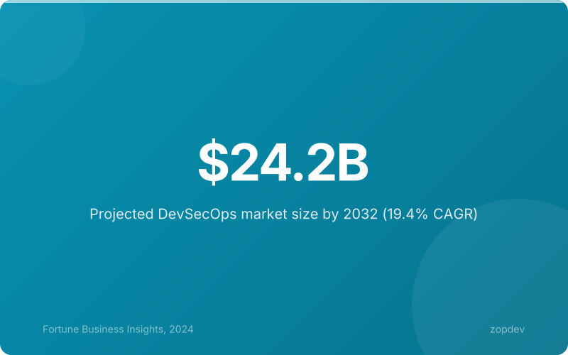
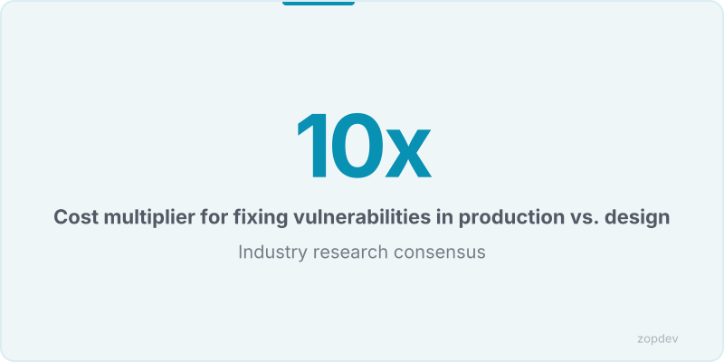
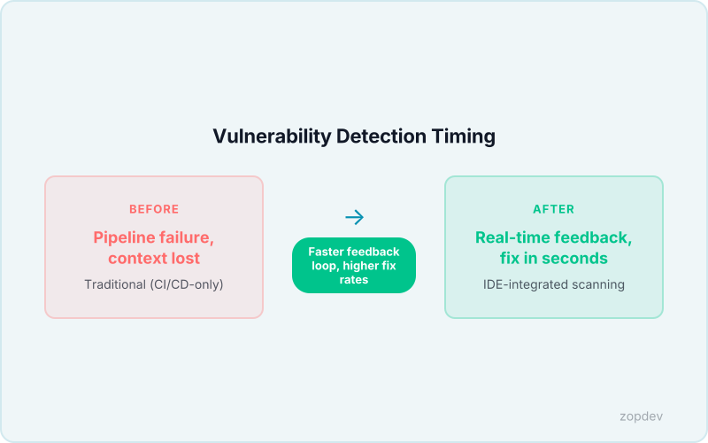
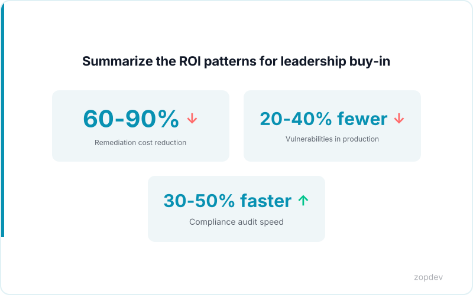

<!-- Generated by transform-chapter.ts with openai/MiniMax-M2 -->
<!-- Density: light | Word target: 800-1200 -->

The global application security market will reach $26.4 billion by 2028, driven by accelerating digital transformation (Fortune Business Insights). This growth masks a troubling reality: 97% of modern codebases contain open-source components, and 81% of those harbor high- or critical-risk vulnerabilities (Black Duck OSSRA Report). The attack surface has never been larger, yet detection still happens too late. Shift-left security moves vulnerability detection from production to design and coding phases, fundamentally changing this equation. Organizations that adopt shift-left practices reduce remediation costs by 60-90% compared to traditional approaches—an economic case as compelling as the security one. But here is the deeper problem: 80% of open-source dependencies remain un-updated for over a year (Sonatype). This chapter shows you how to catch vulnerabilities before they hatch, transforming security from a bottleneck into a competitive advantage.



## What Is Shift-Left Security?

The traditional security model treats application protection as a final inspection—a gatekeeper reviewing the finished product before deployment. Security teams receive a completed build, run penetration tests, and issue a pass-or-fail verdict. When vulnerabilities surface in production, the cost to fix them explodes.

The economics are stark. Catching a flaw during system design costs approximately $0. Fixing the same vulnerability during coding runs about $100. In staging, the price tag reaches $1,000. In production, remediation can exceed $10,000 when accounting for incident response, customer notification, and reputational damage.

Shift-left security inverts this model. Rather than treating security as a checkpoint at the end, it weaves protective measures into design, coding, and continuous integration pipelines. Developers receive real-time feedback as they write code. Architects identify threats during system modeling. The result is dramatic: early detection reduces remediation costs by 60-90% compared to traditional approaches (FACT SHEET).

This is not about replacing security teams. It is about empowering developers to own security from the first line they write—shifting the burden from reactive firefighting to proactive defense.

## Threat Modeling in the Design Phase

Security vulnerabilities compound when teams defer threat analysis until implementation. Threat modeling addresses this by making security risks visible during system design—a structured exercise that identifies what could go wrong before anyone writes code. The STRIDE framework (Spoofing, Tampering, Repudiation, Information Disclosure, Denial of Service, Elevation of Privilege) offers a lightweight vocabulary for categorizing threats without requiring deep security expertise.

What should teams model? Trace data flows across system boundaries, identify trust boundaries where assumptions shift between components, locate authentication and authorization enforcement points, and catalog where sensitive data persists. This is not a solo security team exercise—it demands collaboration. Developers understand the code, architects understand the system behavior, and security professionals contribute threat intelligence. When all three perspectives converge, blind spots disappear.

A realistic investment: one to two hours per feature or module yields immediate returns. Threat modeling during system design prevents costly rework later by catching structural flaws before code exists. Early detection reduces remediation costs by 60-90% compared to patching vulnerabilities in production (FACT SHEET). The math is simple—two hours of structured thinking eliminates days of emergency fixes and reputational damage when a breach surfaces.



## IDE-Integrated Security Scanning

The moment a developer types a SQL query, security should respond—not hours later in a CI pipeline scan. IDE-integrated scanning tools (Snyk, Checkmarx, SonarQube LSP, GitHub Copilot Security) analyze code as developers type, providing inline annotations for vulnerabilities, outdated dependencies, and insecure patterns. This real-time feedback transforms security from a blocker into a helpful collaborator.

When a developer writes `query = f"SELECT * FROM users WHERE id = {user_input}"`, the scanner immediately flags the SQL injection risk with inline annotations explaining the danger and suggesting parameterized alternatives. Hardcoded API keys trigger similar instant alerts. Developers fix issues while the code is fresh in their minds—shifting security from a post-commit chore to a natural part of the coding flow.

Configuration integrates directly into project files. A `.snyk` file defines scanning policy, while `sonar-project.properties` configures SonarQube analysis. The tools run silently in the background, surfacing findings without disrupting workflow.

The developer experience benefit is concrete: no more waiting for pipeline scans to discover flaws, no more context-switching to fix problems discovered hours after writing code, no more security as a final gate that blocks deployments. Early detection reduces remediation costs by 60-90% compared to traditional approaches (FACT SHEET). Security becomes something developers own—useful, immediate, and integrated.



## Pre-Commit and Pre-Receive Security Hooks

Your code is about to enter the repository. One line stands between a clean commit and a leaked API key spreading across every developer's machine: the Git hook.

Git hooks automate security checks before code enters the repository (FACT SHEET). Pre-commit hooks execute locally on a developer's machine before `git commit` runs—ideal for fast, developer-facing checks like linting, basic static analysis, and secret scanning. These hooks catch problems at the earliest possible moment, before code ever touches shared history.

Pre-receive hooks run server-side during `git push`, enforcing organizational policy: mandating code review approvals, blocking commits that violate naming conventions, or rejecting pushes that bypass required CI checks. Where pre-commit hooks protect individual developers, pre-receive hooks protect the entire organization.

A practical pre-commit hook uses gitleaks or detect-secrets to scan for exposed credentials:

```bash
#!/bin/sh
# Pre-commit hook to detect secrets before commit

echo "Running secret detection..."
gitleaks detect --staged --verbose
if [ $? -ne 0 ]; then
  echo "Commit blocked: secrets detected"
  exit 1
fi
```

This runs in seconds and prevents credentials from ever reaching version control. Hooks must complete in under 30 seconds—slower hooks breed bypasses and developer frustration. By catching issues at commit time, early detection reduces remediation costs by 60-90% compared to patching vulnerabilities discovered later (FACT SHEET). Security becomes invisible, automatic, and relentless.

## The Business Case for Shift-Left

The Datadog State of DevSecOps report found that 87% of organizations have known exploitable vulnerabilities in production (Datadog). That is a business risk, not just a security metric. Shift-left security directly addresses this by catching issues before they reach production—moving vulnerability detection from the build pipeline to the coding phase (FACT SHEET).

The financial case is straightforward: early detection reduces remediation costs by 60-90% compared to patching issues discovered in production (FACT SHEET). Threat modeling during system design prevents costly rework later (FACT SHEET). IDE-integrated scanning provides real-time feedback that developers act on immediately (FACT SHEET). Git hooks automate security checks before code enters the repository, catching problems at the earliest possible moment (FACT SHEET). Policy-as-Code with OPA accelerates audits by encoding compliance as executable tests. SBOM drift detection prevents supply chain breaches by flagging unauthorized dependency changes.

Yes, developer onboarding requires upfront investment—security tooling, training, and workflow adjustments take time. But the dividend appears as reduced incident response burden and fewer fire drills. Security becomes a competitive advantage, not a bottleneck.



## Summary: Start Shifting

Shift-left security is not optional—it is cheaper, faster, and more effective than patching production vulnerabilities. Early detection reduces remediation costs by 60-90% (FACT SHEET). This chapter covered four practices: threat modeling during design prevents costly rework; IDE-integrated scanning provides real-time feedback developers act on immediately; Git hooks automate security checks before code enters the repository; and the business case proves ROI through reduced incident response. Pick ONE practice to implement this week—start small, measure impact, expand. Shift-left is a journey, not a destination. The foundation built here enables more advanced practices like policy-as-code and SBOM drift detection.
