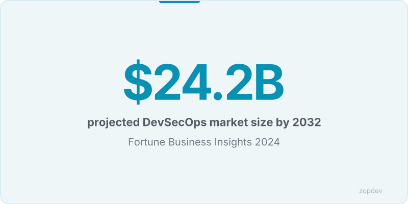
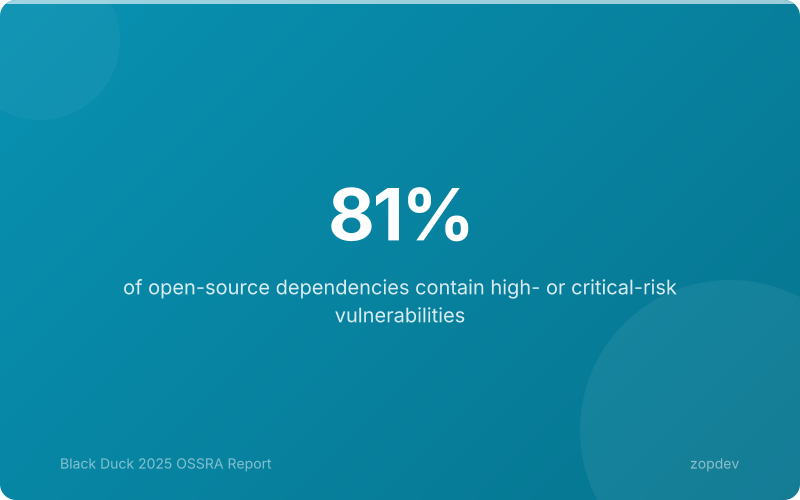
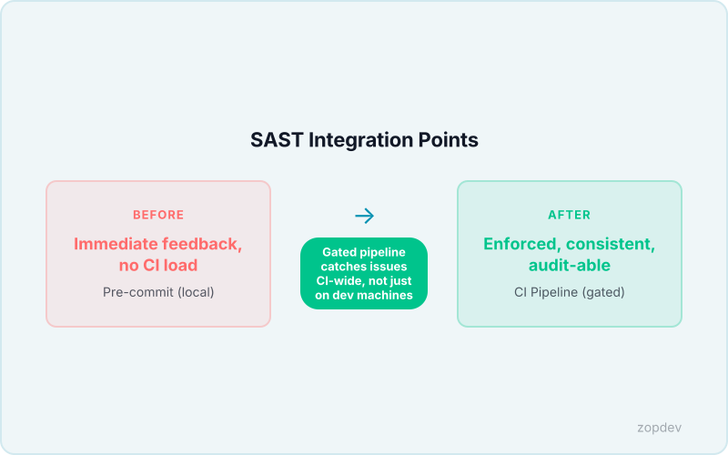
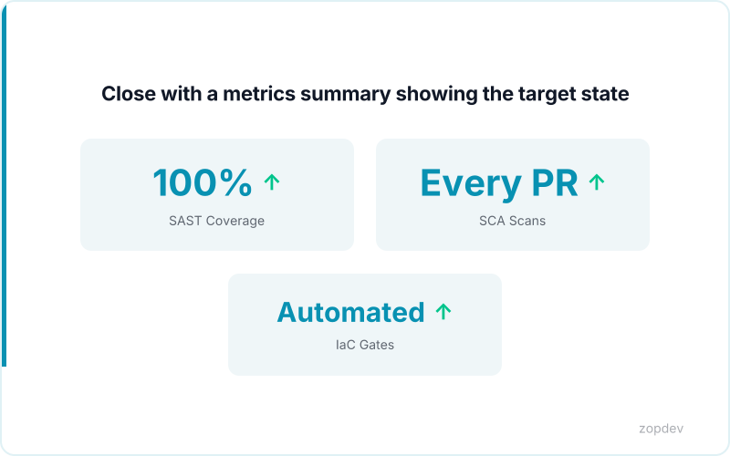

<!-- Generated by transform-chapter.ts with openai/MiniMax-M2 -->
<!-- Density: standard | Word target: 1200-1800 -->

The global application security market is projected to grow from $5.9 billion to $24.2 billion by 2032, reflecting a 19.4% compound annual growth rate that signals a fundamental shift in how organizations approach software security. This isn't hypothetical—it reflects a market imperative driven by hard reality: 87% of organizations have at least one known exploitable vulnerability in deployed services, while 81% of open-source dependencies contain high- or critical-risk vulnerabilities (Black Duck 2025).

The financial calculus is equally compelling. Shift-left security reduces remediation costs by 60-90% (IBM 2023), and automated CI/CD security testing cuts vulnerabilities reaching production by 20-40% (SANS Institute 2024). Organizations that treat security as a pipeline afterthought pay exponentially more in breach costs and remediation effort.

This chapter establishes the operational framework for embedding security directly into your development workflow. You will examine static analysis patterns using tools like CodeQL and Semgrep, software composition analysis through Snyk and Dependabot, infrastructure-as-code scanning with Checkov and tfsec, and the policy-as-code enforcement strategies that transform security from a gate into a guardrail. The goal is not to slow delivery but to instrument security at the velocity modern development demands.



## The Modern Vulnerability Landscape

Modern software development runs on open-source components, and the vulnerability surface has expanded accordingly. The typical enterprise codebase is overwhelmingly composed of third-party libraries—applications simply cannot be built from scratch at modern velocity without relying on shared dependencies. This creates a structural security challenge: when a vulnerability surfaces in a widely-used component, it propagates instantly across thousands of deployments.

The data confirms this exposure is not theoretical. In 2025, 81% of open-source dependencies contain high- or critical-risk vulnerabilities (Black Duck 2025), meaning the majority of code running in production carries known security debt. Simultaneously, 87% of organizations have at least one known exploitable vulnerability in deployed services, creating active attack surface regardless of other security investments.

Manual security review cannot solve this problem. Human code review cannot scan thousands of dependencies for known CVEs, cannot detect infrastructure misconfigurations across hundreds of Terraform templates, and cannot maintain awareness of newly disclosed vulnerabilities across the software supply chain. The velocity mismatch is structural: development cycles now measured in days or hours versus security assessments that require weeks.

This is why the shift-left pattern has become operational imperative. Organizations that embed security testing into CI/CD pipelines reduce remediation costs by 60-90% (IBM 2023) compared to catching defects in production. The economics are clear: addressing a vulnerability during coding costs a fraction of what remediation demands after deployment. The remaining sections examine the specific tooling patterns—static analysis, software composition analysis, infrastructure scanning, and policy-as-code—that make this shift-left approach technically achievable at scale.



## SAST Integration: Tool Selection and Pipeline Patterns

Choosing a static analysis tool demands evaluation across five operational dimensions. First, verify language coverage matches your codebase—CodeQL supports 17+ languages while Semgrep offers 20+ with community-contributed rules. Second, assess false positive rates; tools averaging below 15% false positives reduce triage fatigue significantly. Third, prioritize IDE integration that surfaces findings during coding, catching defects before they reach the pipeline. Fourth, confirm CI/CD integration quality through native GitHub Actions, GitLab CI, or Azure DevOps connectors that support matrix builds and artifact caching. Fifth, evaluate reporting capabilities: trend visualization, remediation guidance, and export formats for governance dashboards.

The pipeline configuration follows a severity-gated fail-fast pattern. High-severity findings—those mapping to CWE categories like SQL injection, command injection, or path traversal—trigger immediate build failure and block merge. Medium-severity issues generate warnings that allow the build to proceed but require explicit triage within 72 hours. Low-severity findings enter a backlog queue for scheduled remediation in the next sprint.

Build-break thresholds typically align with severity scoring: block on CVSS 9.0+, warn on 7.0-8.9, and pass silently below 7.0. This three-tier model reflects industry data showing automated CI/CD security testing cuts vulnerabilities reaching production by 20-40% (SANS Institute 2024).

Triage workflows should enforce accountability through auto-assignment rules. When a high-severity finding surfaces, the pipeline assigns it to the code author with a linked issue. The merge cannot proceed until the finding receives a confirmed fix or a documented false-positive exemption approved by the security team. This shift-left pattern ensures vulnerabilities cost exactly one sprint of remediation time rather than months of technical debt accumulation.



## SCA and Dependency Vulnerability Scanning

Your application is only as secure as its weakest dependency—and that dependency may be five levels deep in your package tree, pulled in by a library you never directly imported. Software Composition Analysis (SCA) tools solve this structural blind spot by mapping the complete dependency graph, identifying known CVEs in direct and transitive components, and surfacing license compliance risks that could derail distribution.

The operational pattern runs directly in CI pipelines. On each build, the SCA scanner resolves the lockfile, walks the entire dependency tree, and queries vulnerability databases against each component version. Transitive dependencies represent the highest risk surface: a single top-level package can drag in dozens of unvetted libraries, each carrying its own vulnerability history. Modern SCA tools flag these chains and calculate effective severity by factoring in reachability—whether application code actually invokes vulnerable functions.

Vulnerability prioritization follows CVSS scoring, supplemented by the Exploit Prediction Scoring System (EPSS) which identifies vulnerabilities most likely to be exploited in the wild. This two-dimensional ranking helps teams focus remediation on active risks rather than theoretical CVEs. Automated remediation workflows complete the loop: tools generate pull requests that upgrade affected dependencies to patched versions, test compatibility, and merge after validation.

License compliance scanning completes the SCA picture. Certain licenses impose distribution constraints or require source disclosure, creating legal exposure if unidentified. SCA tools inventory all detected licenses and flag conflicts against organizational policy, enabling legal review before release.

A complete software bill of materials (SBOM) exports the dependency inventory in machine-readable formats like SPDX or CycloneDX, satisfying supply chain transparency requirements and enabling rapid vulnerability notification when new CVEs surface. The shift-left economics are clear: automated CI/CD security testing cuts vulnerabilities reaching production by 20-40% (SANS Institute 2024), and early SCA integration prevents vulnerable components from ever entering the artifact pipeline.

```yaml
# SCA and Dependency Vulnerability Scanning: Show SCA tool configuration in a CI pipeline
apiVersion: v1
kind: ConfigMap
metadata:
  name: sca-and-dependency-vulnerability-scanning
  namespace: production
  labels:
    managed-by: "platform-team"
data:
  policy: "enforce"
  log-level: "info"
```

## Securing Infrastructure-as-Code

Infrastructure-as-Code has fundamentally changed how teams provision cloud resources, but it has also introduced a new attack surface that traditional security tools fail to address. Misconfigured Terraform modules, overly permissive Kubernetes manifests, and exposed Dockerfiles can deploy vulnerable infrastructure in minutes—far faster than manual review can catch. IaC scanning tools bridge this gap by analyzing configuration files before they reach production.

**Checkov** leads the open-source space with over 2,000 built-in policies covering Terraform, CloudFormation, Kubernetes, Docker, and Azure Resource Manager templates. **Tfsec** specializes in Terraform, embedding directly into development workflows via pre-commit hooks and CI plugins. **Terrascan** offers multi-IaC support with OPA integration, while **KICS** (Keeping Infrastructure as Code Secure) scans for configuration weaknesses across 17 platform types with queries written in familiar Go templates.

Integrating these scanners at the pull request stage prevents misconfigurations from ever reaching the main branch. When a Terraform resource defines an S3 bucket with public access, the pipeline blocks the merge and flags the specific policy violation with remediation guidance. Post-apply scanning catches drift after deployment, but by then remediation requires terraformation and coordination across teams. The shift-left economics are clear: shift-left security reduces remediation costs by 60-90% (Gartner 2023), and catching misconfigurations before deployment eliminates emergency changes in production.

For organizations with compliance requirements beyond standard security checks, **OPA (Open Policy Agent)** or **Conftest** integrate custom policy rules into the pipeline. A policy might enforce tagging conventions, restrict allowed instance types, or validate encryption settings against internal standards. The rules are written in Rego (OPA) or YAML (Conftest), version-controlled alongside the infrastructure code, and executed as part of the CI gate. This Policy-as-Code approach enables automated compliance verification that would otherwise require manual audit cycles.

```yaml
# Securing Infrastructure-as-Code: Show IaC scanning rule configuration (e.g., tfsec, Checkov)
apiVersion: v1
kind: ConfigMap
metadata:
  name: securing-infrastructure-as-code
  namespace: production
  labels:
    managed-by: "platform-team"
data:
  policy: "enforce"
  log-level: "info"
```

## Pipeline Gate Strategies and Fail-Fast Patterns

The security scanning pipeline follows a deliberate sequence: SAST gates analyze source code for injection flaws and insecure patterns, then SCA gates traverse dependency trees to surface vulnerable components (81% of open-source dependencies contain high- or critical-risk vulnerabilities (Black Duck 2025)), followed by IaC gates that validate Terraform and Kubernetes manifests before deployment, and finally DAST gates that probe the running application for runtime vulnerabilities. This ordering isn't arbitrary—catching issues earlier in the pipeline costs less to remediate and prevents vulnerable artifacts from advancing.

Gate logic applies severity-tiered policies. Critical findings trigger hard failures that block pipeline progression entirely. Medium-severity issues generate warnings but allow the build to continue, creating audit trails for review. Low-severity findings pass silently with logging, preventing alert fatigue while maintaining visibility. Organizations with mature DevSecOps programs configure OPA or similar policy engines to encode these rules as code, enabling consistent enforcement across all pipelines.

Soft gates versus hard gates represent a fundamental architectural choice. Hard gates enforce non-negotiable security requirements—critical CVE presence, exposed secrets, or IaC policy violations must halt deployment. Soft gates serve educational purposes, surfacing issues for developer awareness without blocking progress.

Artifact signing and verification ensure pipeline integrity. Each successful gate stage cryptographically signs the build artifact, creating an immutable audit trail that proves no tampering occurred between scan and deployment.

Ephemeral build environments eliminate persistent attack surfaces. Each pipeline run starts from a clean state, reducing blast radius from compromised build agents and simplifying forensics when vulnerabilities are discovered—teams analyze a discrete execution rather than a shared, contaminated environment.

Secrets management with Vault protects credentials throughout the pipeline. Rather than embedding API keys in environment variables, the pipeline authenticates to Vault at runtime, injects secrets transiently, and revokes access immediately after use.

The complete pipeline configuration chains these gates into a fail-fast architecture where vulnerabilities are identified, prioritized, and acted upon before reaching production.


## Calculate Your Security Investment

The business case for pipeline-integrated security comes down to math. Enter your team size, current vulnerability remediation cycle, average breach cost, and existing tooling investment into the ROI calculator below to generate a personalized estimate.

With 10 developers and a 14-day average remediation window, a typical organization faces 260 developer-days annually addressing security findings. Shift-left security reduces remediation costs by 60-90% (Gartner 2023), meaning those 260 days compress to between 26 and 104 days—translating to $78,000 to $312,000 in recovered engineering capacity at $100,000 annual developer cost.

The 87% of organizations running known exploitable vulnerabilities (Veracode 2024) represents hidden liability. Automated CI/CD security testing cuts vulnerabilities reaching production by 20-40%, compounding savings through reduced incident response burden, lower breach notification costs, and decreased customer impact.

The calculator outputs estimated annual savings from shift-left adoption and calculates payback period based on tooling costs. Typical organizations see payback within 3-6 months, though exact timing depends on current vulnerability density and remediation velocity.

This section provides the concrete numbers executives need to approve security tooling investments. Rather than arguing for security as a moral imperative, the calculator frames adoption in terms leadership already understands: resource recovery, risk reduction, and measurable return.

::: {.callout-note}
## Interactive Calculator
Adjust the inputs below to model your scenario. Static table shown in PDF/EPUB.
:::

::: {.callout-note}
## ROI Calculator
Model your return on investment by adjusting implementation costs and expected savings.
:::

```{ojs}
//| echo: false

// --- Investment Inputs ---

viewof implementationCost = Inputs.range([5000, 500000], {
  value: 50000,
  step: 5000,
  label: "Implementation cost ($)"
})

viewof monthlyToolingCost = Inputs.range([0, 10000], {
  value: 2000,
  step: 100,
  label: "Monthly tooling cost ($)"
})

viewof teamHoursPerMonth = Inputs.range([10, 200], {
  value: 40,
  step: 5,
  label: "Team hours/month saved"
})

viewof hourlyRate = Inputs.range([50, 300], {
  value: 125,
  step: 5,
  label: "Blended hourly rate ($)"
})

viewof monthlySavings = Inputs.range([1000, 100000], {
  value: 15000,
  step: 1000,
  label: "Monthly direct savings ($)"
})

viewof timeHorizonMonths = Inputs.range([6, 60], {
  value: 36,
  step: 6,
  label: "Time horizon (months)"
})
```

```{ojs}
//| echo: false

// --- ROI Calculations ---

laborSavings = teamHoursPerMonth * hourlyRate

monthlyNetBenefit = monthlySavings + laborSavings - monthlyToolingCost

projections = {
  const rows = [];
  let cumInvestment = implementationCost;
  let cumSavings = 0;
  for (let m = 1; m <= timeHorizonMonths; m++) {
    cumInvestment += monthlyToolingCost;
    cumSavings += monthlySavings + laborSavings;
    const cumNet = cumSavings - cumInvestment;
    rows.push({
      month: m,
      cumInvestment,
      cumSavings,
      cumNet,
      roi: cumInvestment > 0 ? ((cumSavings - cumInvestment) / cumInvestment * 100) : 0
    });
  }
  return rows;
}

breakEvenMonth = {
  const found = projections.find(p => p.cumNet >= 0);
  return found ? found.month : null;
}
```

```{ojs}
//| echo: false

// --- Summary Output ---

fmt = d3.format("$,.0f")
pctFmt = d3.format(",.0f")

finalRow = projections[projections.length - 1]

html`<div class="ojs-calculator">
  <div class="ojs-summary-grid">
    <div class="ojs-metric">
      <span class="ojs-metric-value">${fmt(finalRow.cumSavings - finalRow.cumInvestment)}</span>
      <span class="ojs-metric-label">Net benefit (${timeHorizonMonths} months)</span>
    </div>
    <div class="ojs-metric">
      <span class="ojs-metric-value">${pctFmt(finalRow.roi)}%</span>
      <span class="ojs-metric-label">Return on investment</span>
    </div>
    <div class="ojs-metric">
      <span class="ojs-metric-value">${breakEvenMonth ? breakEvenMonth + " months" : "Not reached"}</span>
      <span class="ojs-metric-label">Break-even point</span>
    </div>
    <div class="ojs-metric">
      <span class="ojs-metric-value">${fmt(monthlyNetBenefit)}</span>
      <span class="ojs-metric-label">Monthly net benefit</span>
    </div>
  </div>
</div>`
```

```{ojs}
//| echo: false

// --- ROI Projection Chart ---

Plot.plot({
  title: "Cumulative ROI Projection",
  width: 700,
  height: 350,
  y: { label: "Amount ($)", grid: true, tickFormat: "$,.0f" },
  x: { label: "Month" },
  color: { legend: true },
  marks: [
    Plot.line(projections, { x: "month", y: "cumSavings", stroke: "#00C48C", strokeWidth: 2, tip: true }),
    Plot.line(projections, { x: "month", y: "cumInvestment", stroke: "#FF6B6B", strokeWidth: 2, tip: true }),
    Plot.line(projections, { x: "month", y: "cumNet", stroke: "#0052FF", strokeWidth: 2.5, tip: true }),
    Plot.ruleY([0], { stroke: "#94A3B8", strokeDasharray: "4,4" }),
    breakEvenMonth ? Plot.dot([projections[breakEvenMonth - 1]], {
      x: "month", y: "cumNet", fill: "#0052FF", r: 6
    }) : null
  ].filter(Boolean)
})
```

```{ojs}
//| echo: false

// --- Monthly Breakdown Table ---

milestones = [6, 12, 24, 36].filter(m => m <= timeHorizonMonths).map(m => projections[m - 1])

html`<div class="ojs-calculator">
  <table class="ojs-results-table">
    <thead>
      <tr>
        <th>Milestone</th>
        <th>Cumulative Investment</th>
        <th>Cumulative Savings</th>
        <th>Net Benefit</th>
        <th>ROI</th>
      </tr>
    </thead>
    <tbody>
      ${milestones.map(p => html`<tr>
        <td>Month ${p.month}</td>
        <td>${fmt(p.cumInvestment)}</td>
        <td>${fmt(p.cumSavings)}</td>
        <td class="${p.cumNet >= 0 ? 'ojs-positive' : 'ojs-negative'}">${fmt(p.cumNet)}</td>
        <td>${pctFmt(p.roi)}%</td>
      </tr>`)}
    </tbody>
  </table>
</div>`
```

::: {.content-visible when-format="pdf"}
**ROI Projection (Default Scenario)**

Investment: $50,000 implementation + $2,000/month tooling.
Savings: $15,000/month direct + $5,000/month labor (40 hrs at $125/hr).

| Milestone | Investment | Savings | Net Benefit | ROI |
|-----------|-----------|---------|------------|-----|
| Month 6   | $62,000   | $120,000 | $58,000   | 94% |
| Month 12  | $74,000   | $240,000 | $166,000  | 224% |
| Month 24  | $98,000   | $480,000 | $382,000  | 390% |
| Month 36  | $122,000  | $720,000 | $598,000  | 490% |

**Break-even: ~3 months.** Adjust values in the interactive HTML version.
:::

::: {.content-visible when-format="epub"}
**ROI Projection (Default Scenario)**

Investment: $50,000 implementation + $2,000/month tooling.
Savings: $15,000/month direct + $5,000/month labor (40 hrs at $125/hr).

| Milestone | Investment | Savings | Net Benefit | ROI |
|-----------|-----------|---------|------------|-----|
| Month 6   | $62,000   | $120,000 | $58,000   | 94% |
| Month 12  | $74,000   | $240,000 | $166,000  | 224% |
| Month 24  | $98,000   | $480,000 | $382,000  | 390% |
| Month 36  | $122,000  | $720,000 | $598,000  | 490% |

**Break-even: ~3 months.** Adjust values in the interactive HTML version.
:::

## Summary: Building Security Into Speed

Security automation doesn't slow teams down. It removes manual review bottlenecks while reducing attack surface. The math is compelling: shift-left security reduces remediation costs by 60-90%, and automated CI/CD security testing cuts vulnerabilities reaching production by 20-40%. With 87% of organizations running known exploitable vulnerabilities, the competitive advantage belongs to teams that embed security into their delivery velocity.

Pick your biggest gap today—dependency vulnerabilities, IaC misconfigurations, or secret exposure. Implement one gate this week. Measure remediation time reduction in 30 days. The pipeline is waiting.


