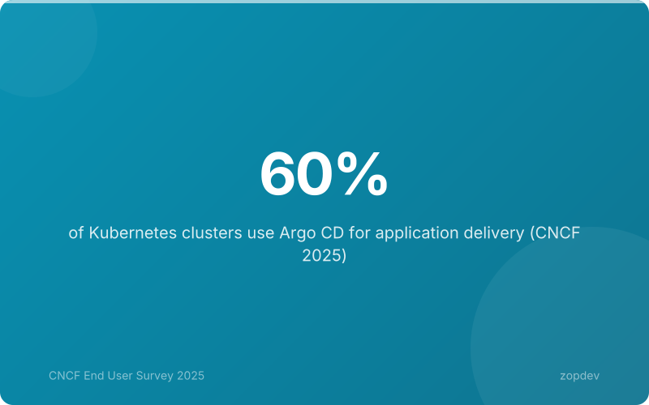

<!-- Generated by transform-chapter.ts with openai/MiniMax-M2 -->
<!-- Density: light | Word target: 800-1200 -->

**Sixty percent of Kubernetes clusters now run ArgoCD.** This is not a future projection or vendor aspiration. The CNCF 2025 survey confirms GitOps with ArgoCD has become the dominant delivery pattern for Kubernetes (60% adoption). The numbers tell a clearer story: an NPS of 79 places ArgoCD among the most loved tools in the cloud-native ecosystem, while 97% of users report production usage—essentially zero experimental adoption.



The industry has spoken. GitOps is no longer a architectural preference; it is the operational standard. But why has ArgoCD specifically won?

Three design pillars explain the dominance. ArgoCD treats infrastructure as declarative code, versioned in Git, and synchronized through a Pull-based model rather than traditional push pipelines. This combination transforms how teams manage clusters. Continuous reconciliation eliminates configuration drift automatically—the controller constantly monitors Git state and cluster reality, syncing without manual intervention.

The question is no longer whether to adopt ArgoCD. The question is why any team would build Kubernetes delivery without it.

## GitOps: The Operating Model for Cloud-Native Delivery

Git is the control plane. This is the core promise of GitOps.

The model rests on three pillars. First, declarative. You define what the system should look like, not the steps to get there. Kubernetes itself is declarative. ArgoCD extends this philosophy to your entire delivery pipeline. Second, versioned. Git stores the canonical configuration. Every change creates an audit trail. Rollback means reverting a commit. Third, Pull-based. ArgoCD's controller continuously pulls desired state from Git rather than having a pipeline push changes to clusters. This inverts the security model. No credentials live in CI servers. No exposed cluster APIs wait for deployments.

Traditional push-based CD requires secrets and tokens with cluster access. GitOps eliminates this attack surface. The three pillars—declarative, versioned, Pull-based—transform how teams manage infrastructure. ApplicationSets reduce configuration code 70-80% for multi-environment setups. Multi-cluster management from a single ArgoCD instance cuts operational overhead 40-60%.

ArgoCD, a CNCF-graduated project, embodies these principles. Start with one Application CRD. Scale with ApplicationSets when enterprise needs arrive.

*Visualize the Pull-based GitOps workflow showing Git as the single source of truth*

## ArgoCD Architecture: How It Works Under the Hood

At its core, ArgoCD runs three components that turn Git into a living control plane. The Application CRD defines the deployment. This Kubernetes custom resource specifies the Git repository, the target revision, the path within that repo, and the destination namespace. One Application CRD describes what to deploy, where, and how.

The controller is the engine. It runs a continuous reconciliation loop, polling Git for desired state and comparing it against actual cluster state every three minutes. When drift is detected, the controller triggers an automatic sync. This self-healing behavior means the cluster always converges toward Git's definition without human intervention.

The API server exposes the system. It serves the web UI, responds to CLI commands, and handles authentication. Teams interact with ArgoCD through this interface to create applications, view sync status, and manage rollout strategies.

This architecture treats Git as the single source of truth. The controller constantly works to align cluster reality with Git state. If someone manually changes a deployment, ArgoCD detects the drift and reverts it. If the Git repo updates, ArgoCD propagates the change automatically. An Application CRD declares intent. The controller enforces it. The API server makes it visible. Together, these components transform Kubernetes into a self-correcting system that never drifts.

## Drift Detection: Your Safety Net Against Configuration Drift

Manual interventions silently corrupt Kubernetes clusters. A developer runs kubectl edit to troubleshoot. A failed deployment leaves resources in limbo. Cluster autoscaling creates unmanaged nodes. These scenarios share one outcome: your running state diverges from Git state. This is configuration drift, and it breaks the GitOps promise.

ArgoCD solves this through continuous reconciliation. The controller constantly monitors both Git and cluster state, comparing desired configuration against what's actually running every three minutes. When drift is detected, ArgoCD automatically syncs the cluster back to match Git—this is self-healing. Teams receive alerts when drift occurs, or they let ArgoCD handle corrections autonomously.

The result is a cluster that always mirrors your Git repository. No more "works on my machine" mysteries. No more forgotten manual changes. No more drift between environments. ArgoCD's continuous reconciliation eliminates configuration drift automatically. Your infrastructure becomes self-correcting, declarative, and versioned—the three pillars that transform how teams manage infrastructure.

## Your First ArgoCD Application

Deploying an application in ArgoCD begins with a single YAML file. The Application custom resource sits at the heart of GitOps. One declarative manifest captures the entire deployment. Here's a complete example:

```yaml
apiVersion: argoproj.io/v1alpha1
kind: Application
metadata:
  name: my-service
  namespace: argocd
spec:
  project: default
  source:
    repoURL: https://github.com/myorg/apps.git
    targetRevision: main
    path: services/my-service/overlays/prod
  destination:
    server: https://kubernetes.default.svc
    namespace: production
  syncPolicy:
    automated:
      prune: true
      selfHeal: true
```

The apiVersion and kind identify this as an ArgoCD Application. The metadata.name sets the application name in the ArgoCD namespace. The spec.project references a logical grouping for RBAC. Under source, repoURL points to your Git repository. The targetRevision specifies the branch or tag. The path tells ArgoCD where Kubernetes manifests live in that repo. Under destination, server identifies the target cluster API. The namespace declares where resources land. The syncPolicy enables automated sync. Prune removes resources deleted from Git. SelfHeal reverts manual cluster changes. One YAML file declares complete intent—the controller enforces it.

## Scaling with ApplicationSets

A single Application handles one workload. Enterprise deployments need more. ApplicationSets solve this by generating multiple Applications from one template. This is the pattern that enables enterprise-scale deployments.

The matrix generator combines two generators to create Applications for each environment and region combination. The git generator scans a directory structure to create one Application per subdirectory.

Consider deploying the same service across dev, staging, and production. Without ApplicationSets, you need three separate Application manifests. With ApplicationSets, one template defines the pattern. A generator produces one Application per environment. The result: Template-based deployments reduce config code 70-80% for multi-environment setups.

ArgoCD provides the controller that reconciles each generated Application. You maintain one template. You scale to hundreds of targets. This is how ArgoCD scales beyond single app deployment.

```yaml
apiVersion: argoproj.io/v1alpha1
kind: ApplicationSet
metadata:
  name: multi-env-apps
  namespace: argocd
spec:
  generators:
  - list:
      elements:
      - cluster: staging
        url: https://staging.example.com
      - cluster: production
        url: https://prod.example.com
  template:
    metadata:
      name: 'my-service-{{cluster}}'
    spec:
      project: default
      source:
        repoURL: https://github.com/myorg/apps.git
        targetRevision: main
        path: 'overlays/{{cluster}}'
      destination:
        server: '{{url}}'
        namespace: my-service
```

## Summary: The GitOps Imperative

This approach delivers a single source of truth through Git, ensuring every cluster state mirrors your repository exactly. ArgoCD's continuous reconciliation eliminates configuration drift automatically—the controller monitors both Git and cluster state, auto-syncing when discrepancies appear. For enterprise scale, ApplicationSets generate hundreds of targeted Applications from one template, reducing config code 70-80% for multi-environment setups. Manage multiple clusters from a single ArgoCD instance, cutting operational overhead significantly.

ArgoCD is the CNCF-graduated project that embodies GitOps principles. As you implement these patterns, ArgoCD provides the controller, API server, and UI to manage the entire lifecycle. Start with one Application CRD, then scale with ApplicationSets. Your next steps: set up your first ArgoCD instance, convert one app to GitOps, and experience the safety net of drift detection firsthand.
