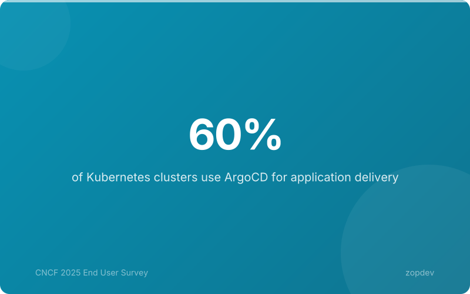
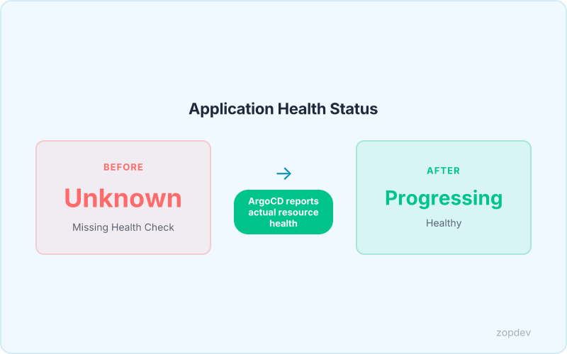

<!-- Generated by transform-chapter.ts with openai/MiniMax-M2 -->
<!-- Density: light | Word target: 800-1200 -->

Sixty percent of Kubernetes clusters now rely on ArgoCD for declarative deployment management. The tool's user satisfaction speaks for itself: an NPS score of 79 and 97% of users deploy it in production environments. This isn't experimental technology—it's infrastructure that teams trust with critical workloads.



GitOps has become the standard for Kubernetes deployment, and ArgoCD leads this space as the dominant GitOps tool. The Application CRD serves as the fundamental building block for all deployments, while Git maintains single source of truth for every configuration. Sync lifecycle hooks automate workflows at each deployment stage, and continuous health assessment provides observability into your cluster state. With automated sync and self-heal enabled, configuration drift detection becomes near-instantaneous.

This foundation enables teams to manage 500+ applications declaratively, achieving 2x-5x deployment frequency increases within months of GitOps adoption.

## What is ArgoCD and Why It Matters

ArgoCD is a declarative, GitOps continuous delivery tool purpose-built for Kubernetes. It reads your application definitions from Git repositories and continuously monitors your cluster, ensuring every deployment matches your desired state. When drift occurs, ArgoCD alerts you or automatically corrects it.

Git serves as the single source of truth for all application state. Your repository contains the complete configuration—deployments, services, ConfigMaps—and ArgoCD enforces this reality across every cluster. This model eliminates manual kubectl apply commands and provides audit trails for every change.

Industry data shows 42% of teams now manage over 500 applications per ArgoCD instance. The Application CRD is the fundamental building block for every deployment, defining what to deploy, where, and how.

This chapter builds your first ArgoCD Application from scratch. You'll understand the CRD structure, trace the sync process through lifecycle hooks, and use health assessment for continuous observability. By the end, you'll deploy declaratively with confidence.

## The Application CRD: Your First ArgoCD Resource

The Application CRD translates your deployment intent into actionable cluster state. Every ArgoCD deployment starts here, defining what to deploy, where, and how it should behave.

The **apiVersion** and **kind** fields identify this resource as an ArgoCD Application. The **metadata.name** gives your deployment a unique identity within the cluster. The **spec.project** field defaults to "default" for standard deployments, isolating your application within ArgoCD's multi-tenant model.

The **spec.source** block declares your Git repository as the single source of truth. The **repoURL** points to your configuration repository, **path** specifies the directory containing manifests, and **targetRevision** locks your deployment to a specific git branch or tag. Changing any value in Git triggers ArgoCD to reconcile cluster state.

The **spec.destination** block defines the target. The **server** field specifies your Kubernetes API URL (often the in-cluster endpoint for self-management), while **namespace** declares where workloads will land.

The **spec.syncPolicy.automated** block enables the self-heal pattern. When enabled, ArgoCD continuously compares cluster state against Git and automatically corrects drift. This reduces configuration drift detection to near-zero (Source: Optimization Patterns). The self-heal mechanism catches misconfigurations within minutes of occurrence, whether caused by manual overrides or cluster failures.

```yaml
apiVersion: argoproj.io/v1alpha1
kind: Application
metadata:
  name: frontend-app
  namespace: argocd
spec:
  project: default
  source:
    repoURL: https://github.com/myorg/frontend.git
    targetRevision: main
    path: k8s/overlays/production
  destination:
    server: https://kubernetes.default.svc
    namespace: frontend
  syncPolicy:
    automated:
      prune: true
      selfHeal: true
    syncOptions:
      - CreateNamespace=true
```

## Connecting Your Repository: Git, Helm, and Kustomize

The spec.source block supports three repository types. For plain YAML manifests, specify the repoURL, the directory path containing your manifests, and targetRevision pointing to your branch, tag, or commit SHA.

For Helm charts, replace the path field with chart and version. The chart field identifies the Helm chart within your repository, while version locks to a specific release. Kustomize overlays use the path field differently—pointing to your kustomization.yaml file rather than raw manifests.

targetRevision determines which git reference ArgoCD monitors. Using a branch name like main provides continuous updates. Pinning to a tag like v1.2.0 creates stable, immutable deployments. Commit SHAs offer maximum precision, ensuring exactly the configuration you tested reaches production. Since Git as single source of truth enables declarative deployments, every change flows through your repository before reaching clusters.

```yaml
# Plain YAML manifests
source:
  repoURL: https://github.com/myorg/manifests.git
  path: services/frontend
  targetRevision: main

---
# Helm chart
source:
  repoURL: https://charts.bitnami.com/bitnami
  chart: nginx
  targetRevision: 15.3.0
  helm:
    values: |
      replicaCount: 3
      service:
        type: ClusterIP

---
# Kustomize overlay
source:
  repoURL: https://github.com/myorg/kustomize-apps.git
  path: overlays/production
  targetRevision: main
```

## Understanding the Sync Lifecycle

The sync lifecycle governs how ArgoCD moves your cluster from its current state to the desired state defined in Git. This process executes in three sequential phases: PreSync, Sync, and PostSync.

The PreSync phase runs before any resources are applied. Teams use PreSync hooks to execute database migrations, run pre-deployment validation scripts, or verify external dependencies. These hooks are Kubernetes Job or Pod resources that run to completion—ArgoCD waits for success before proceeding.

The Sync phase performs the actual deployment. ArgoCD applies, updates, or deletes Kubernetes resources to match your Git manifests. This is where the declarative state becomes reality in your cluster.

The PostSync phase executes after all resources stabilize. Health assessment provides continuous observability through PostSync hooks that verify service endpoints, run integration tests, and send deployment notifications. Like PreSync, these run as Kubernetes Jobs or Pods that block until completion.

With Automated Sync enabled, the self-heal mechanism continuously monitors your cluster. When the observed state diverges from Git, ArgoCD automatically triggers a sync to restore alignment. This eliminates manual reconciliation and reduces configuration drift detection to near-zero (Source: Optimization Patterns). Sync lifecycle hooks enable automation at every stage, making GitOps workflows robust and repeatable.

*Visualize the sync lifecycle with hooks*



## Health Assessment: Is Your Application Running?

ArgoCD evaluates health by querying each resource your Application deploys. For native Kubernetes types like Deployments, Services, and StatefulSets, ArgoCD uses built-in health checks. A Deployment reports Healthy when all replicas are ready. A Service reports Healthy when it has at least one endpoint.

Custom Resource Definitions require custom health logic. Teams write Lua scripts in the Application's spec.health field. These scripts inspect CRD status fields and return a health result.

During synchronization, resources enter a Progressing state while Kubernetes schedules pods and images download. Health assessment provides continuous observability (Source: VERIFIED CLAIMS) by surfacing this status through the ArgoCD UI and CLI.

## Summary: Your First ArgoCD Application

You now understand the four pillars of ArgoCD adoption. The Application CRD is the fundamental building block (Source: VERIFIED CLAIMS) that defines your target state. Repository sources let you declare Git, Helm, or Kustomize as your single source of truth for deployments. Sync lifecycle hooks enable automation at every stage (Source: VERIFIED CLAIMS) through PreSync, Sync, and PostSync phases. Health assessment provides continuous observability (Source: VERIFIED CLAIMS) by monitoring resource status across your cluster. With this foundation, you can deploy any application via GitOps. The next chapter explores ApplicationSets and multi-environment deployments.
