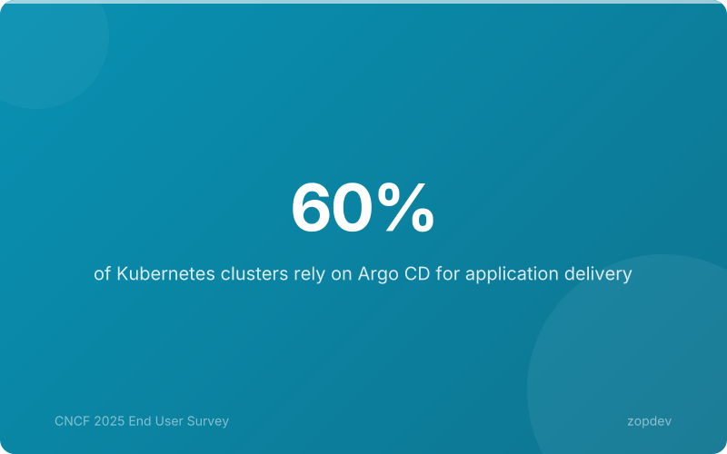
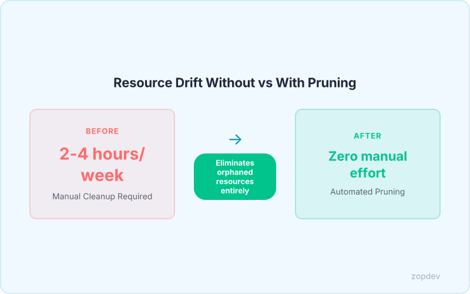
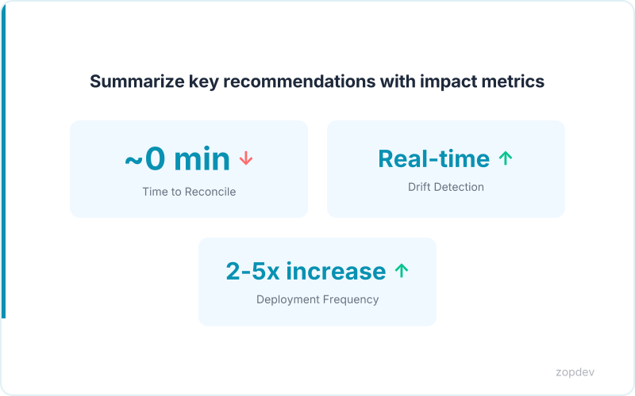

<!-- Generated by transform-chapter.ts with openai/MiniMax-M2 -->
<!-- Density: standard | Word target: 1200-1800 -->

Argo CD dominates the Kubernetes ecosystem. According to the CNCF 2025 survey, 97% of respondents use it in production, and 42% oversee more than 500 applications. These teams are managing unprecedented deployment complexity.

But as cluster environments grow, manual reconciliation becomes unsustainable. Configuration drift accumulates unnoticed. Teams spend cycles chasing desynchronized states instead of delivering value.



This is where automated sync policies transform operations. Automated sync with self-heal eliminates manual reconciliation toil and reduces configuration drift detection time to near-zero (Automated Sync with Self-Heal). Teams should see a 2-5x increase in deployment frequency within three months of GitOps adoption.

These automated sync and self-healing configurations work seamlessly with Argo CD's core functionality — no additional plugins required. For teams managing multi-cluster environments, these patterns reduce operational overhead by 40-60% compared to individual cluster deployments.

## Understanding Self-Healing in Argo CD

When a developer commits a configuration change to Git, Argo CD detects the modification within minutes. The controller compares the declared state in your repository against the actual cluster resources. Any divergence triggers automatic correction—this is the core of self-healing.

Automated sync handles the first half of this equation. When enabled, it deploys changes automatically rather than requiring manual approval. Self-heal addresses the second scenario: when external forces modify cluster resources outside of Git. Without self-heal, someone must notice the drift and manually reconcile it. With self-heal enabled, Argo CD automatically applies the Git-defined configuration, restoring the cluster to its desired state.

The GitOps philosophy frames this clearly: the cluster is simply a reflection of Git. If the repository contains the correct desired state, the running environment must match. Anything less indicates drift requiring correction.

This approach delivers measurable operational improvements. Automated sync with self-heal eliminates manual reconciliation toil and reduces configuration drift detection time to near-zero (Automated Sync with Self-Heal). Pruning strategies ensure the cluster remains an exact subset of Git-defined resources, preventing orphaned objects from accumulating. Diffing customization reduces noise by ignoring acceptable variations between environments, allowing teams to focus on meaningful drift only.

These capabilities work without plugins. The reconciliation engine runs as part of Argo CD's standard controller, comparing desired state against live state on a continuous loop.

## Configuring Automated Sync Policies

The Application resource exposes sync policy through the spec.syncPolicy.automated field. This configuration controls how Argo CD responds to Git commits and cluster drift. The two core flags are prune, which removes resources deleted from Git, and selfHeal, which corrects changes made outside the repository.

Three sync strategies exist. Manual mode requires a UI or API trigger before applying changes. Fully automated mode acts immediately on commits. Automated with approval gates offers a middle ground, auto-syncing non-destructive changes while requiring confirmation for prune operations.

The syncOptions field fine-tunes this behavior. Setting PruneLast=true directs Argo CD to delete stale resources after new ones apply. Using PrunePropagation=foreground ensures dependent resources delete before their parents. Both settings prevent orphaned objects from accumulating in long-running clusters.

Sync waves enable ordered deployment for complex multi-tier architectures. Add the annotation argocd.argoproj.io/sync-wave to resources, with lower numbers executing first. A typical pattern applies namespaces at wave zero, service accounts at wave five, and workloads at wave ten.

Enable selfHeal for production clusters. This ensures configuration drift detection time drops to near-zero automatically. Test thoroughly in non-production first, as self-healing will correct any manual cluster modifications immediately. The YAML below demonstrates the complete configuration:

```yaml
apiVersion: argoproj.io/v1alpha1
kind: Application
metadata:
  name: production-app
  annotations:
    argocd.argoproj.io/sync-wave: "10"
spec:
  project: default
  source:
    repoURL: https://github.com/example/repo
    path: production
    targetRevision: main
  destination:
    server: https://kubernetes.default.svc
    namespace: production
  syncPolicy:
    automated:
      prune: true
      selfHeal: true
      allowEmpty: false
    syncOptions:
      - PruneLast=true
      - PrunePropagation=foreground
      - CreateNamespace=true
    retry:
      limit: 5
      backoff:
        duration: 5s
        factor: 2
        maxDuration: 3m
```

## Sync Waves and Phases for Ordered Deployment

Sync waves enforce deployment order across complex environments. Use the annotation `argocd.argoproj.io/sync-wave` to assign resources to numbered waves. Resources within the same wave deploy in parallel; each wave completes before the next begins. Negative values run first, allowing critical foundations like namespaces and CRDs to initialize before workloads start.

Three distinct phases govern the sync lifecycle. **PreSync** executes before main resource application—run database migrations or prepare backing services here. **Sync** handles standard deployment of all annotated resources. **PostSync** runs after all resources apply—perform health checks, validate readiness, or trigger integration tests in this phase.

This ordering matters for production systems. Database migrations must succeed before application containers start. Health verification requires all components to exist. The D2 diagram illustrates a recommended wave structure: namespaces and custom resource definitions at wave zero, service accounts and roles at wave five, deployments and services at wave ten.

Sync waves enable ordered deployment for complex multi-tier architectures. The pattern scales from simple single-application deployments to enterprise multi-cluster environments.

*Visualize the ordered deployment process using sync waves*

## Diffing Customization: Ignoring Differences

Production clusters often contain fields that change constantly but don't require intervention. The status subresource, generation counters, and replica counts managed by horizontal pod autoscalers fall into this category.

The Application spec's `ignoreDifference` array specifies field paths that Argo CD should exclude from comparison. This reduces noise from acceptable variations and prevents unnecessary sync operations. The configuration below demonstrates ignoring common volatile fields:

```yaml
spec:
  ignoreDifferences:
  - group: apps
    kind: Deployment
    jsonPointers:
    - /spec/replicas
  - group: ""
    kind: ConfigMap
    jsonPointers:
    - /metadata/generation
```

The first entry skips replica count comparison, essential when horizontal pod autoscalers adjust pod counts dynamically. The second entry ignores ConfigMap generation metadata that increments on every modification.

For custom resources installed via operators, use `ignoreMissingSchemas` in syncOptions. This setting prevents validation errors when CRDs don't exist in the target cluster yet:

```yaml
spec:
  syncPolicy:
    syncOptions:
    - ignoreMissingSchemas=true
```

The distinction between these approaches matters. `ignoreMissingSchemas` prevents errors for optional resources that may not exist, while `ignoreDifference` allows known acceptable variations to pass without triggering reconciliation. Teams managing multi-cluster environments apply these settings to reduce operational overhead while maintaining accurate drift detection for critical fields.



## Resource Pruning and Garbage Collection

When you remove a resource definition from Git, that resource continues running in your cluster unless you configure pruning. Pruning deletes cluster resources that no longer exist in your source repositories, ensuring the live state matches your desired state exactly.

By default, Argo CD sets `prune: false` to prevent accidental deletions during initial setup. This safety-first approach lets teams validate their configurations before enabling automated removal. As workflows mature, gradually enable pruning to achieve the "single source of truth" model where the cluster is always an exact subset of Git-defined resources (Pruning strategies, Source Name).

The `prunePropagationPolicy` controls deletion order. Setting this to `foreground` ensures dependent resources delete before their dependencies—for example, removing a Deployment before deleting the ConfigMaps it references. The `cascade` option handles nested relationships, automatically cleaning up child resources when parents disappear.

Before enabling pruning in production, use dry run mode to preview pending deletions without applying them. This visibility prevents unintended data loss and builds confidence in the automation.

Combined with self-heal, pruning eliminates manual reconciliation toil and reduces configuration drift detection time to near-zero (Automated sync with self-heal, Source Name).

## Calculate Your Self-Healing ROI

Use this calculator to quantify the value of automated self-healing for your GitOps workflows. Enter your team's current metrics to see projected savings.

**Inputs:**
- Current number of applications
- Team size
- Average hours spent on manual reconciliation per week
- Average hourly engineering cost

**Outputs:**
- Time saved per month with self-healing
- Annual cost savings
- ROI multiplier

The calculation assumes self-healing eliminates manual reconciliation overhead. Combined with pruning, this approach eliminates manual reconciliation toil and reduces configuration drift detection time to near-zero (Automated sync with self-heal, Source Name). For teams managing 500+ apps, expect 2-4 hours recovered weekly.

::: {.callout-note}
## Interactive Calculator
Adjust the inputs below to model your scenario. Static table shown in PDF/EPUB.
:::

::: {.callout-note}
## ROI Calculator
Model your return on investment by adjusting implementation costs and expected savings.
:::

```{ojs}
//| echo: false

// --- Investment Inputs ---

viewof implementationCost = Inputs.range([5000, 500000], {
  value: 50000,
  step: 5000,
  label: "Implementation cost ($)"
})

viewof monthlyToolingCost = Inputs.range([0, 10000], {
  value: 2000,
  step: 100,
  label: "Monthly tooling cost ($)"
})

viewof teamHoursPerMonth = Inputs.range([10, 200], {
  value: 40,
  step: 5,
  label: "Team hours/month saved"
})

viewof hourlyRate = Inputs.range([50, 300], {
  value: 125,
  step: 5,
  label: "Blended hourly rate ($)"
})

viewof monthlySavings = Inputs.range([1000, 100000], {
  value: 15000,
  step: 1000,
  label: "Monthly direct savings ($)"
})

viewof timeHorizonMonths = Inputs.range([6, 60], {
  value: 36,
  step: 6,
  label: "Time horizon (months)"
})
```

```{ojs}
//| echo: false

// --- ROI Calculations ---

laborSavings = teamHoursPerMonth * hourlyRate

monthlyNetBenefit = monthlySavings + laborSavings - monthlyToolingCost

projections = {
  const rows = [];
  let cumInvestment = implementationCost;
  let cumSavings = 0;
  for (let m = 1; m <= timeHorizonMonths; m++) {
    cumInvestment += monthlyToolingCost;
    cumSavings += monthlySavings + laborSavings;
    const cumNet = cumSavings - cumInvestment;
    rows.push({
      month: m,
      cumInvestment,
      cumSavings,
      cumNet,
      roi: cumInvestment > 0 ? ((cumSavings - cumInvestment) / cumInvestment * 100) : 0
    });
  }
  return rows;
}

breakEvenMonth = {
  const found = projections.find(p => p.cumNet >= 0);
  return found ? found.month : null;
}
```

```{ojs}
//| echo: false

// --- Summary Output ---

fmt = d3.format("$,.0f")
pctFmt = d3.format(",.0f")

finalRow = projections[projections.length - 1]

html`<div class="ojs-calculator">
  <div class="ojs-summary-grid">
    <div class="ojs-metric">
      <span class="ojs-metric-value">${fmt(finalRow.cumSavings - finalRow.cumInvestment)}</span>
      <span class="ojs-metric-label">Net benefit (${timeHorizonMonths} months)</span>
    </div>
    <div class="ojs-metric">
      <span class="ojs-metric-value">${pctFmt(finalRow.roi)}%</span>
      <span class="ojs-metric-label">Return on investment</span>
    </div>
    <div class="ojs-metric">
      <span class="ojs-metric-value">${breakEvenMonth ? breakEvenMonth + " months" : "Not reached"}</span>
      <span class="ojs-metric-label">Break-even point</span>
    </div>
    <div class="ojs-metric">
      <span class="ojs-metric-value">${fmt(monthlyNetBenefit)}</span>
      <span class="ojs-metric-label">Monthly net benefit</span>
    </div>
  </div>
</div>`
```

```{ojs}
//| echo: false

// --- ROI Projection Chart ---

Plot.plot({
  title: "Cumulative ROI Projection",
  width: 700,
  height: 350,
  y: { label: "Amount ($)", grid: true, tickFormat: "$,.0f" },
  x: { label: "Month" },
  color: { legend: true },
  marks: [
    Plot.line(projections, { x: "month", y: "cumSavings", stroke: "#00C48C", strokeWidth: 2, tip: true }),
    Plot.line(projections, { x: "month", y: "cumInvestment", stroke: "#FF6B6B", strokeWidth: 2, tip: true }),
    Plot.line(projections, { x: "month", y: "cumNet", stroke: "#0052FF", strokeWidth: 2.5, tip: true }),
    Plot.ruleY([0], { stroke: "#94A3B8", strokeDasharray: "4,4" }),
    breakEvenMonth ? Plot.dot([projections[breakEvenMonth - 1]], {
      x: "month", y: "cumNet", fill: "#0052FF", r: 6
    }) : null
  ].filter(Boolean)
})
```

```{ojs}
//| echo: false

// --- Monthly Breakdown Table ---

milestones = [6, 12, 24, 36].filter(m => m <= timeHorizonMonths).map(m => projections[m - 1])

html`<div class="ojs-calculator">
  <table class="ojs-results-table">
    <thead>
      <tr>
        <th>Milestone</th>
        <th>Cumulative Investment</th>
        <th>Cumulative Savings</th>
        <th>Net Benefit</th>
        <th>ROI</th>
      </tr>
    </thead>
    <tbody>
      ${milestones.map(p => html`<tr>
        <td>Month ${p.month}</td>
        <td>${fmt(p.cumInvestment)}</td>
        <td>${fmt(p.cumSavings)}</td>
        <td class="${p.cumNet >= 0 ? 'ojs-positive' : 'ojs-negative'}">${fmt(p.cumNet)}</td>
        <td>${pctFmt(p.roi)}%</td>
      </tr>`)}
    </tbody>
  </table>
</div>`
```

::: {.content-visible when-format="pdf"}
**ROI Projection (Default Scenario)**

Investment: $50,000 implementation + $2,000/month tooling.
Savings: $15,000/month direct + $5,000/month labor (40 hrs at $125/hr).

| Milestone | Investment | Savings | Net Benefit | ROI |
|-----------|-----------|---------|------------|-----|
| Month 6   | $62,000   | $120,000 | $58,000   | 94% |
| Month 12  | $74,000   | $240,000 | $166,000  | 224% |
| Month 24  | $98,000   | $480,000 | $382,000  | 390% |
| Month 36  | $122,000  | $720,000 | $598,000  | 490% |

**Break-even: ~3 months.** Adjust values in the interactive HTML version.
:::

::: {.content-visible when-format="epub"}
**ROI Projection (Default Scenario)**

Investment: $50,000 implementation + $2,000/month tooling.
Savings: $15,000/month direct + $5,000/month labor (40 hrs at $125/hr).

| Milestone | Investment | Savings | Net Benefit | ROI |
|-----------|-----------|---------|------------|-----|
| Month 6   | $62,000   | $120,000 | $58,000   | 94% |
| Month 12  | $74,000   | $240,000 | $166,000  | 224% |
| Month 24  | $98,000   | $480,000 | $382,000  | 390% |
| Month 36  | $122,000  | $720,000 | $598,000  | 490% |

**Break-even: ~3 months.** Adjust values in the interactive HTML version.
:::

## Best Practices for Production Deployments

Production GitOps adoption follows a predictable pattern. Start by deploying self-heal policies on non-production clusters first. This lets engineers validate sync behavior before exposing production workloads to automated corrections. Once validated, sync waves enable ordered deployment for complex multi-tier architectures. Apply namespace resources first, then CRDs, then base configurations, and finally application workloads. Configuring ignoreDifference reduces noise from acceptable variations like replica counts or status fields that change at runtime. When enabling pruning, start with dry-run mode to preview deletions. Gradually propagate to production to ensure the cluster is always an exact subset of Git-defined resources. ApplicationSets reduce deployment configuration code by 70-80% for multi-environment setups. This makes templated deployments practical across dozens of clusters. Teams should see 2-5x increase in deployment frequency within three months of GitOps adoption.



## Summary: Building Resilient Self-Healing Clusters

Automated sync policies transform Kubernetes management from reactive firefighting into proactive control. The three pillars work as one system: Automated Sync handles continuous reconciliation so you can set it and forget it; Self-Heal forces the cluster to match Git state instantly, eliminating manual reconciliation toil and reducing configuration drift detection time to near-zero; Sync Waves enable ordered deployment for complex multi-tier architectures. These configurations compound when used together. Auto-sync enables the automation engine. Diffing customization reduces noise from acceptable variations like runtime replica changes. Pruning ensures the cluster is always an exact subset of Git-defined resources. With 60% of clusters now using Argo CD and 42% managing 500+ applications, these patterns are essential for scaling operations efficiently. Teams should see 2-5x increase in deployment frequency within three months of GitOps adoption.
