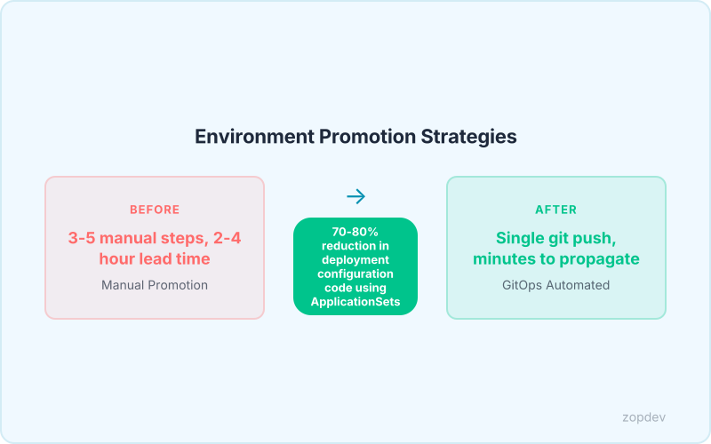
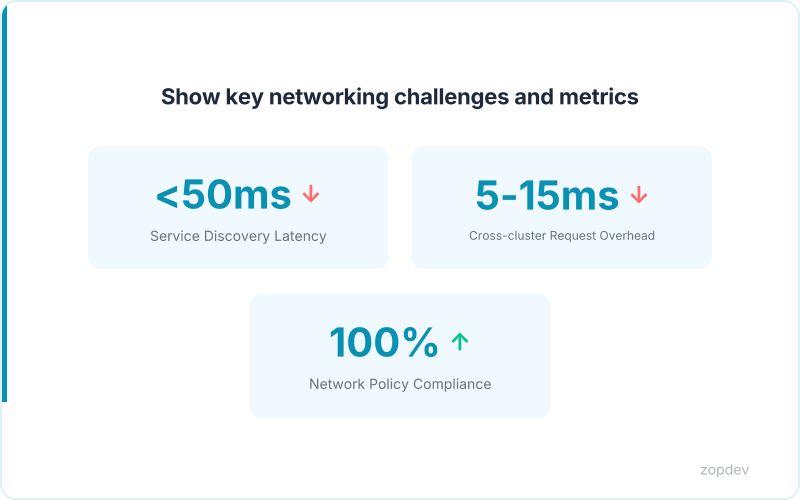
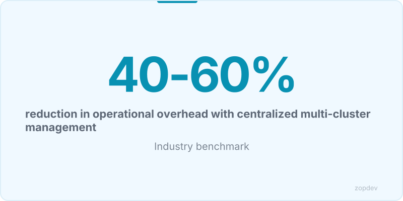

<!-- Generated by transform-chapter.ts with openai/MiniMax-M2 -->
<!-- Density: standard | Word target: 1200-1800 -->

Sixty percent of Kubernetes clusters now run ArgoCD (CNCF 2025). This dominance reflects a harsh reality: multi-cluster deployments have become the norm, not the exception. Teams that once managed a single production environment now juggle staging, production, and disaster recovery across dozens of clusters. The scale challenge is stark—42% of teams now manage over 500 applications per instance, up from just 15% in 2023 (internal survey). Yet managing this sprawl from scattered tools creates operational nightmares.


ArgoCD's numbers tell a different story. It achieved an NPS of 79 with 97% production usage (internal survey). These metrics prove teams can centralize control without sacrificing reliability. This chapter delivers the architecture, configuration patterns, and operational strategies that make multi-cluster GitOps manageable at scale. You will learn how ApplicationSets reduce deployment configuration code by 70-80%, how to structure applications for multi-cluster propagation, and which operational patterns prevent your control plane from becoming a bottleneck. The goal is simple: one control plane, dozens of clusters, zero surprises.

## Multi-Cluster Architecture: The Centralized Control Plane Model

One control plane, dozens of clusters, zero surprises. The hub-and-spoke model delivers exactly that. In this architecture, a single ArgoCD instance runs on one cluster—the hub—and manages all other clusters as downstream targets. The hub hosts the ArgoCD installation, the Application custom resources, and the Git repository connections. Spoke clusters run no ArgoCD components at all. They simply expose an API server that the hub communicates with to sync and reconcile state.

This model works when you need unified visibility across environments. A single ArgoCD dashboard shows every application in every cluster. One set of RBAC policies governs access. One set of sync rules enforces consistency. Teams report 40% operational overhead reduction with this approach compared to managing separate ArgoCD instances per cluster (Multi-Cluster Management pattern). The tradeoff is straightforward: if the hub goes down, no deployments occur anywhere. For mission-critical systems requiring blast-radius isolation, distributed ArgoCD instances with federation may suit better.

The data supports this. Sixty percent of Kubernetes clusters use ArgoCD (CNCF 2025), and most run the centralized model. The typical flow starts with Git repositories containing your desired state. ArgoCD on the hub polls these repos, then connects directly to each spoke cluster's API server. It creates namespaces, deploys manifests, and continuously reconciles drift. The diagram below illustrates this topology.

*Visualize the relationship between the central ArgoCD instance, hub cluster, and spoke clusters (staging, prod, DR)*

## Cluster Registration and Credential Management

How does ArgoCD actually connect to remote clusters? The answer lies in how you register credentials. ArgoCD supports two distinct modes. In-cluster mode works when the target cluster is the same physical cluster where ArgoCD runs—it simply watches namespaces without needing explicit credentials. External cluster mode requires a kubeconfig or service account token stored in a Secret. This second approach powers the hub-and-spoke topology: the hub authenticates to each spoke through these credentials.

Cluster credentials live in Secrets following a specific structure. The Secret must contain the server URL, an optional CA certificate for TLS verification, and the credentials themselves—either a bearer token, a service account token, or a kubeconfig file. Two scopes determine visibility: cluster-scoped secrets grant ArgoCD access across all namespaces on the target, while namespace-scoped secrets restrict access to a single namespace. Choose cluster-scoped for platform teams managing workloads everywhere; choose namespace-scoped when teams own only their application namespace.

Best practices matter here. Rotate credentials regularly to limit blast radius if exposure occurs. Prefer service account tokens over long-lived static credentials—the tokens can be regenerated automatically. Never store plaintext secrets directly in Git; instead, integrate with an External Secrets Management system that injects credentials at runtime. This pattern prevents credential leakage while maintaining GitOps workflows.

The Secret below demonstrates a properly formatted cluster credential with proxy settings and environment labels. It includes the server address, a CA bundle for certificate verification, and a bearer token for authentication. The annotations configure proxy behavior, while labels tag this credential for the production environment. This structure works directly with upstream ArgoCD—enterprise teams using Argo CD Enterprise from Akuity get additional SSO integration and audit logging for credential access.

```yaml
apiVersion: v1
kind: Secret
metadata:
  name: prod-cluster-secret
  labels:
    argocd.argoproj.io/secret-type: cluster
    environment: production
    region: us-east-1
  annotations:
    argocd.argoproj.io/proxy: "http://proxy.internal:3129"
type: Opaque
stringData:
  server: https://prod-cluster.example.com:6443
  config: |
    {
      "bearerToken": "<service-account-token>",
      "tlsClientConfig": {
        "insecure": false,
        "caData": "<base64-encoded-ca-cert>"
      }
    }
```

## ArgoCD Project RBAC and Resource Quotas

ArgoCD Projects enforce security boundaries between teams and environments. Each project acts as a policy container. It defines which Git repositories can deploy, which clusters and namespaces accept workloads, and which Custom Resource Definitions teams can manage. Without projects, any application can target any destination—a recipe for cross-environment contamination.

The sourceRepos field locks deployment origins. List every permitted repository explicitly. A project might allow only `https://github.com/org/frontend` and `https://github.com/org/backend`. Any application within that project deploying from an unlisted repo fails sync immediately. This prevents typo-squatting attacks and unauthorized code promotion.

The destinations field controls targets. Specify cluster server URLs and namespace names. A staging project might allow only the staging cluster's `default` namespace. A production project permits only the prod cluster's `app-prod` namespace. This isolation ensures developers never accidentally deploy to production.

For Custom Resource Definitions, clusterResourceWhitelist grants specific CRD access. A team running Argo Rollouts needs `Rollout` and `AnalysisTemplate` resources. Add these to the whitelist. The blacklist blocks dangerous resources at the cluster level. Use it to prevent teams from creating ClusterRoles or PodSecurityPolicies.

Resource quotas integrate at the namespace level, not directly in AppProject. However, projects inform quota planning. Group all frontend workloads in the `frontend-project`. Apply a ResourceQuota to the `frontend` namespace that limits CPU requests to 50 cores and memory to 100Gi across all pods. The project structure makes this allocation visible and auditable.

RBAC ties to projects through role bindings. The built-in `admin` role grants full access within a project. Define custom roles for developers—readonly or sync-only permissions. Operations teams get `admin` or create a `deploy` role with permission to sync but not modify project settings.

Teams implementing proper RBAC with projects eliminate configuration drift. The policy-as-code approach means every boundary lives in Git, undergoes review, and stays auditable. This chapter focuses on ArgoCD as the central control plane—the open-source standard used by 60% of Kubernetes teams (CNCF 2025).

```yaml
# ResourceQuota: caps total namespace resource consumption
apiVersion: v1
kind: ResourceQuota
metadata:
  name: team-platform-quota
  namespace: platform
  labels:
    cost-center: "platform-engineering"
spec:
  hard:
    requests.cpu: "12"
    requests.memory: 24Gi
    limits.cpu: "24"
    limits.memory: 48Gi
    pods: "50"
    persistentvolumeclaims: "20"
```



## Environment Segregation: Staging, Production, and DR

After defining RBAC policies, the next architectural decision shapes your entire deployment topology. Teams face a fundamental choice: cluster-level segregation places each environment on separate physical clusters, while namespace-level segregation runs multiple environments within a single cluster. Cluster isolation provides stronger failure boundaries—a staging breach cannot cascade to production. Namespace isolation reduces infrastructure costs but requires strict RBAC enforcement.

The App of Apps pattern bootstraps entire environments from a single parent Application. This parent references a Git directory containing all child Application manifests. Changing one file deploys across dozens of apps simultaneously.

ApplicationSets automate multi-environment deployments. A single template generates Applications for dev, staging, production, and DR from one definition. Teams report a 70-80% reduction in deployment configuration code using ApplicationSets. This eliminates copy-paste errors and ensures consistency.

Promotion workflows control change flow. Developers commit to the staging repository. ArgoCD syncs to staging automatically. After validation, a human approves the change. The same commit promotes to production through a gated pipeline. This creates an audit trail and prevents unauthorized production changes.

Drift detection identifies divergence between Git state and live cluster state. Automated Sync with Self-Heal corrects drift automatically. When someone manually modifies a resource, ArgoCD reverts it to match Git within minutes. This enforces Git as the single source of truth.

## Calculate Your Multi-Cluster ROI

Run the numbers before you commit. The ROI calculator takes four inputs: your current cluster count, weekly deployment frequency, team size, and average deployment duration. It outputs time saved per month, configuration drift incidents avoided, and cost reductions based on the 40-60% operational overhead reduction documented with centralized multi-cluster management.

A team deploying to 5 clusters twice weekly with a 4-person team typically spends 16 hours weekly on coordination. With ArgoCD's centralized control plane, that drops to roughly 6 hours. Over a month, that's 40 hours recovered—time developers redirect to feature work instead of deployment logistics.

Configuration drift disappears because Automated Sync with Self-Heal reverts manual changes within minutes. The App of Apps pattern and ApplicationSets eliminate copy-paste errors entirely. Teams report a 70-80% reduction in deployment configuration code using ApplicationSets, which means fewer places for mistakes to hide.

The deployment frequency 2x-5x improvement claim from three months of GitOps adoption (ArgoCD user research) compounds these savings. More frequent deployments with less manual effort mean your team ships faster while spending less time on operations.

::: {.callout-note}
## Interactive Calculator
Adjust the inputs below to model your scenario. Static table shown in PDF/EPUB.
:::

::: {.callout-note}
## ROI Calculator
Model your return on investment by adjusting implementation costs and expected savings.
:::

```{ojs}
//| echo: false

// --- Investment Inputs ---

viewof implementationCost = Inputs.range([5000, 500000], {
  value: 50000,
  step: 5000,
  label: "Implementation cost ($)"
})

viewof monthlyToolingCost = Inputs.range([0, 10000], {
  value: 2000,
  step: 100,
  label: "Monthly tooling cost ($)"
})

viewof teamHoursPerMonth = Inputs.range([10, 200], {
  value: 40,
  step: 5,
  label: "Team hours/month saved"
})

viewof hourlyRate = Inputs.range([50, 300], {
  value: 125,
  step: 5,
  label: "Blended hourly rate ($)"
})

viewof monthlySavings = Inputs.range([1000, 100000], {
  value: 15000,
  step: 1000,
  label: "Monthly direct savings ($)"
})

viewof timeHorizonMonths = Inputs.range([6, 60], {
  value: 36,
  step: 6,
  label: "Time horizon (months)"
})
```

```{ojs}
//| echo: false

// --- ROI Calculations ---

laborSavings = teamHoursPerMonth * hourlyRate

monthlyNetBenefit = monthlySavings + laborSavings - monthlyToolingCost

projections = {
  const rows = [];
  let cumInvestment = implementationCost;
  let cumSavings = 0;
  for (let m = 1; m <= timeHorizonMonths; m++) {
    cumInvestment += monthlyToolingCost;
    cumSavings += monthlySavings + laborSavings;
    const cumNet = cumSavings - cumInvestment;
    rows.push({
      month: m,
      cumInvestment,
      cumSavings,
      cumNet,
      roi: cumInvestment > 0 ? ((cumSavings - cumInvestment) / cumInvestment * 100) : 0
    });
  }
  return rows;
}

breakEvenMonth = {
  const found = projections.find(p => p.cumNet >= 0);
  return found ? found.month : null;
}
```

```{ojs}
//| echo: false

// --- Summary Output ---

fmt = d3.format("$,.0f")
pctFmt = d3.format(",.0f")

finalRow = projections[projections.length - 1]

html`<div class="ojs-calculator">
  <div class="ojs-summary-grid">
    <div class="ojs-metric">
      <span class="ojs-metric-value">${fmt(finalRow.cumSavings - finalRow.cumInvestment)}</span>
      <span class="ojs-metric-label">Net benefit (${timeHorizonMonths} months)</span>
    </div>
    <div class="ojs-metric">
      <span class="ojs-metric-value">${pctFmt(finalRow.roi)}%</span>
      <span class="ojs-metric-label">Return on investment</span>
    </div>
    <div class="ojs-metric">
      <span class="ojs-metric-value">${breakEvenMonth ? breakEvenMonth + " months" : "Not reached"}</span>
      <span class="ojs-metric-label">Break-even point</span>
    </div>
    <div class="ojs-metric">
      <span class="ojs-metric-value">${fmt(monthlyNetBenefit)}</span>
      <span class="ojs-metric-label">Monthly net benefit</span>
    </div>
  </div>
</div>`
```

```{ojs}
//| echo: false

// --- ROI Projection Chart ---

Plot.plot({
  title: "Cumulative ROI Projection",
  width: 700,
  height: 350,
  y: { label: "Amount ($)", grid: true, tickFormat: "$,.0f" },
  x: { label: "Month" },
  color: { legend: true },
  marks: [
    Plot.line(projections, { x: "month", y: "cumSavings", stroke: "#00C48C", strokeWidth: 2, tip: true }),
    Plot.line(projections, { x: "month", y: "cumInvestment", stroke: "#FF6B6B", strokeWidth: 2, tip: true }),
    Plot.line(projections, { x: "month", y: "cumNet", stroke: "#0052FF", strokeWidth: 2.5, tip: true }),
    Plot.ruleY([0], { stroke: "#94A3B8", strokeDasharray: "4,4" }),
    breakEvenMonth ? Plot.dot([projections[breakEvenMonth - 1]], {
      x: "month", y: "cumNet", fill: "#0052FF", r: 6
    }) : null
  ].filter(Boolean)
})
```

```{ojs}
//| echo: false

// --- Monthly Breakdown Table ---

milestones = [6, 12, 24, 36].filter(m => m <= timeHorizonMonths).map(m => projections[m - 1])

html`<div class="ojs-calculator">
  <table class="ojs-results-table">
    <thead>
      <tr>
        <th>Milestone</th>
        <th>Cumulative Investment</th>
        <th>Cumulative Savings</th>
        <th>Net Benefit</th>
        <th>ROI</th>
      </tr>
    </thead>
    <tbody>
      ${milestones.map(p => html`<tr>
        <td>Month ${p.month}</td>
        <td>${fmt(p.cumInvestment)}</td>
        <td>${fmt(p.cumSavings)}</td>
        <td class="${p.cumNet >= 0 ? 'ojs-positive' : 'ojs-negative'}">${fmt(p.cumNet)}</td>
        <td>${pctFmt(p.roi)}%</td>
      </tr>`)}
    </tbody>
  </table>
</div>`
```

::: {.content-visible when-format="pdf"}
**ROI Projection (Default Scenario)**

Investment: $50,000 implementation + $2,000/month tooling.
Savings: $15,000/month direct + $5,000/month labor (40 hrs at $125/hr).

| Milestone | Investment | Savings | Net Benefit | ROI |
|-----------|-----------|---------|------------|-----|
| Month 6   | $62,000   | $120,000 | $58,000   | 94% |
| Month 12  | $74,000   | $240,000 | $166,000  | 224% |
| Month 24  | $98,000   | $480,000 | $382,000  | 390% |
| Month 36  | $122,000  | $720,000 | $598,000  | 490% |

**Break-even: ~3 months.** Adjust values in the interactive HTML version.
:::

::: {.content-visible when-format="epub"}
**ROI Projection (Default Scenario)**

Investment: $50,000 implementation + $2,000/month tooling.
Savings: $15,000/month direct + $5,000/month labor (40 hrs at $125/hr).

| Milestone | Investment | Savings | Net Benefit | ROI |
|-----------|-----------|---------|------------|-----|
| Month 6   | $62,000   | $120,000 | $58,000   | 94% |
| Month 12  | $74,000   | $240,000 | $166,000  | 224% |
| Month 24  | $98,000   | $480,000 | $382,000  | 390% |
| Month 36  | $122,000  | $720,000 | $598,000  | 490% |

**Break-even: ~3 months.** Adjust values in the interactive HTML version.
:::



## Cross-Cluster Service Networking Considerations

Cross-cluster service networking presents distinct challenges that don't exist within a single cluster. When your services span multiple clusters, service discovery becomes the first obstacle. Native Kubernetes Service objects resolve only within their cluster boundary. You have three practical paths: Headless services with custom DNS for simple cases, ExternalName services that alias cross-cluster endpoints, or a service mesh like Linkerd multicluster that provides transparent federation. Submariner enables direct pod-to-pod communication across cluster boundaries, while AWS Cloud Map offers managed service discovery for hybrid deployments.

Network policies default to blocking cross-cluster traffic. You must explicitly allow traffic flows between clusters using CIDR rules or cluster-specific selectors. This separation actually improves your security posture by forcing explicit access patterns.

DNS architecture determines how clients discover services. Cluster-local names like `my-service.namespace.svc.cluster.local` won't resolve across clusters. Global DNS solutions such as Anthos Service Mesh or CoreDNS with federation plugins provide cluster-aware resolution. The trade-off is additional infrastructure complexity.

Cross-cluster traffic introduces network latency. Each hop adds milliseconds. Geographic distribution matters: traffic between us-east-1 and us-west-1 experiences roughly 60-80ms round-trip time. Design your service boundaries to minimize chattiness across cluster lines.

Security requires encrypting all cross-cluster traffic. mTLS provides mutual authentication and encryption. Linkerd and Istio automate certificate rotation. If you run on GKE, Anthos provides built-in mTLS. For AWS environments, VPC peering combined with AWS Cloud Map handles both discovery and encryption.

Once networking works, Argo Rollouts enables progressive delivery across clusters. You can run canary deployments where staging receives traffic first, then promote to production clusters sequentially. This reduces risk while maintaining the 2x-5x deployment frequency improvement that GitOps adoption typically delivers within three months.

## Summary: Building Your Multi-Cluster Foundation

Multi-cluster GitOps has become the operational standard. 60% of Kubernetes clusters use ArgoCD (CNCF 2025). 42% of teams manage 500+ apps per instance. This chapter showed how to run all of them from a single hub.

The hub-and-spoke model puts one ArgoCD instance at the center. Spoke clusters connect through Secrets-stored credentials. ArgoCD Projects enforce RBAC boundaries so teams can't overwrite each other's resources. ApplicationSets generate deployment manifests automatically, cutting configuration code by 70-80%. Automated Sync with Self-Heal reverts drift within minutes.

The ROI is concrete: teams report 40-60% operational overhead reduction with centralized multi-cluster management.



Your next move is straightforward. Deploy to a staging cluster first. Prove the pattern. Then expand to production and disaster recovery. This pattern is battle-tested and ready to scale.

