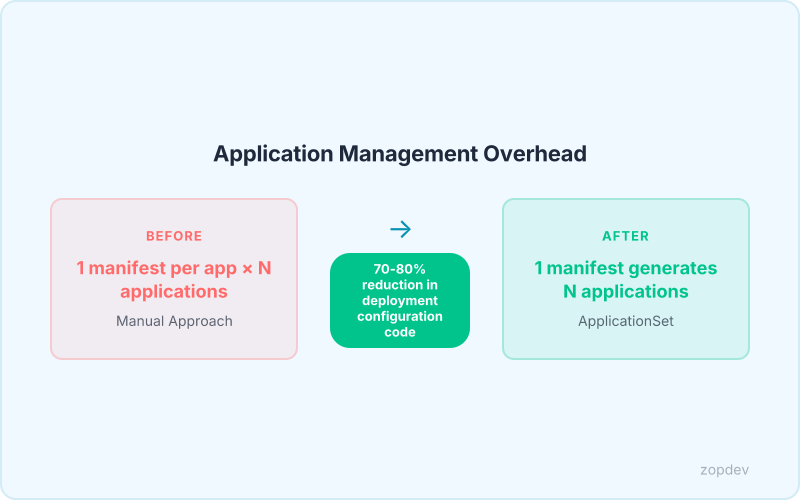
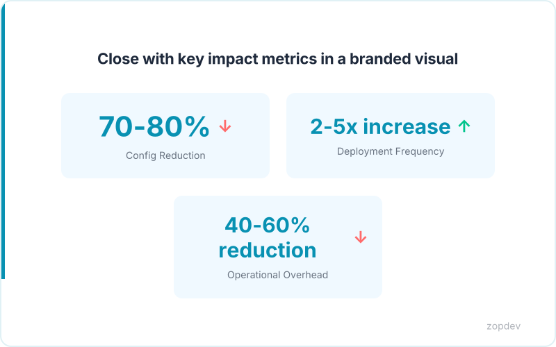

<!-- Generated by transform-chapter.ts with openai/MiniMax-M2 -->
<!-- Density: standard | Word target: 1200-1800 -->

The CNCF 2025 survey reveals that 60% of organizations have adopted GitOps for Kubernetes deployment. This widespread adoption brings new challenges: 42% of teams now oversee 500+ applications per instance, a figure that has nearly tripled from just 15% in 2023. These teams report an NPS of 79, demonstrating strong practitioner satisfaction, while 97% operate ApplicationSets in production environments.

While Argo CD handles single application deployment beautifully, managing hundreds of applications across multiple clusters becomes unwieldy without abstraction. This chapter introduces ApplicationSet—the CRD that lets you deploy hundreds of apps from one manifest.


The ApplicationSet CRD reduces deployment configuration code by 70-80% for multi-environment and multi-cluster setups. You will learn how the Git generator uses repository structure as the source of truth, how the Matrix generator combines multiple generators to create cartesian products of deployments, and how the Cluster selector dynamically assigns Applications to clusters based on metadata labels. Teams can achieve 2x-5x deployment frequency increase within 3 months of GitOps adoption.



## The Scaling Challenge in GitOps

The challenge isn't theoretical. Teams managing hundreds of microservices across multiple clusters face an explosion of Kubernetes manifests. Each Application resource requires identical fields—namespace, cluster, repository URL, revision—repeated endlessly. A single cluster rename triggers cascading updates across dozens of files. The manual approach multiplies effort and error risk.

The "App of Apps" pattern emerged as an early solution. This pattern uses one Application to deploy others, demonstrating that templating was possible. However, it falls short in three critical areas. It cannot generate Applications from repository structure. It lacks matrix capabilities for cartesian product deployments. It offers no cluster selector for dynamic assignment based on metadata labels.

ApplicationSet addresses these gaps natively. The Git generator uses repository structure as the source of truth for generating Applications. The Matrix generator combines multiple generators to create cartesian products of deployments. The Cluster selector dynamically assigns Applications to clusters based on metadata labels. The CRD reduces deployment configuration code by 70-80% for multi-environment and multi-cluster setups.

This approach slashes operational overhead by 40-60% compared to managing individual cluster deployments. The result: teams deploy faster with fewer errors and less boilerplate.

## Understanding the ApplicationSet CRD

At its core, ApplicationSet is a Custom Resource Definition that extends Argo CD. It introduces a layer of abstraction above the Application resource. Where a single Application deploys one workload, ApplicationSet deploys dozens—or hundreds—from a single manifest.

The mechanism relies on two components: generators and the template. Generators define the input—the source of variation across your deployments. The template defines the output—the Application spec that gets rendered for each generator input. When ApplicationSet processes a manifest, it iterates over every generator element, combines each with the template, and produces a distinct Application resource.

The List generator demonstrates this pattern clearly. It accepts an explicit set of values and generates one Application per entry. The following ApplicationSet creates three Applications for dev, staging, and prod environments:

```yaml
apiVersion: argoproj.io/v1alpha1
kind: ApplicationSet
metadata:
  name: environments
spec:
  generators:
  - list:
      elements:
      - env: dev
        cluster: dev-cluster
      - env: staging
        cluster: staging-cluster
      - env: prod
        cluster: prod-cluster
  template:
    metadata:
      name: '{{env}}-app'
    spec:
      project: default
      source:
        repoURL: https://github.com/example/repo.git
        targetRevision: HEAD
        path: apps/myapp
      destination:
        server: https://kubernetes.default.svc
        namespace: '{{env}}'
```

The generator produces three elements from the list. The template injects each `env` value into the Application name and namespace. The result: three fully formed Application resources from one YAML file.

This pattern scales beyond environment lists. The Git generator derives inputs from repository structure. The Matrix generator combines generators to create cartesian products. The Cluster selector assigns Applications dynamically based on cluster metadata labels. Each extends the same core concept: define inputs once, render many Applications.

## Git Generator: Directory and File-Based Templating

The git generator treats your repository as the single source of truth for deployment topology. It inspects your directory structure or specific files and generates one Application resource per discovered element. This eliminates manual tracking entirely.

**Directory generator mode** traverses a folder path and creates one Application for each subdirectory found. Consider a repository with the following structure under `/apps`:

```
/apps/service-a/
/apps/service-b/
/apps/service-c/
```

Each directory contains the Kubernetes manifests for that microservice. The ApplicationSet generator configuration specifies the repository, the branch to watch, and the directory path to scan:

```yaml
generators:
- git:
    repoURL: https://github.com/team/apps-repo.git
    revision: HEAD
    directories:
    - apps/*
```

When ApplicationSet processes this generator, it discovers three directories. The template then renders one Application for each, injecting the directory path into the Application name:

```yaml
template:
  metadata:
    name: '{{path.basename}}'
  spec:
    project: default
    source:
      repoURL: https://github.com/team/apps-repo.git
      targetRevision: HEAD
      path: '{{path}}'
    destination:
      server: https://kubernetes.default.svc
      namespace: default
```

The `{{path}}` variable contains the full directory path like `apps/service-a`. The `{{path.basename}}` variable extracts just the folder name for use in naming. This transforms three folders into three Applications automatically.

**File generator mode** parses individual files rather than directories. It reads JSON or YAML files containing Application definitions and generates one Application per file. This approach suits teams that store Application specs as standalone files.

The practical impact is direct. When a developer adds a new service folder to `/apps`, ApplicationSet detects it on the next sync cycle. No manifest changes required. No ApplicationSet updates needed. The GitOps workflow handles everything through repository structure.

This pattern drives real velocity. Teams can achieve 2x-5x deployment frequency increase within 3 months of GitOps adoption by removing the operational bottleneck of manual Application creation.

## Matrix Generator: Combining Generators

The Matrix generator takes generator composition to its logical extreme. It combines the outputs from two or more generators to produce a cartesian product of their inputs. When you pair 3 environments with 4 regions, the Matrix generator produces 12 distinct Application resources from a single configuration.

The data flow is straightforward. Generator A emits the environment list. Generator B emits the region list. The Matrix generator cross-references these inputs, creating every possible combination. The template then renders an Application for each pair, injecting both values into the appropriate fields.

Visualized as a flow: Generator A (environments) feeds into the Matrix combiner. Generator B (regions) feeds into the same combiner. The Matrix produces 12 combined elements. Each element flows into the template, which renders the final Application spec.

The configuration uses nested generator references:

```yaml
generators:
- matrix:
    generators:
    - list:
        elements:
        - env: dev
        - env: staging
        - env: prod
    - list:
        elements:
        - region: us-east
        - region: us-west
        - region: eu
        - region: apac
  template:
    metadata:
      name: '{{env}}-{{region}}-app'
    spec:
      project: default
      source:
        repoURL: https://github.com/example/repo.git
        targetRevision: HEAD
        path: apps/myapp
      destination:
        server: https://kubernetes.default.svc
        namespace: '{{env}}'
```

This example combines two List generators. The first provides the environments. The second provides the regions. The Matrix produces 12 elements. The template injects both values into the Application name and namespace.

This is where ApplicationSet delivers maximum value for large-scale deployments. The Matrix generator combines multiple generators to create cartesian products of deployments. You define your topology once. The system renders every combination automatically. The ApplicationSet CRD reduces deployment configuration code by 70-80% for multi-environment and multi-cluster setups. Instead of managing 12 separate Application manifests, you maintain one ApplicationSet that scales to hundreds of combinations without additional overhead.

*Visualize how Matrix combines two generators to create a cartesian product of deployments* *(diagram: before-after-optimization)*

## Cluster Selector: Dynamic Target Assignment

When your infrastructure spans multiple Kubernetes clusters, targeting the right destination becomes a moving target. The cluster selector generator solves this by reading metadata directly from Argo CD's registered cluster credentials. Each cluster in Argo CD carries labels that describe its purpose, environment, or owner. The generator reads those labels and filters which clusters should receive generated Applications.

Consider three clusters registered with Argo CD. The first carries the label `environment=dev`. The second has `environment=staging`. The third bears `environment=prod`. You want one ApplicationSet that deploys to all production clusters only. The cluster selector filters based on that label:

```yaml
generators:
- cluster:
    selector:
      matchLabels:
        environment: prod
  template:
    metadata:
      name: '{{metadata.name}}-app'
    spec:
      project: default
      source:
        repoURL: https://github.com/example/repo.git
        targetRevision: HEAD
        path: apps/myapp
      destination:
        server: '{{server}}'
        namespace: production
```

The `{{server}}` variable resolves to each cluster's API endpoint automatically. When a new cluster joins with the `environment=prod` label, ApplicationSet picks it up on the next sync. No configuration changes required.

This pattern enables true "deploy once, target many" behavior across your estate. A single ApplicationSet can target every cluster belonging to the payments team by selecting on `team=payments`. The cluster selector dynamically assigns Applications to clusters based on metadata labels. The ApplicationSet CRD reduces deployment configuration code by 70-80% for multi-environment and multi-cluster setups.

## Calculate Your ApplicationSet ROI

Every ApplicationSet implementation delivers measurable returns. The following calculator quantifies your specific gains based on three inputs: current application count, environment or cluster count, and monthly maintenance hours.

**Input your numbers:**

- Current applications: ___
- Environments or clusters: ___
- Hours per month maintaining manifests: ___

**Calculator outputs:**

For every application targeting multiple environments, ApplicationSet eliminates redundant YAML. If you manage 50 applications across 4 environments, you maintain 200 Application manifests traditionally. ApplicationSet reduces deployment configuration code by 70-80% for multi-environment and multi-cluster setups, collapsing those 200 definitions into approximately 40-60 ApplicationSet resources.

**Time saved per month:** Multiply your monthly maintenance hours by 0.75. A team spending 40 hours monthly on manifest maintenance recovers 30 hours. Multi-Cluster Management reduces operational overhead by 40-60% compared to managing individual cluster deployments.

**Config line reduction:** Multiply application count by environment count, then apply the 70-80% reduction factor. One hundred applications across five environments drops from 500 YAML files to roughly 100-150 ApplicationSet definitions.

**Projected annual savings:** Multiply your hourly rate by hours saved monthly, then by 12. At $100/hour, a 30-hour monthly recovery equals $36,000 annually.

Teams can achieve 2x-5x deployment frequency increase within 3 months of GitOps adoption by eliminating manual Application management. The matrix generator combines multiple generators to create cartesian products of deployments, further accelerating your ROI.

::: {.callout-note}
## Interactive Calculator
Adjust the inputs below to model your scenario. Static table shown in PDF/EPUB.
:::

::: {.callout-note}
## ROI Calculator
Model your return on investment by adjusting implementation costs and expected savings.
:::

```{ojs}
//| echo: false

// --- Investment Inputs ---

viewof implementationCost = Inputs.range([5000, 500000], {
  value: 50000,
  step: 5000,
  label: "Implementation cost ($)"
})

viewof monthlyToolingCost = Inputs.range([0, 10000], {
  value: 2000,
  step: 100,
  label: "Monthly tooling cost ($)"
})

viewof teamHoursPerMonth = Inputs.range([10, 200], {
  value: 40,
  step: 5,
  label: "Team hours/month saved"
})

viewof hourlyRate = Inputs.range([50, 300], {
  value: 125,
  step: 5,
  label: "Blended hourly rate ($)"
})

viewof monthlySavings = Inputs.range([1000, 100000], {
  value: 15000,
  step: 1000,
  label: "Monthly direct savings ($)"
})

viewof timeHorizonMonths = Inputs.range([6, 60], {
  value: 36,
  step: 6,
  label: "Time horizon (months)"
})
```

```{ojs}
//| echo: false

// --- ROI Calculations ---

laborSavings = teamHoursPerMonth * hourlyRate

monthlyNetBenefit = monthlySavings + laborSavings - monthlyToolingCost

projections = {
  const rows = [];
  let cumInvestment = implementationCost;
  let cumSavings = 0;
  for (let m = 1; m <= timeHorizonMonths; m++) {
    cumInvestment += monthlyToolingCost;
    cumSavings += monthlySavings + laborSavings;
    const cumNet = cumSavings - cumInvestment;
    rows.push({
      month: m,
      cumInvestment,
      cumSavings,
      cumNet,
      roi: cumInvestment > 0 ? ((cumSavings - cumInvestment) / cumInvestment * 100) : 0
    });
  }
  return rows;
}

breakEvenMonth = {
  const found = projections.find(p => p.cumNet >= 0);
  return found ? found.month : null;
}
```

```{ojs}
//| echo: false

// --- Summary Output ---

fmt = d3.format("$,.0f")
pctFmt = d3.format(",.0f")

finalRow = projections[projections.length - 1]

html`<div class="ojs-calculator">
  <div class="ojs-summary-grid">
    <div class="ojs-metric">
      <span class="ojs-metric-value">${fmt(finalRow.cumSavings - finalRow.cumInvestment)}</span>
      <span class="ojs-metric-label">Net benefit (${timeHorizonMonths} months)</span>
    </div>
    <div class="ojs-metric">
      <span class="ojs-metric-value">${pctFmt(finalRow.roi)}%</span>
      <span class="ojs-metric-label">Return on investment</span>
    </div>
    <div class="ojs-metric">
      <span class="ojs-metric-value">${breakEvenMonth ? breakEvenMonth + " months" : "Not reached"}</span>
      <span class="ojs-metric-label">Break-even point</span>
    </div>
    <div class="ojs-metric">
      <span class="ojs-metric-value">${fmt(monthlyNetBenefit)}</span>
      <span class="ojs-metric-label">Monthly net benefit</span>
    </div>
  </div>
</div>`
```

```{ojs}
//| echo: false

// --- ROI Projection Chart ---

Plot.plot({
  title: "Cumulative ROI Projection",
  width: 700,
  height: 350,
  y: { label: "Amount ($)", grid: true, tickFormat: "$,.0f" },
  x: { label: "Month" },
  color: { legend: true },
  marks: [
    Plot.line(projections, { x: "month", y: "cumSavings", stroke: "#00C48C", strokeWidth: 2, tip: true }),
    Plot.line(projections, { x: "month", y: "cumInvestment", stroke: "#FF6B6B", strokeWidth: 2, tip: true }),
    Plot.line(projections, { x: "month", y: "cumNet", stroke: "#0052FF", strokeWidth: 2.5, tip: true }),
    Plot.ruleY([0], { stroke: "#94A3B8", strokeDasharray: "4,4" }),
    breakEvenMonth ? Plot.dot([projections[breakEvenMonth - 1]], {
      x: "month", y: "cumNet", fill: "#0052FF", r: 6
    }) : null
  ].filter(Boolean)
})
```

```{ojs}
//| echo: false

// --- Monthly Breakdown Table ---

milestones = [6, 12, 24, 36].filter(m => m <= timeHorizonMonths).map(m => projections[m - 1])

html`<div class="ojs-calculator">
  <table class="ojs-results-table">
    <thead>
      <tr>
        <th>Milestone</th>
        <th>Cumulative Investment</th>
        <th>Cumulative Savings</th>
        <th>Net Benefit</th>
        <th>ROI</th>
      </tr>
    </thead>
    <tbody>
      ${milestones.map(p => html`<tr>
        <td>Month ${p.month}</td>
        <td>${fmt(p.cumInvestment)}</td>
        <td>${fmt(p.cumSavings)}</td>
        <td class="${p.cumNet >= 0 ? 'ojs-positive' : 'ojs-negative'}">${fmt(p.cumNet)}</td>
        <td>${pctFmt(p.roi)}%</td>
      </tr>`)}
    </tbody>
  </table>
</div>`
```

::: {.content-visible when-format="pdf"}
**ROI Projection (Default Scenario)**

Investment: $50,000 implementation + $2,000/month tooling.
Savings: $15,000/month direct + $5,000/month labor (40 hrs at $125/hr).

| Milestone | Investment | Savings | Net Benefit | ROI |
|-----------|-----------|---------|------------|-----|
| Month 6   | $62,000   | $120,000 | $58,000   | 94% |
| Month 12  | $74,000   | $240,000 | $166,000  | 224% |
| Month 24  | $98,000   | $480,000 | $382,000  | 390% |
| Month 36  | $122,000  | $720,000 | $598,000  | 490% |

**Break-even: ~3 months.** Adjust values in the interactive HTML version.
:::

::: {.content-visible when-format="epub"}
**ROI Projection (Default Scenario)**

Investment: $50,000 implementation + $2,000/month tooling.
Savings: $15,000/month direct + $5,000/month labor (40 hrs at $125/hr).

| Milestone | Investment | Savings | Net Benefit | ROI |
|-----------|-----------|---------|------------|-----|
| Month 6   | $62,000   | $120,000 | $58,000   | 94% |
| Month 12  | $74,000   | $240,000 | $166,000  | 224% |
| Month 24  | $98,000   | $480,000 | $382,000  | 390% |
| Month 36  | $122,000  | $720,000 | $598,000  | 490% |

**Break-even: ~3 months.** Adjust values in the interactive HTML version.
:::



## Summary: Scaling GitOps with ApplicationSets

The four generators work as building blocks. The ApplicationSet CRD extends Argo CD to handle mass deployment across dozens of clusters. The Git generator reads your repository structure to determine what gets deployed where—no manual tracking required. The Matrix generator creates cartesian products by combining generators, letting you mix cluster metadata with application paths. The cluster selector filters targets based on Argo CD cluster labels.

These pieces compose naturally. Use Git generator to define application structure. Add Matrix to combine that with cluster information. Apply cluster selector to filter which environments receive each deployment. One ApplicationSet can manage a hundred applications across twenty clusters with a single configuration block.

Teams can achieve 2x-5x deployment frequency increase within 3 months of GitOps adoption. The ApplicationSet CRD reduces deployment configuration code by 70-80% for multi-environment and multi-cluster setups.

As infrastructure grows past 500 applications, manual Application management becomes untenable. ApplicationSet isn't optional at that scale—it's essential. Start by templating one service across your staging and production environments. Expand once the pattern proves itself.

