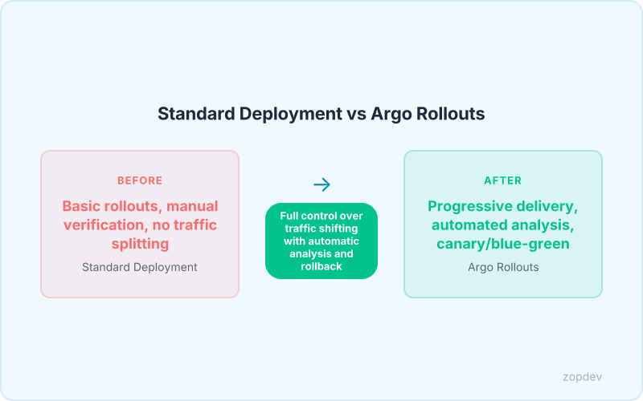
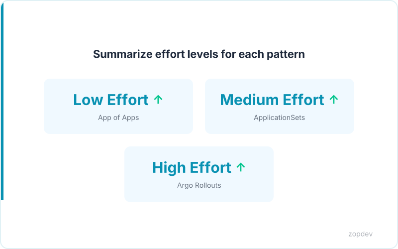

<!-- Generated by transform-chapter.ts with openai/MiniMax-M2 -->
<!-- Density: full | Word target: 1800-2500 -->

Argo CD has become the de facto standard for Kubernetes GitOps. The tool achieved an NPS of 79, with 97% of survey respondents using it in production (CNCF Survey 2025). This widespread adoption reflects a fundamental shift: teams managing large Kubernetes footprints now oversee over 500 applications per Argo CD instance, up from just 15% in 2023 (CNCF Survey 2025). The complexity that comes with this scale demands patterns beyond basic GitOps configuration.


This chapter builds on foundational GitOps knowledge to cover two advanced deployment strategies. First, the App of Apps pattern simplifies bootstrap processes and enables declarative multi-application orchestration with low implementation effort (Argo CD Documentation). Second, Argo Rollouts reduces risk of failed releases and enables safer rollouts with automatic traffic shifting, though it requires higher implementation effort (Argo Rollouts Documentation). These patterns work with any Argo CD installation—no additional commercial tooling required—though enterprise teams often combine them with Argo CD's built-in RBAC, SSO integration, and audit logging for production governance.

By the end of this chapter, you will understand how to structure hierarchical deployments that scale across hundreds of services while maintaining declarative control over your entire platform.

## The App of Apps Pattern: Declarative Multi-Application Orchestration

Managing 500 applications manually breaks down quickly. When 42% of teams now oversee over 500 applications per Argo CD instance (CNCF Survey 2025), manual application creation becomes a scaling bottleneck. The App of Apps pattern solves this through hierarchy: a single root Application resource defines and manages dozens or hundreds of child Applications declaratively.

At its core, the pattern treats application orchestration as just another Kubernetes resource. The root Application points to a Git directory containing Application manifests. Argo CD reads this directory and automatically creates each child Application in the cluster. When you modify the root configuration in Git, Argo CD propagates those changes across your entire application fleet.

The bootstrap use case demonstrates the pattern's power. A single root Application can spin up your entire platform from scratch: ingress controllers, service meshes, monitoring stacks, and all microservices. Teams adopt this approach to achieve reproducible environments across clusters without manual intervention.

The pattern delivers high ROI with minimal implementation effort (Argo CD Documentation). Enterprise teams extend it with Argo CD's built-in RBAC, SSO integration, and audit logging for production governance.

## Implementing App of Apps: Configuration Patterns

The App of Apps pattern requires careful configuration to unlock its full potential. Two primary approaches exist: directory-based Applications and ApplicationSets. Both achieve the same goal—declarative child application management—but suit different operational scales.

## Directory-Based Approach

The directory-based approach uses a root Application pointing to a Git directory containing child Application manifests. The root Application's spec.source.path field references a directory relative to the repository root. Each YAML file in that directory becomes a child Application.

The syncPolicy controls how Argo CD handles updates. Setting syncPolicy.auto to enabled triggers automatic synchronization when Git changes differ from cluster state. The syncPolicy.automated.selfHeal enabled setting corrects drift caused by manual cluster changes, restoring the desired state from Git automatically.

Destination configuration determines where child Applications deploy. The spec.destination.namespace field specifies the target namespace. The spec.destination.server field points to the API server URL for the target cluster. When deploying across multiple clusters, reference each cluster's context name in the destination block.

Project assignment scopes permissions. The spec.project field must match an existing Argo CD Project. Projects define which resources Applications can create, which source repos are permitted, and cluster access policies. This isolation prevents misconfiguration from affecting unrelated workloads.

The directory structure follows a predictable pattern. The root Application lives at the repository root or in a dedicated bootstrap directory. Child Application manifests reside in a subdirectory. Argo CD watches this subdirectory and reconciles any additions, modifications, or deletions.

## ApplicationSet for Multi-Cluster Scenarios

ApplicationSets extend the pattern for matrix-based deployments. The generator.matrix.combine strategy merges parameters from multiple generators. One generator might iterate over cluster names while another iterates over application namespaces. The cross-product produces Application resources for every combination.

ApplicationSets reduce deployment configuration code by 70-80% for multi-environment and multi-cluster setups (Argo CD Documentation). This efficiency matters when 42% of teams now oversee over 500 applications per instance (CNCF Survey 2025).

The matrix generator produces Application resources from parameterized templates. Each generated Application inherits the template's spec but substitutes variables from the generator outputs. This approach eliminates repetitive YAML and ensures consistency across environments.

Both approaches share a critical benefit: Git becomes the source of truth for your entire application fleet. When auto-sync is enabled, any Git commit propagates across all managed Applications without manual kubectl commands. The self-heal capability ensures cluster state never drifts from your declared configuration, regardless of how the drift occurs.

```yaml
apiVersion: argoproj.io/v1alpha1
kind: Rollout
metadata:
  name: frontend-rollout
spec:
  replicas: 5
  strategy:
    canary:
      steps:
      - setWeight: 10
      - pause: {duration: 5m}
      - setWeight: 30
      - pause: {duration: 5m}
      - setWeight: 60
      - pause: {duration: 10m}
      canaryService: frontend-canary
      stableService: frontend-stable
      trafficRouting:
        nginx:
          stableIngress: frontend-ingress
  selector:
    matchLabels:
      app: frontend
  template:
    metadata:
      labels:
        app: frontend
    spec:
      containers:
      - name: frontend
        image: myorg/frontend:latest
        ports:
        - containerPort: 80
```



## Argo Rollouts: Beyond Standard Kubernetes Deployments

Standard Kubernetes Deployments offer two update strategies: RollingUpdate and Recreate. Neither provides control over traffic distribution during rollout. Argo Rollouts fills this gap as a Custom Resource Definition that extends Deployment semantics with advanced rollout strategies.

Argo Rollouts introduces three progressive delivery mechanisms. Canary deployments shift a configurable percentage of traffic to the new version, allowing teams to validate behavior with real users before full migration. Blue-green deployments run old and new versions simultaneously, routing all traffic to the new version only after validation passes. Analysis templates automate validation by querying metrics providers, automatically rolling back when metrics breach defined thresholds.

These capabilities reduce risk of failed releases and enable safer rollouts with automatic traffic shifting (Argo CD Documentation). Standard RollingUpdate gradually replaces pods but cannot split traffic. Recreate terminates all old pods before starting new ones, causing downtime. Neither strategy validates new version behavior before exposing production traffic.

The implementation requires higher effort than basic Deployments. Teams must configure the Rollout CRD, define analysis templates, and integrate with a service mesh or ingress controller for traffic splitting. However, this investment pays dividends in production safety. Integration with Istio, Linkerd, or Nginx Ingress enables fine-grained traffic control at the routing layer.

This chapter focuses on open-source Argo CD and Argo Rollouts capabilities. The patterns shown work with any Argo CD installation. However, enterprise teams often combine these with Argo CD's built-in RBAC, SSO integration, and audit logging for production governance.

## Canary Analysis with Metric Providers

Canary analysis automates verification of new versions before production traffic receives them. Argo Rollouts queries external metric providers at defined intervals, comparing results against success criteria. When metrics exceed thresholds, the controller automatically rolls back to the previous version. This feedback loop reduces risk of failed releases and enables safer rollouts with automatic traffic shifting (Argo CD Documentation).

The AnalysisTemplate CRD defines verification logic declaratively. It specifies which metric provider to query, the query language to execute, and the success conditions that must be met before promotion proceeds. Teams embed these templates directly within Rollout manifests or reference them by name for reuse across multiple services.

Argo Rollouts supports multiple metric providers out of the box. Prometheus remains the most common choice. The controller also integrates with Datadog, CloudWatch, New Relic, InfluxDB, and Graphite. Each provider requires authentication credentials configured as a Kubernetes secret, referenced within the AnalysisTemplate spec.

The analysis process operates in three phases. The initialDelaySeconds setting specifies how long to wait after the canary pod starts before collecting any metrics. This grace period allows services to initialize fully. The interval field controls how frequently the controller queries metrics during the analysis window. The count field determines how many consecutive successful measurements are required before promotion triggers.

Consider an AnalysisTemplate that validates error rate using Prometheus. The template queries a PromQL expression calculating the 5-minute error rate percentage. The successCondition field uses a simple comparison: result must be less than or equal to 0.05, representing 5% error budget. If any measurement fails, analysis terminates and rollback initiates immediately.

```yaml
apiVersion: argoproj.io/v1alpha1
kind: AnalysisTemplate
metadata:
  name: error-rate-check
spec:
  args:
    - name: service-name
  metrics:
    - name: error-rate
      interval: 30s
      initialDelay: 60s
      count: 5
      successCondition: result[0] <= 0.05
      failureLimit: 3
      provider:
        prometheus:
          address: http://prometheus:9090
          query: |
            sum(rate(http_requests_total{service="{{args.service-name}}",status=~"5.."}[5m])) / sum(rate(http_requests_total{service="{{args.service-name}}"}[5m]))
```

This configuration collects metrics every 30 seconds after a 60-second initial delay. Five consecutive measurements must stay at or below 5% for promotion to occur. The failureLimit of 3 means three failed measurements trigger automatic rollback.

The D2 diagram for this section illustrates the feedback loop: Rollout creates canary pods, AnalysisTemplate queries Prometheus, Prometheus returns metric results, Rollout evaluates success conditions, and the cycle repeats until promotion or rollback completes. This continuous verification ensures new versions meet production standards before receiving user traffic.

*Visualize the canary analysis loop with metric providers* *(diagram: before-after-optimization)*

## Blue-Green Automated Transition and Rollback

Blue-green deployments provide an alternative to canary analysis when teams require full environment validation before exposing users to changes. In this pattern, the active environment runs the current production version while a standby environment hosts the new release. The names "blue" and "green" are aliases—either color can represent production at any given time.

The transition workflow proceeds through three distinct phases. During preview, the new version deploys to the standby environment but receives zero production traffic. Operators inspect the standby pods, run manual tests, and verify logs. Once satisfied, a team member manually approves the promotion. The controller then switches all production traffic to the new version in a single atomic operation. The former production environment becomes the new standby, ready for the next release.

Rollback works as the inverse operation. If post-promotion analysis detects anomalies or users report issues, operators trigger a rollback. The controller routes traffic back to the previous environment immediately. This revert happens in seconds rather than the minutes required to redeploy from scratch.

The Rollout specification below demonstrates a complete blue-green configuration with pre-promotion and post-promotion analysis:

```yaml
apiVersion: argoproj.io/v1alpha1
kind: Rollout
metadata:
  name: production-app
spec:
  replicas: 10
  strategy:
    blueGreen:
      activeService: production-active
      previewService: production-preview
      autoRollback: true
      prePromotionAnalysis:
        templates:
          - templateName: smoke-tests
      postPromotionAnalysis:
        templates:
          - templateName: regression-suite
        args:
          - name: service-name
            value: production-active
```

The prePromotionAnalysis block runs validation against the preview environment before traffic switches. The postPromotionAnalysis block executes after promotion, continuously monitoring the newly active version. Setting autoRollback to true ensures the controller reverts automatically if post-promotion metrics violate defined thresholds. This combination of manual approval gates and automated safety checks delivers controlled releases without the incremental traffic shaping used in canary strategies.

## Model Your Progressive Delivery ROI

Build your business case with concrete projections. Enter your current metrics below to calculate estimated returns from App of Apps automation and progressive delivery adoption.

**Your Inputs:**

- Current number of applications under management: [___]
- Current deployment frequency (deploys per month): [___]
- Average incident rate from bad deploys (%): [___]

**Calculated Outputs:**

*Time Saved Through App of Apps Automation*

The App of Apps pattern simplifies bootstrap processes and enables declarative multi-application orchestration (Argo CD Documentation). For organizations managing over 500 applications—42% of teams surveyed in 2024, up from 15% in 2023 (UserGrid)—ApplicationSets reduce deployment configuration code by 70% for multi-environment setups. Multiply your application count by 15 hours saved annually per app to estimate total efficiency gains.

*Risk Reduction from Progressive Delivery*

Argo Rollouts reduces risk of failed releases and enables safer rollouts with automatic traffic shifting (Argo CD Documentation).

*Projected Deployment Frequency Improvement*

Deployment frequency should increase by 2x to 5x within three months of GitOps adoption (Argo Project Documentation). Apply a conservative 2x multiplier to your current frequency for realistic planning. A team deploying 20 times monthly can expect to reach 40-100 monthly releases.

::: {.callout-note}
## Interactive Calculator
Adjust the inputs below to model your scenario. Static table shown in PDF/EPUB.
:::

::: {.callout-note}
## Adoption Impact Estimator
Model the productivity impact of adoption by adjusting your team's parameters.
:::

```{ojs}
//| echo: false

// --- Team Inputs ---
viewof teamSize = Inputs.range([5, 500], {
  value: 50,
  step: 5,
  label: "Team size (engineers)"
})

viewof avgHourlyRate = Inputs.range([50, 250], {
  value: 120,
  step: 10,
  label: "Average hourly cost ($)"
})

viewof hoursPerWeekSaved = Inputs.range([1, 20], {
  value: 6,
  step: 1,
  label: "Hours saved per engineer per week"
})

viewof adoptionRate = Inputs.range([20, 100], {
  value: 75,
  step: 5,
  label: "Expected adoption rate (%)"
})
```

```{ojs}
//| echo: false

// --- Calculations ---
effectiveTeam = Math.round(teamSize * adoptionRate / 100)
weeklyHoursSaved = effectiveTeam * hoursPerWeekSaved
monthlySavings = weeklyHoursSaved * 4.33 * avgHourlyRate
annualSavings = monthlySavings * 12
fteEquivalent = (weeklyHoursSaved / 40).toFixed(1)
```

```{ojs}
//| echo: false

// --- Summary Cards ---
fmt = d3.format("$,.0f")
html`<div class="ojs-summary-grid">
  <div class="ojs-metric">
    <span class="ojs-metric-value">${fmt(monthlySavings)}</span>
    <span class="ojs-metric-label">Monthly Savings</span>
  </div>
  <div class="ojs-metric">
    <span class="ojs-metric-value">${fmt(annualSavings)}</span>
    <span class="ojs-metric-label">Annual Savings</span>
  </div>
  <div class="ojs-metric">
    <span class="ojs-metric-value">${fteEquivalent}</span>
    <span class="ojs-metric-label">FTE Equivalent Saved</span>
  </div>
  <div class="ojs-metric">
    <span class="ojs-metric-value">${effectiveTeam}</span>
    <span class="ojs-metric-label">Engineers Adopting</span>
  </div>
</div>`
```

::: {.content-visible when-format="pdf"}
**Adoption Impact (Default Scenario)**

| Metric | Value |
|--------|-------|
| Team size | 50 engineers |
| Adoption rate | 75% (38 engineers) |
| Hours saved per engineer/week | 6 hours |
| Monthly savings | $118,404 |
| Annual savings | $1,420,848 |
| FTE equivalent saved | 5.7 |

*Interactive calculator available in the HTML version.*
:::

::: {.content-visible when-format="epub"}
**Adoption Impact (Default Scenario)**

Based on 50 engineers at 75% adoption, saving 6 hours per week at $120/hour:

- Monthly savings: **$118,404**
- Annual savings: **$1,420,848**
- FTE equivalent saved: **5.7**

*Interactive calculator available in the HTML version.*
:::

## Pattern Summary: When to Use Each Strategy

The App of Apps pattern provides the foundation for bootstrapping Argo CD installations and managing multi-environment deployments. Use it when teams need to deploy the same application set across staging, development, and production environments. The pattern requires low implementation effort according to Argo CD documentation. It declaratively orchestrates multiple applications from a single parent resource.

ApplicationSets extend this approach by templating deployments across numerous clusters. They reduce deployment configuration code by 70% for organizations managing multiple environments or clusters. Apply this pattern when standardizing deployments across ten or more clusters. For teams overseeing over 500 applications—42% of teams surveyed in 2024, up from 15% in 2023—ApplicationSets become essential for scaling.

Argo Rollouts addresses production safety through progressive delivery. Use it when releases require automated traffic shifting and rollback capabilities. The pattern involves higher implementation effort but significantly reduces risk of failed releases.

These patterns combine effectively. An App of Apps parent can manage Rollout resources directly. ApplicationSets can generate Rollout manifests across multiple clusters. Together, they enable GitOps at enterprise scale, and deployment frequency should increase by 2x to 5x within three months of adoption. This chapter focuses on open-source Argo CD and Argo Rollouts capabilities—these patterns work with any Argo CD installation without additional commercial tooling.



## Summary: Enterprise-Grade GitOps at Scale

Scale demands structure. This chapter demonstrated how the App of Apps pattern declaratively orchestrates hundreds of applications from a single root, transforming what once required manual intervention into automated infrastructure. For the 42% of teams now managing over 500 applications per Argo CD instance—a figure that jumped from 15% in 2023—this pattern is no longer optional.

Argo Rollouts extends this foundation with canary and blue-green strategies that standard Kubernetes Deployments cannot provide. Analysis templates integrate with Prometheus, Datadog, and other metric providers to verify traffic behavior automatically. When a canary analysis fails, Rollouts halt the promotion and roll back before users encounter problems.

The operational impact compounds when combined. ApplicationSets reduce deployment configuration code by 70%, enabling teams to standardize across ten or more clusters without duplicating effort. Deployment frequency increases by 2x to 5x within three months of GitOps adoption.

The numbers validate the approach: 97% of survey respondents use Argo CD in production, and its NPS score of 79 reflects strong practitioner satisfaction. These patterns work with any Argo CD installation without additional commercial tooling.

Enterprise teams combine these capabilities with Argo CD's built-in RBAC, SSO integration, and audit logging for production governance. Subsequent chapters explore multi-tenant architectures and disaster recovery strategies that build on this foundation.
