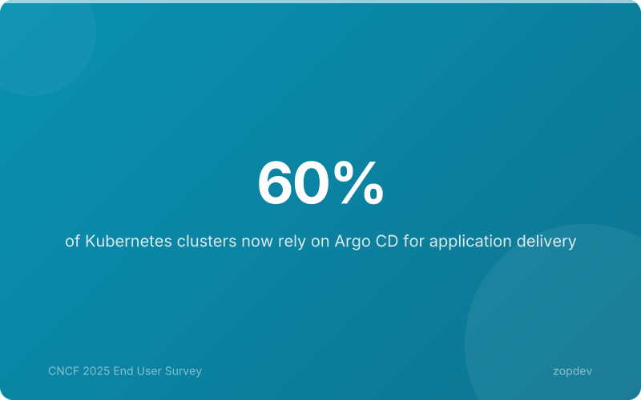
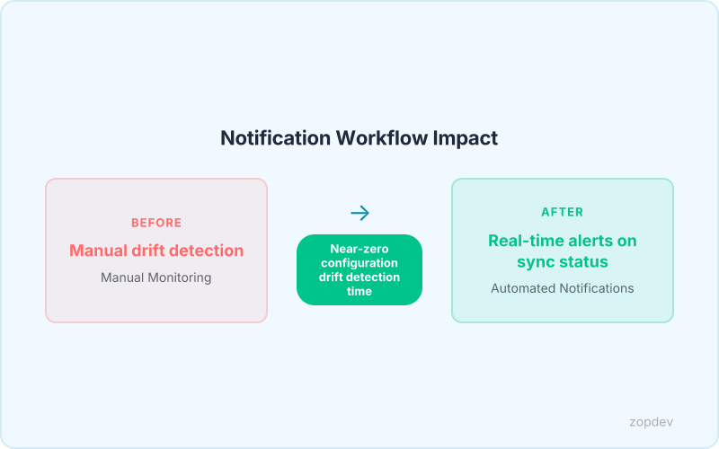
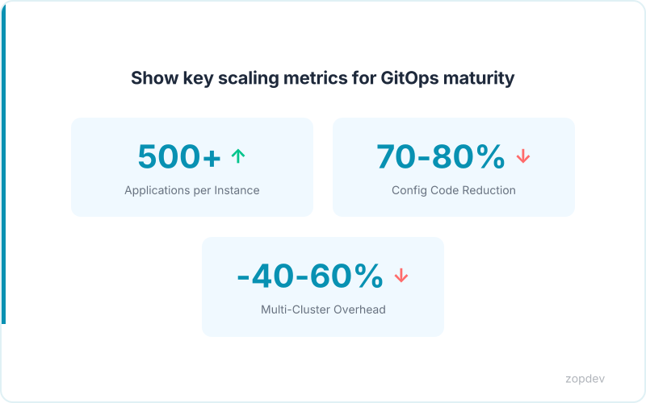
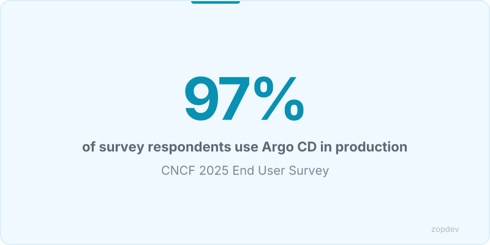

<!-- Generated by transform-chapter.ts with openai/MiniMax-M2 -->
<!-- Density: standard | Word target: 1200-1800 -->



, and operational workflows. The challenge intensifies when teams manage hundreds of applications across multiple clusters. According to the CNCF 2025 survey, 42% of teams manage over 500 applications per Argo CD instance, creating complexity that breaks brittle manual processes.

This chapter serves as your production-hardening guide. It addresses the three pillars of operational excellence: securing secrets through external secrets management so plaintext credentials never enter Git, implementing fine-grained RBAC to enforce least-privilege access across teams, and optimizing operational workflows with patterns like ApplicationSets that reduce deployment configuration code by 70-80%. You'll learn how to eliminate manual reconciliation toil through automated sync with self-heal, reducing configuration drift detection time to near-zero. Multi-cluster management patterns reduce operational overhead by 40-60%, enabling your team to scale without linear headcount growth.

The techniques in this chapter work with open-source tools including External Secrets Operator, Sealed Secrets, and Argo CD itself. These patterns apply regardless of your managed Kubernetes platform and integrate with enterprise secret management solutions already deployed in your organization. By the end, your GitOps installation will be ready for production at any scale.

## External Secrets Operator: Bridging GitOps and Secret Stores

GitOps demands Git as the single source of truth for all infrastructure and application configuration. Every team with 500+ applications per Argo CD instance relies on this declarative model to maintain consistency across clusters. The problem: Kubernetes requires secrets to exist as native objects, yet storing plaintext credentials in Git represents a critical security violation. External Secrets Operator bridges this gap by externalizing secret storage while preserving GitOps workflows.

ESO introduces two custom resources that work together. SecretStore definitions configure connections to external secret providers including AWS Secrets Manager, HashiCorp Vault, Azure Key Vault, and GCP Secret Manager. These stores define authentication mechanisms and endpoint details without exposing any actual secret values. ExternalSecret resources then reference a SecretStore and specify which secrets to synchronize, pulling actual values from the backend and creating matching Kubernetes native secrets.

This architecture keeps Git completely free of plaintext credentials. Teams store only the ExternalSecret configuration, which acts as a contract describing what secrets the application needs. ESO handles the actual synchronization, refreshing values on configurable intervals or triggering immediate updates when external secrets change.

A SecretStore for AWS Secrets Manager defines the connection:

```yaml
apiVersion: external-secrets.io/v1beta1
kind: SecretStore
metadata:
  name: aws-secrets-manager
spec:
  provider:
    aws:
      service: SecretsManager
      region: us-east-1
      auth:
        jwt:
          serviceAccountRef:
            name: eso-sa
            namespace: external-secrets
```

External Secrets Management eliminates plaintext secrets in Git and enables compliance with security policies that forbid version-controlled credentials. Your Git repository remains the authoritative source for infrastructure intent while actual secrets flow from dedicated stores into cluster namespaces automatically.

*Show the architecture of External Secrets Operator connecting to secret store backends*

## Sealed Secrets: Git-Encrypted Secret Management

Sealed Secrets provides an alternative approach that encrypts secrets directly within the GitOps framework. Instead of external secret stores, it uses asymmetric cryptography to transform plaintext Kubernetes secrets into encrypted SealedSecret resources that can be safely committed to version control.

The workflow involves two components: the kubeseal CLI and the SealedSecret controller running in-cluster. Developers run kubeseal against a plain Kubernetes Secret, which uses the cluster's public key to generate an encrypted SealedSecret manifest. This encrypted resource contains no usable secret data—only ciphertext that can only be decrypted by the SealedSecret controller holding the corresponding private key.

The encryption model supports two key modes. Cluster-wide sealing uses a single key for all namespaces, while namespace-scoped sealing generates separate keys per namespace for stricter isolation. Teams managing 500+ applications per Argo CD instance should evaluate their isolation requirements when choosing between these modes.

A SealedSecret resource mirrors the structure of a standard Secret but stores encrypted data:

```yaml
apiVersion: bitnami.com/v1alpha1
kind: SealedSecret
metadata:
  name: api-credentials
spec:
  encryptedData:
    username: AgBy...
    password: AgBy...
```

When the controller detects a SealedSecret, it decrypts the data and creates a matching native Secret. Developers can then delete the encrypted file from Git, keeping only the native Secret in the cluster.

Choose Sealed Secrets for smaller teams and single-cluster setups where simplicity outweighs advanced features. External Secrets Operator better serves multi-cluster environments and enterprises requiring integration with centralized secret stores. The External Secrets Management pattern eliminates plaintext secrets in Git and enables compliance with security policies that forbid version-controlled credentials—regardless of which tool you select.



## ArgoCD Notifications and Event Workflows

ArgoCD's built-in notifications system eliminates alert fatigue by delivering targeted alerts only when meaningful state changes occur. The system operates through trigger templates that evaluate application conditions, then route notifications to configured services including Slack, Microsoft Teams, email, and webhooks.

Triggers define conditions such as sync status changes, health check failures, or deployment events. When a trigger evaluates to true, the notification controller matches it against subscription rules and dispatches alerts to the appropriate service. This model scales effectively—42% of teams manage 500+ applications per Argo CD instance (CNCF 2025), and each requires different alerting thresholds.

The notification configuration lives in a ConfigMap, allowing teams to define triggers and services alongside their application manifests:

```yaml
apiVersion: v1
kind: ConfigMap
metadata:
  name: argocd-notifications-cm
data:
  service.slack: |
    apiUrl: $SLACK_WEBHOOK_URL
  trigger.on-sync-status-changing: |
    - send: [slack]
      when: app.status.operationState.phase in [Succeeded, Failed]
  subscription.slack: |
    - selector: app.namespace == "production"
```

The Automated Sync with Self-Heal pattern reduces configuration drift detection time to near-zero, but teams still need visibility into what the system corrected automatically. Notifications serve this gap—alerting on drift events enables post-mortem analysis without requiring manual monitoring.

ArgoCD also emits Kubernetes events that external systems consume for advanced workflows. Integrate these events with incident management platforms to auto-create tickets when deployments fail. Build approval workflows that pause promotions until designated reviewers acknowledge alerts. This event-driven model transforms ArgoCD from a deployment tool into a coordination hub for entire delivery pipelines.

## RBAC Best Practices and Audit Considerations

ArgoCD implements RBAC through a policy-based model that maps roles to subjects. The system defines four built-in roles: readonly grants read-only access to all resources; guest provides minimal viewing capabilities; member enables standard application management; and admin grants full control across the entire instance. These roles use CSV (ClusterScopedVersion) resources to define permission bundles that scale from single-team deployments to enterprise multi-tenant environments.

For teams requiring finer-grained access, ArgoCD supports custom role creation through the same policy mechanism. A typical developer policy grants application read and write permissions without project administrative capabilities. This separation ensures developers can deploy within their assigned namespaces while security teams retain project-level governance. The policy syntax follows a clear pattern: the resource definition specifies the role name, scope, and a list of policy rules that enumerate permitted actions against specific resource groups.

Multi-tenant deployments benefit from namespace-scoped restrictions that isolate tenant workloads. Custom roles can restrict access to a single namespace or set of namespaces, preventing cross-tenant resource visibility. This isolation proves essential when 60% of Kubernetes clusters use Argo CD for application delivery (CNCF 2025), as organizations increasingly run shared infrastructure across business units.

Enterprise identity integration connects ArgoCD with existing authentication systems. OIDC providers like Okta or Keycloak enable single sign-on. LDAP directories support group-based role assignment. SAML integrations work with corporate identity management. When a user authenticates through an external provider, ArgoCD maps their group membership to configured roles automatically.

Audit logging captures every significant action within the system. Each operation records the actor, timestamp, resource affected, and outcome. These logs integrate with external SIEM tools through standard export formats, supporting compliance requirements for SOC2 and PCI-DSS. Organizations requiring audit trails can forward logs to centralized security platforms for correlation with broader infrastructure events.

Multi-cluster management reduces operational overhead by 40-60% while centralizing RBAC policies across all managed clusters. A single ArgoCD instance can enforce consistent access controls across development, staging, and production environments, eliminating the need to configure permissions independently on each cluster.

```yaml
apiVersion: external-secrets.io/v1beta1
kind: ExternalSecret
metadata:
  name: argocd-repo-creds
  namespace: argocd
spec:
  refreshInterval: 1h
  secretStoreRef:
    name: aws-secrets-manager
    kind: ClusterSecretStore
  target:
    name: repo-creds-secret
    creationPolicy: Owner
  data:
  - secretKey: password
    remoteRef:
      key: argocd/repo-credentials
      property: github-token
  - secretKey: username
    remoteRef:
      key: argocd/repo-credentials
      property: github-username
```

## GitOps ROI and Adoption Impact Estimator

A GitOps ROI calculator transforms abstract efficiency claims into concrete planning numbers. By inputting current deployment frequency, cluster count, and team size, teams project expected improvements within the first quarter of adoption.

The projection logic follows established benchmarks: GitOps adoption increases deployment frequency by 2x to 5x within 3 months (OneUptime). A team deploying 10 times monthly can anticipate 20 to 50 deployments after full implementation. At 20 monthly deployments, the range extends to 40 to 100. These projections assume standard CI/CD integration without requiring process redesign.

Time savings compound across multiple efficiency vectors. ApplicationSets reduce deployment configuration code by 70-80%, directly cutting the hours teams spend maintaining templated manifests. For teams managing 500+ applications per Argo CD instance, this reduction eliminates substantial toil. Multi-cluster management reduces operational overhead by 40-60% (CNCF 2025), further amplifying savings across distributed environments.

The comparative output displays baseline versus projected metrics, highlighting where templated deployments deliver the largest code reduction. A team with five clusters and a current 15-deployment monthly cadence sees projected frequencies between 30 and 75, operational overhead cuts of two to three cluster-equivalent work hours daily, and manifest maintenance reduced to one-fifth of current effort. These numbers anchor adoption planning in measurable outcomes rather than aspirational targets.

::: {.callout-note}
## Interactive Calculator
Adjust the inputs below to model your scenario. Static table shown in PDF/EPUB.
:::

::: {.callout-note}
## Adoption Impact Estimator
Model the productivity impact of adoption by adjusting your team's parameters.
:::

```{ojs}
//| echo: false

// --- Team Inputs ---
viewof teamSize = Inputs.range([5, 500], {
  value: 50,
  step: 5,
  label: "Team size (engineers)"
})

viewof avgHourlyRate = Inputs.range([50, 250], {
  value: 120,
  step: 10,
  label: "Average hourly cost ($)"
})

viewof hoursPerWeekSaved = Inputs.range([1, 20], {
  value: 6,
  step: 1,
  label: "Hours saved per engineer per week"
})

viewof adoptionRate = Inputs.range([20, 100], {
  value: 75,
  step: 5,
  label: "Expected adoption rate (%)"
})
```

```{ojs}
//| echo: false

// --- Calculations ---
effectiveTeam = Math.round(teamSize * adoptionRate / 100)
weeklyHoursSaved = effectiveTeam * hoursPerWeekSaved
monthlySavings = weeklyHoursSaved * 4.33 * avgHourlyRate
annualSavings = monthlySavings * 12
fteEquivalent = (weeklyHoursSaved / 40).toFixed(1)
```

```{ojs}
//| echo: false

// --- Summary Cards ---
fmt = d3.format("$,.0f")
html`<div class="ojs-summary-grid">
  <div class="ojs-metric">
    <span class="ojs-metric-value">${fmt(monthlySavings)}</span>
    <span class="ojs-metric-label">Monthly Savings</span>
  </div>
  <div class="ojs-metric">
    <span class="ojs-metric-value">${fmt(annualSavings)}</span>
    <span class="ojs-metric-label">Annual Savings</span>
  </div>
  <div class="ojs-metric">
    <span class="ojs-metric-value">${fteEquivalent}</span>
    <span class="ojs-metric-label">FTE Equivalent Saved</span>
  </div>
  <div class="ojs-metric">
    <span class="ojs-metric-value">${effectiveTeam}</span>
    <span class="ojs-metric-label">Engineers Adopting</span>
  </div>
</div>`
```

::: {.content-visible when-format="pdf"}
**Adoption Impact (Default Scenario)**

| Metric | Value |
|--------|-------|
| Team size | 50 engineers |
| Adoption rate | 75% (38 engineers) |
| Hours saved per engineer/week | 6 hours |
| Monthly savings | $118,404 |
| Annual savings | $1,420,848 |
| FTE equivalent saved | 5.7 |

*Interactive calculator available in the HTML version.*
:::

::: {.content-visible when-format="epub"}
**Adoption Impact (Default Scenario)**

Based on 50 engineers at 75% adoption, saving 6 hours per week at $120/hour:

- Monthly savings: **$118,404**
- Annual savings: **$1,420,848**
- FTE equivalent saved: **5.7**

*Interactive calculator available in the HTML version.*
:::



## Scaling GitOps: ApplicationSets and Progressive Delivery

When managing 500+ applications per Argo CD instance, manual deployment configuration becomes unsustainable. ApplicationSets solve this by generating manifests from templates using generators. The matrix generator combines parameters from multiple sources, enabling a single definition to target dozens of clusters and environments. The merge generator overlays additional parameters onto base configurations. Git generators reference directory structures in repositories. Pull request generators create deployments automatically when branches merge.

ApplicationSets reduce deployment configuration code by 70-80% by replacing duplicate manifests with parameterized templates. A single matrix generator can produce hundreds of application definitions across development, staging, and production clusters from one resource.

The App of Apps pattern establishes a hierarchical deployment model. A root application bootstraps child applications declaratively. This approach simplifies cluster initialization and ensures consistent application ordering across environments.

Argo Rollouts introduces progressive delivery to GitOps workflows. Canary deployments shift traffic incrementally while analysis runs verify metrics. When analysis passes, traffic shifts automatically to the new version. When analysis fails, Rollouts abort the rollout and revert to the stable version.

```yaml
apiVersion: argoproj.io/v1alpha1
kind: ApplicationSet
metadata:
  name: multi-cluster-deployments
spec:
  generators:
    - matrix:
        generators:
          - git:
              repoURL: https://github.com/org/cluster-configs
              directories:
                - clusters/*
          - clusters:
              selector:
                matchLabels:
                  environment: production
  template:
    metadata:
      name: '{{path.basename}}-{{name}}'
    spec:
      project: default
      source:
        repoURL: https://github.com/org/app-manifests
        targetRevision: HEAD
        path: 'apps/{{path.basename}}'
      destination:
        server: '{{server}}'
        namespace: default
      syncPolicy:
        automated:
          prune: true
          selfHeal: true
```

These patterns work together: ApplicationSets handle scale, App of Apps handles orchestration, and Rollouts handle safety. Teams adopting this stack gain confidence in deploying frequently without manual intervention.

## Summary: Production Hardening Checklist

Use this checklist to assess your GitOps maturity across five critical areas.

**Secrets Management**: Have you integrated External Secrets Operator with your enterprise secret store (HashiCorp Vault, AWS Secrets Manager)? This eliminates plaintext secrets in Git and enforces compliance. For repository-level encryption, have you deployed Sealed Secrets to protect sensitive values at rest?

**Operational Awareness**: Have you configured Argo CD notifications for sync failures, deployment errors, and health violations? Real-time alerts enable rapid response before issues propagate.

**Compliance and Governance**: Have you implemented RBAC policies that enforce least-privilege access? Are audit logs capturing all configuration changes for security review?

**Scaling Patterns**: Have you adopted ApplicationSets to reduce deployment configuration code by 70-80%? Does your architecture use the App of Apps pattern for declarative orchestration across environments? Have you enabled Argo Rollouts for progressive delivery with automatic traffic shifting?

**Automation**: Have you enabled Automated Sync with self-heal to reduce configuration drift detection time to near-zero?



Argo CD achieved an NPS of 79 with 97% production usage (CNCF 2025). This confirms that GitOps for production workloads has reached enterprise maturity—and teams not yet on this path risk falling behind.

